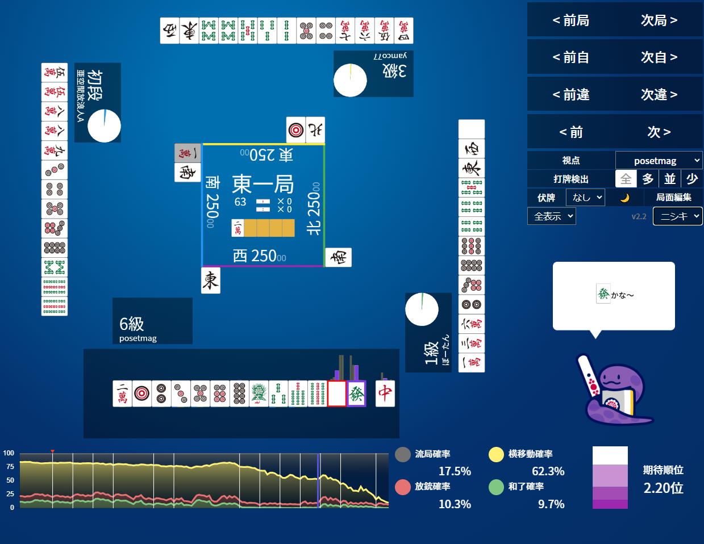
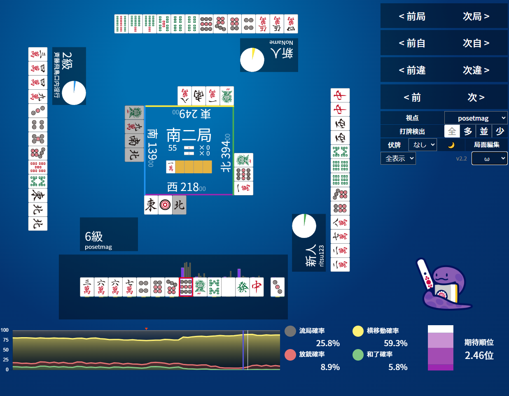

那個爛指的是介面，比如katago會顯示不同位置的勝率。

特別是場上什麼都還沒有的時候，NAGA中發白有巨大的差異，同樣都是要丟掉的牌，居然不是33%33%33%

NAGA是說超副露派喜歡打白板  
超門清派喜歡打發  
這樣嗎  
  
[連結](https://naga.dmv.nico/htmls/a629d59bcab83326b6f4373dfc0cae23406a7f4c3321c4470058a4d152c626f8v2_2.html?tw=2)  
  
[連結](https://naga.dmv.nico/htmls/1abad016a0b33b3d17360e1299dba468fc880477e0bf0cd51a51e41eacec01ddv2_2.html?tw=3)  

而且也沒有後續聽型期望，絕藝起碼還會給個三選變化圖。

也不能嘗試選不同的牌看後續勝率跟聽型期望。

真的蠻爛的，退訂了。

#後AI時代 #AI魔法師 #AI溝通師 #AI #NAGA