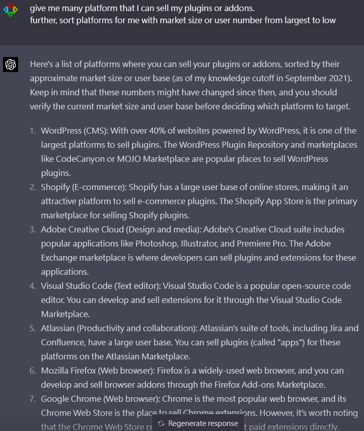

這陣子跟不同人和非人類聊到的想法：比起做產品，做plugins賣也不錯，比如unity也有asset store。  
MVP是做產品一直以來是很重要的概念，plugins製作速度比產品更小更快，也更能快速做市場驗證，開發成本也更低。

  
以上述AI列的幾個來說，VSCode就是很不好打的市場，因為vscode使用者都是工程師高手(或者說plugin開發者都是高手，簡單說使用者很刁、開發又很競爭) 。Adobe也是類似的概念，難在需要符合美術開發者的習慣。  

反之WordPress就是很好打的市場，因為WordPress的定位就是不會架站的使用者，在WordPress上寫文章的人大多沒有太多技術能力，(略懂技術的人的都自己架站了 ex:我自己架站在 posetmage.com/Blog/ 和 lattice.posetmage.com) 
