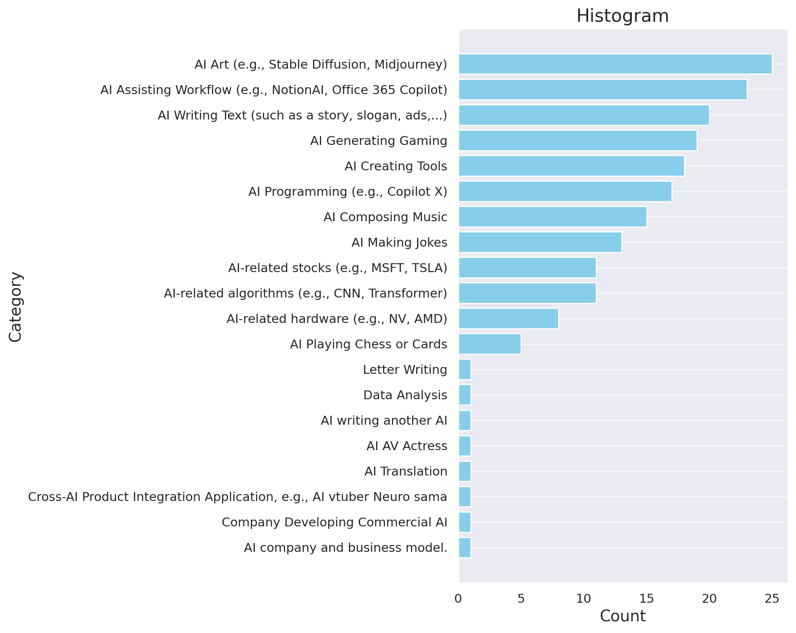
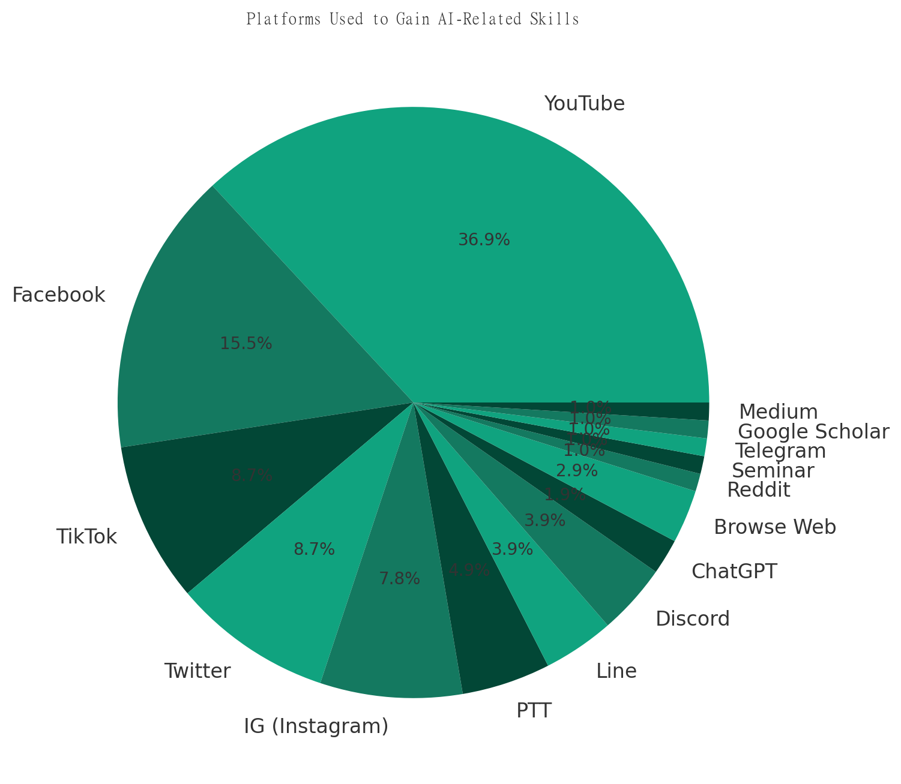
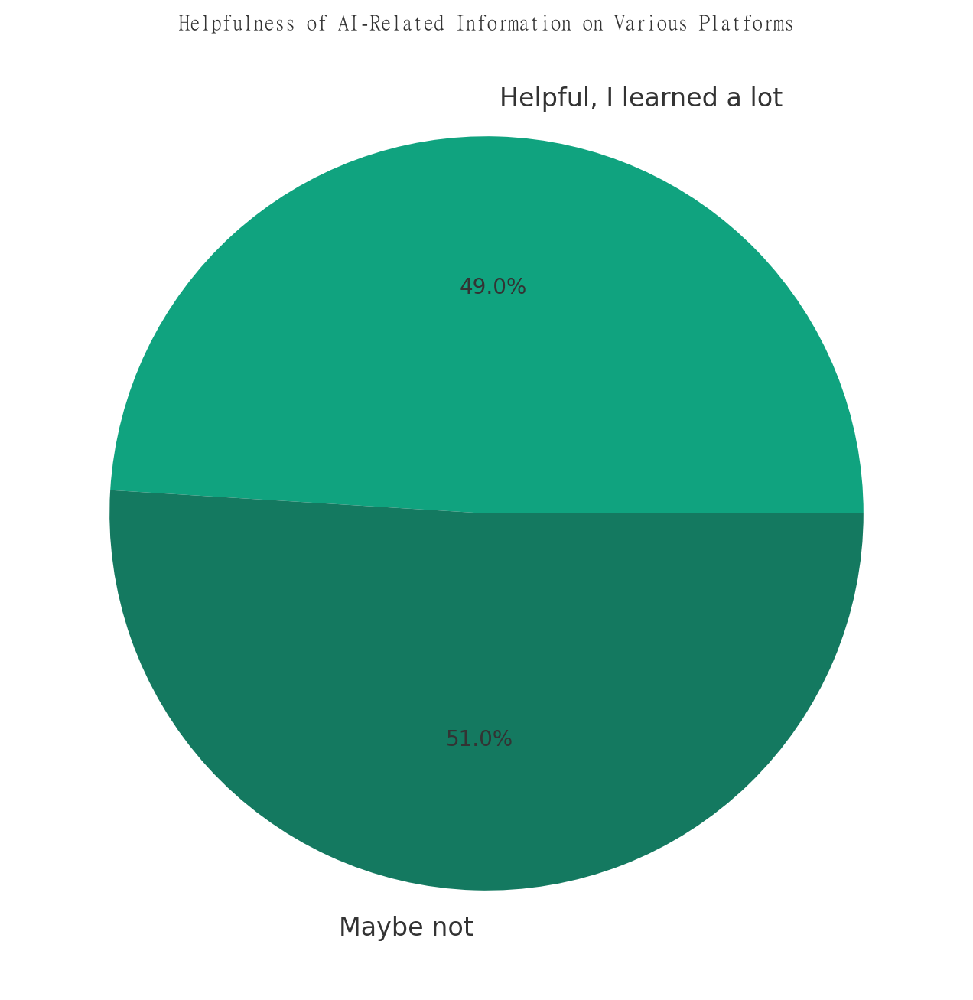
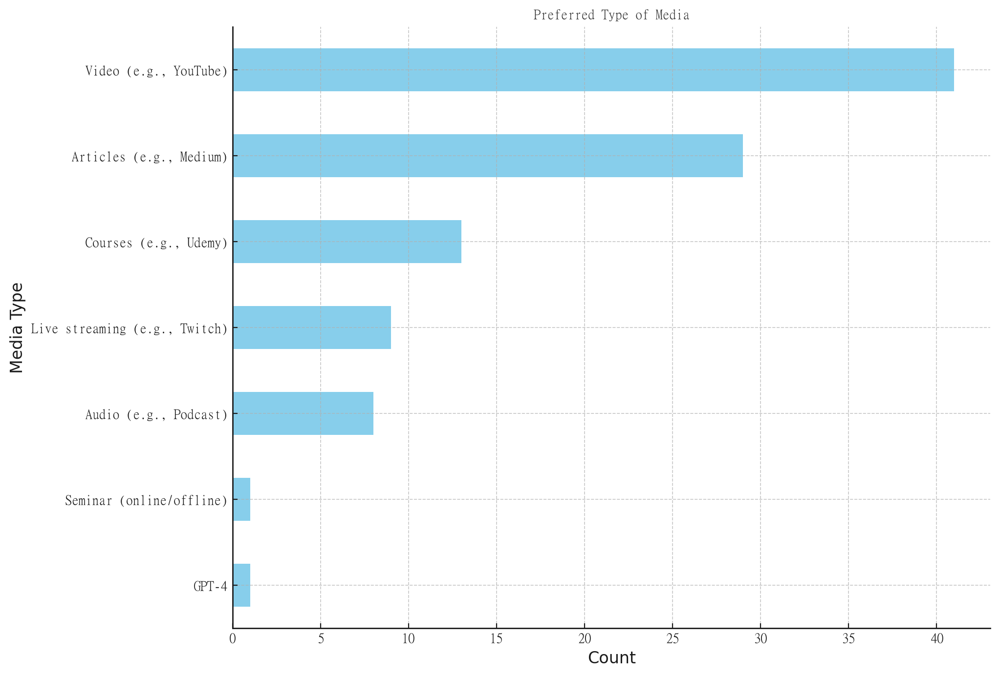
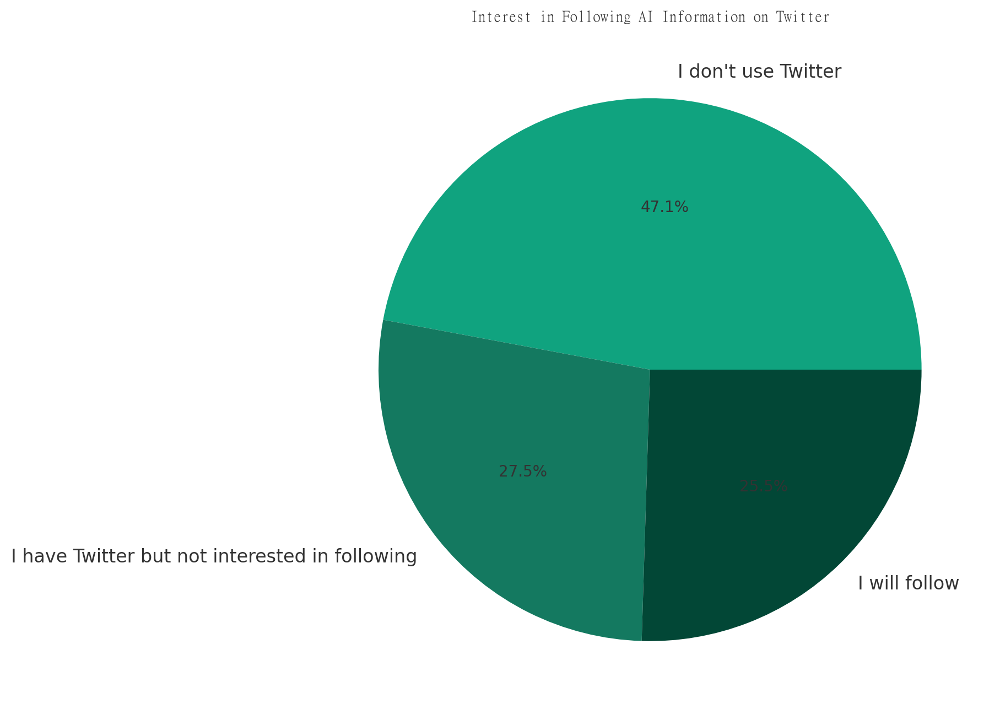
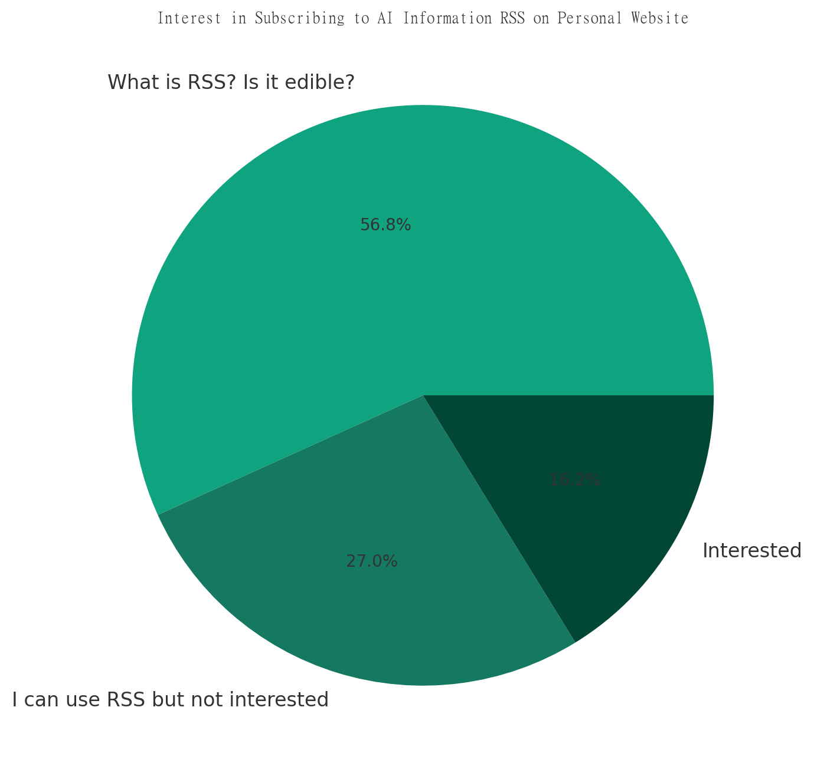

目前來做一個經驗總結，

對於問卷的收集方式，如果不特別在意品質的話，可以考慮問卷交換社團（英文的部分幾乎是透過這樣的方式獲得的）。  

現在對Google表單的格式有點不滿，因為在進行解析時不太友善。在資料結構方面，AI也認為JSON格式可能是更好的選擇。  
自有檔案的優點在於我們可以將其放到不同的平台上進行解析，但是很多問卷系統下載檔案的功能都需要付費，而且所提供的格式也未必適合我們的需求。  
此外，目前很多問卷系統的多語言支援服務都需要付費，例如Google表單的免費版現在只能創建兩份問卷。  

希望是純文字檔的方式去打問卷題目，GUI一格一格拉很煩，加上翻譯的部分，如果純文字AI都可以代勞。  
綜觀以上經驗，在考慮未來可能會自建問卷系統並將資料存成JSON格式。

也可以將結果交由AI進行解析。雖然問卷結果可能相當明顯，給AI基本上也獲得相似的回答。例如，透過YouTube影片或者是撰寫文章的方式來教學AI繪圖、助理、Prompt。

可以查看原始檔案[xlsx](./AI魔法師問卷/AI魔法師問卷0730.xlsx)，或者是gpt4 copilot分析的詠唱過程在[chat](./AI魔法師問卷/chat.html)。

## Q1 對AI相關的什麼議題有興趣?
  

## Q2 平常使用哪些平台獲取AI相關使用技巧，而且是真的在使用?
  

## Q3 目前各家平台FB,YT..... AI相關的資訊你覺得有幫助嗎?
  

## Q4 基於上兩題，為什麼你會推薦一個AI相關頻道，是因為你學到了什麼並且用在哪了?
<iframe src="./AI魔法師問卷/04.html" width="650" height="300px" style="background-color: white;"></iframe>

## Q5 會希望看到怎樣的資訊形式?
  

## Q6 你想解決什麼問題? 或者遇到哪些問題? 所以會想看哪些資訊?
<iframe src="./AI魔法師問卷/06.html" width="650" height="300px" style="background-color: white;"></iframe>

## Q7 你目前遇到哪些痛點是AI不能解決的?
<iframe src="./AI魔法師問卷/07.html" width="650" height="300px" style="background-color: white;"></iframe>

## Q8 你目前遇到哪些痛點是AI有可能解決的?
<iframe src="./AI魔法師問卷/08.html" width="650" height="300px" style="background-color: white;"></iframe>

## Q9 除了以上之外還有什麼跟AI相關的想法嗎??
<iframe src="./AI魔法師問卷/09.html" width="650" height="300px" style="background-color: white;"></iframe>

## Q10 我AI訊息都發佈在 推特-AIMageGuild 是否有興趣follow
  

## Q11 我AI訊息都發布在個人網站，是否有興趣訂閱RSS
  

## Q12 對於這個問卷有其他建議嗎?
<iframe src="./AI魔法師問卷/09.html" width="650" height="300px" style="background-color: white;"></iframe>
