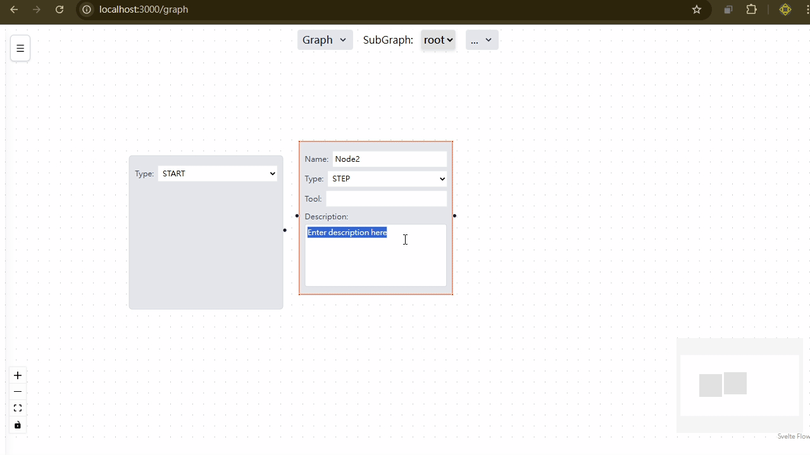
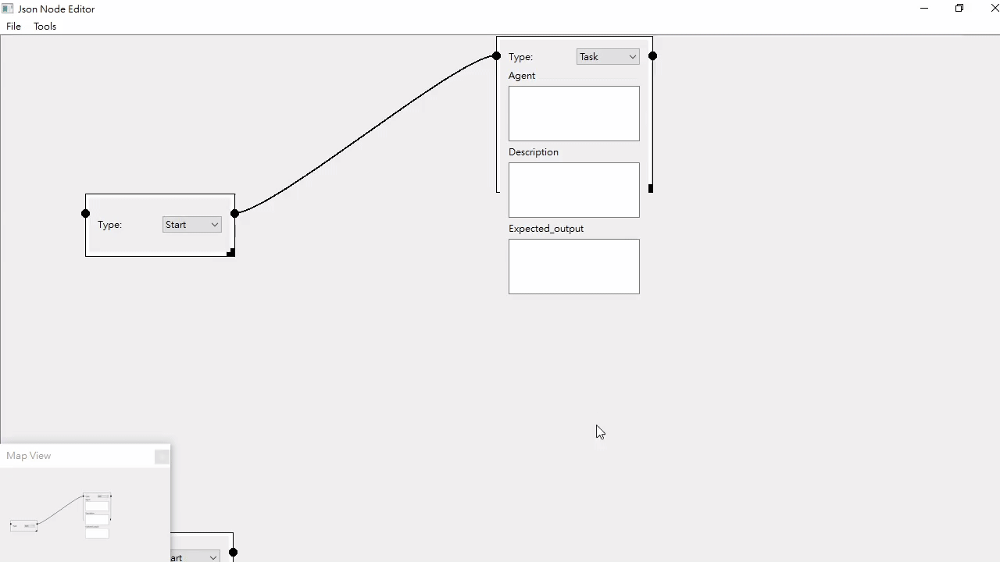
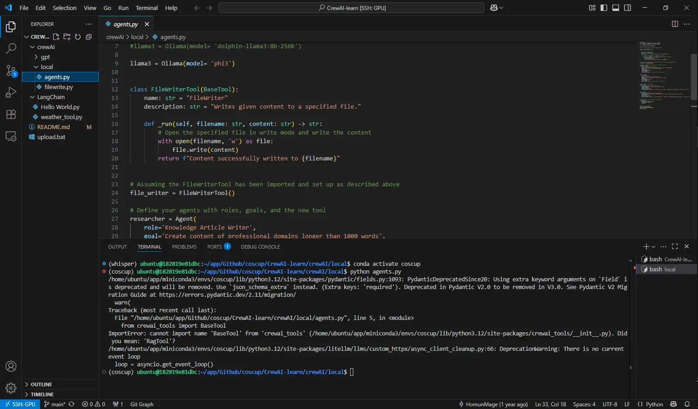
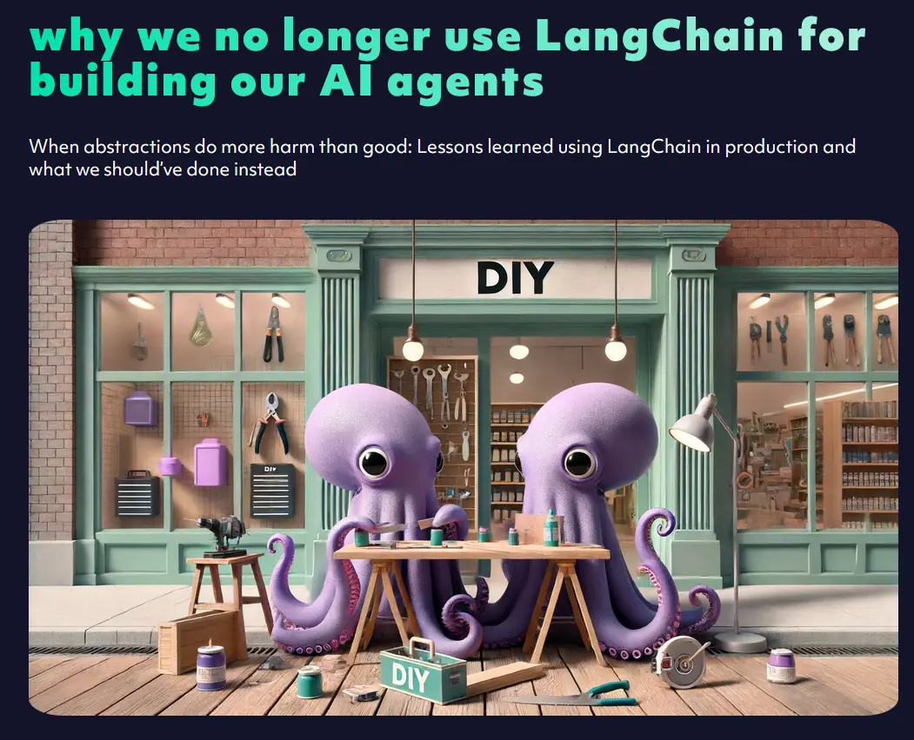
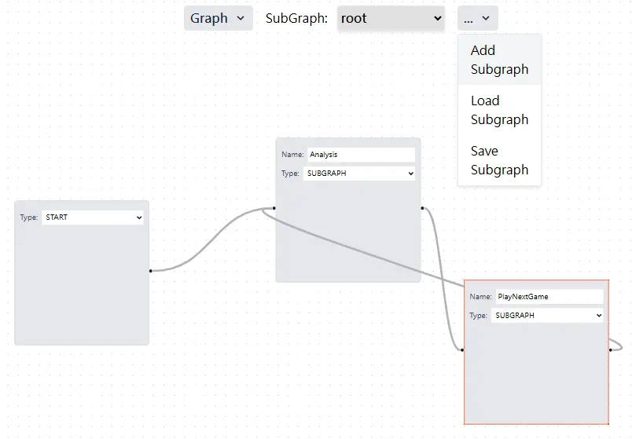

## Self-hosted AI Workflow Visualization with LangGraph-GUI & CrewAI-GUI

slide link: https://homun.posetmage.com/Content/Slides/2025/COSCUP/

## LangGraph-GUI Demo

* visulization, low code, easy to prompt
* simple for dev tools

## Motivation & Goals

1. **Local GPU Support** (e.g., Ollama)
2. **Full Customization** of UI and backend logic
3. **LangGraph Compatibility** for flexible graph-based workflows
4. **Easy Deployment** with Docker Compose and Kubernetes

other tool usually limited shape, you cannot drag some node to any node you want

* Other similar software
  * dify
    * 
    * https://framerusercontent.com/images/7IPPObp2xkFVLH1IyW9QvFQ0a2I.gif
  * coze
    * 
    * https://pbs.twimg.com/media/GP5rEiZaEAAUqWu
  * n8n
    * 
    * https://raw.githubusercontent.com/n8n-io/n8n/master/assets/n8n-screenshot-readme.png

## First attempts - CrewAI-Qt

Build CrewAI-GUI with pyside6

* **Pros** of CrewAI : 
  * Beginner-friendly introduction to AI agents
  * LangGraph, LangChain resource not friendly to green hands

## Why Not CrewAI?

* **Cons** of CrewAI : 
  * Abstracts too many steps (limited visibility)
  * Frequent updates may breaks existing code
  * 

## Abadon PyQt

- **Containerization Challenges:** Qt-based UIs proved unreliable when deployed in Docker/Kubernetes.
- **Frontend Modernization:** Switched from PySide6 to a React-based UI for faster iteration and broader ecosystem support.
- **Architecture Validation:** Demonstrated our JSON-contract design lets us swap out frontends with zero backend changes.

* frontend change:

-> 
->  
->  

## Why Not LangChain?

Both langchain and  crewai are Fragility

* **Not Modularity:** Tool usage is isolated, hard to combine
* **Fragility:** Breaking changes across versions
* **Bad Abstraction:** Layers obscure data flow

[why we no longer use LangChain for building our AI agents](https://octomind.dev/blog/why-we-no-longer-use-langchain-for-building-our-ai-agents)

## Why Choose LangGraph

* Pros of LangGraph:
  * **Graph-Centric Design**: Focus on nodes and edges
  * **Model-Agnostic**: Plug in any LLM or agent
  * **Composable**: Mix-and-match components seamlessly

* My core recommand reason:
  * state machine concept align to LLM
  * very native
  * elegant, can loop, condition to change branch

* Learning Resource:
  * [LangGraph-GUI/LangGraph-learn](https://github.com/LangGraph-GUI/LangGraph-learn)

moreover we can do graph in graph like small agent but just use origin keywords

## Design of LangGraph-GUI

1. **JSON Contract**: text based, easy to decouple
2. **Frontend Agnostic**: ReactFlow, SvelteFlow, or custom
3. **Backend Flexible**: Python, etc.
4. **Extensible**: Add custom properties via `ext:` fields

* other design: subgraph:

## Extend Ability

## python backend

- **Framework Upgrade:** Started with Flask for its simplicity, then migrated to FastAPI for async support and superior performance.  
- **Declarative Routing:** Leveraged Python decorators to keep endpoint definitions clean and self-documented.  
- **Modular Extensions:** Easy to add features—JWT authentication, per-user workspaces, custom middleware.  
- **Developer-Friendly:** Clear JSON contract and pluggable modules make onboarding and iteration a breeze.

 image source: https://www.imaginarycloud.com/blog/flask-vs-fastapi

## DevOps

* Support Kubernetes
  * Ollama in NV-container

* Support Docker Compose
  * easy for local debug 

## Thank You!

