<script src="https://posetmage.com/cdn/js/jekyll/injectMermaid.js"></script>
<script src="https://posetmage.com/cdn/js/EmbedYoutubeVideo.js"></script>


<div class="slide">

## Use SvelteFlow to Create AI Workflow Visualized Node-Edge Graph GUI Editor


</div>


<div class="slide">

## What I want

like dify, Coze, n8n.....

and self-host, more flexibity, use langgraph

* dify
  * 
* coze
  * 
* n8n
  * 

</div>

<div class="slide">

## The Core Problem: Why Build Another One?

Although existing platforms are powerful, they commonly suffer from several pain points:

* **Vendor Lock-in**: Core logic is deeply integrated with specific cloud services, making migration difficult.
* **Limited Extensibility**: Hard to easily integrate custom tools or models.
* **Opaque Logic**: Lack of full visibility into the internal workings of the agent, making debugging challenging.
* **Cost**: Large-scale usage in production environments can become prohibitively expensive.

</div>

<div class="slide">

## Why Is Visual Programming Needed?

* Lower the Technical Barrier
* Improve Development Efficiency
* Facilitate Team Collaboration
* Reduce Configuration Errors

</div>

<div class="slide">

## Time Flies......

OpenAI AgentKit


</div>


<div class="slide">

## Similar LLM libs

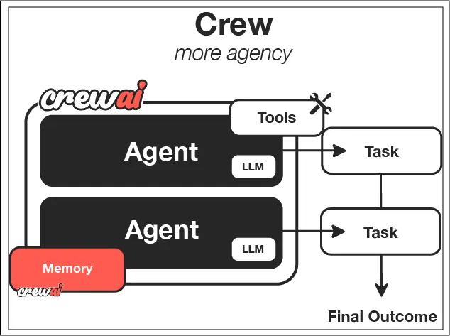


| Feature | CrewAI | LangChain | LangGraph |
|---------|---------|-----------|-----------|
| Graph Support | ❌ Limited | ⚠️ Linear chains | ✅ Full graphs |
| Loops | ❌ No | ❌ No | ✅ Yes |
| Conditions | ❌ No | ⚠️ Limited | ✅ Yes |
| Multi-agent | ✅ Yes | ⚠️ Basic | ✅ Yes |
| GUI Support | ❌ No | ❌ No | ❌ No |

**all of these not have official GUI, we need create by ourself.**

</div>

<div class="slide">

## core design

use Nodes as SSOT to represent Edges
<div class="inject-mermaid" file="./graph.mmd" style="background-color: white;"></div>

</div>

<div class="slide">

## Evolution: From PyQt to Web-Based Solution

CrewAI-GUI-pyQt


**Limitations**:
- Desktop-only deployment
- Limited web integration
- Harder to collaborate
- Less familiar developer ecosystem

</div>


<div class="slide">

## Technology Stack

* Frontend:
  * Svelte 
  * react  (early version)
* Backend:
  * FastAPI 
  * flask (early version)
* Infrastructure
  * Kubernetes 
  * Docker Compose 
</div>

<div class="slide">

## backend API

If your backend have JWT, you can switch by username

```
post /clean-cache/{username}
get /download/{username}
post /upload/{username}
post /run/{username}
```

Run Graph Button
```
post /upload/{username}
post /run/{username}
```

</div>

<div class="slide">

## LangGraph.js

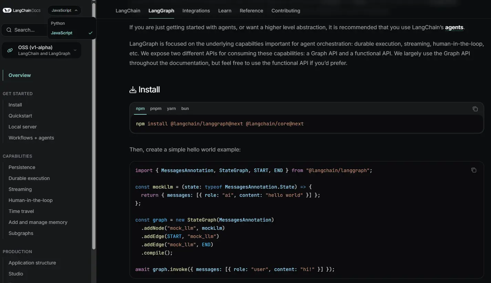

</div>


<div class="slide">

## Graph Data Strcture Design

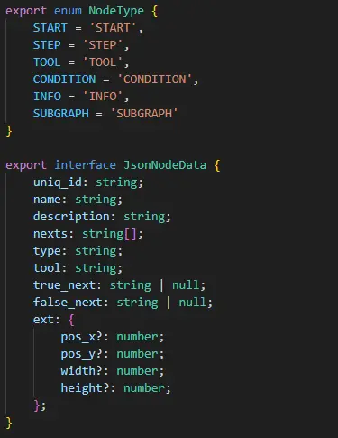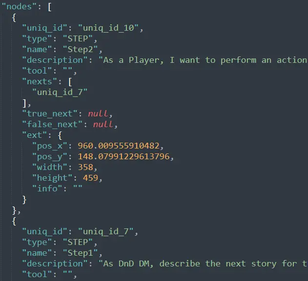

</div>


<div class="slide">

## Why xyflow

xyflow is mature js graph library (svelteflow, reactflow)


</div>

<div class="slide">

## Custom Nodes

no code


</div>

<div class="slide">

## Custom Nodes

low code


</div>


<div class="slide">

## Why ReactFlow


* React have large ecosystem and community
* Graph GUI with node edge design
* flexibity enough for make it as editor

</div>


<div class="slide">

## Benefit from ReactFlow

custom edge, custom nodes

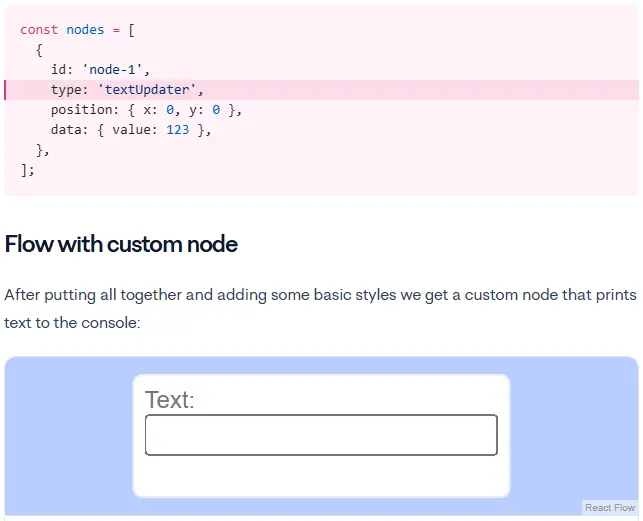

</div>

<div class="slide">

## The Jourery of ReactFlow

LangGraph-GUI 1.0 using reactflow

* Hard to make SSOT
  * **ReactFlow not support signal-like logic**
  * hard to sync Redux and React Context
  * data update flow cannot align SSOT design
  * not only nodes, but also edges need update seperatly
* Code lines more longer

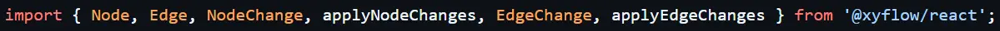

  <div class="inject-mermaid" file="./redux.mmd" style="background-color: white;"></div>

</div>

<div class="slide">

## learn lessons from ReactFlow


#### Fixing typing content in node too early
  * React’s `onChange` fires **too early** → saves unfinished text.
  * only save after click other place: ```onBlur``` 

#### Fixing Japanese Input in React (IME Support)
  * Japanese/Chinese/Korean use **IME** (Input Method Editor).
  * Example: typing "日本" → React may save `"niho"` before confirmation.
  * need ```const changeBuffer = useRef({})```

#### JS → TS
  * As projects grow, plain JavaScript becomes harder to manage. TypeScript helps us scale.
  * unclear data structures, harder to refactor

</div>

<div class="slide">

## bothered by TS

```js
"scripts": {
  "lint": "prettier --write . && prettier --check . && npx eslint . --ext .svelte,.svelte.ts,.svelte.js --fix",
},
```

```any``` will through warning, this is annoying

```js
// lib/json.ts

export type Json = 
  | string 
  | number 
  | boolean 
  | null 
  | Json[] 
  | { [key: string]: Json };

```

</div>


<div class="slide">

## Why SvelteFlow


* Svelte 5 using signals
  * code numbers usually fewer than react
  * easy to pass computed runes
* SvelteFlow 1.0 highly affinity svelt 5 rune, signals
* fewer and more beautiful lines

</div>


<div class="slide">

## Signals

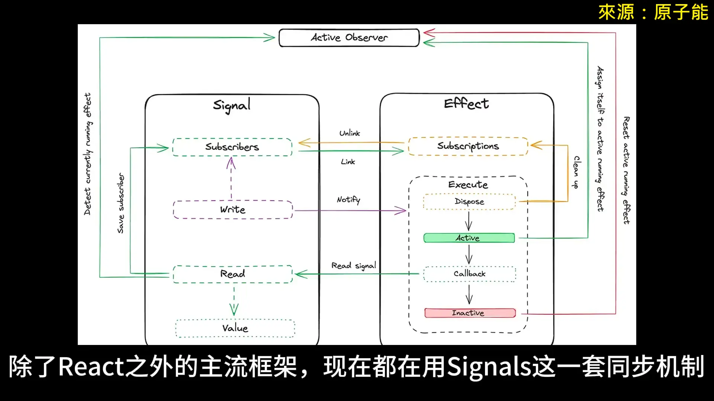


</div>

<div class="slide">

## Signals

* Reactive Value
* A signal is essentially a wrapped value. Anywhere it is read, dependencies are automatically subscribed.
  * Updating a signal → automatically notifies its dependents → triggers UI updates or recomputations.
* Computed Signals (Derived Values)
  * A computed signal is a value derived from other signals.
* Effect / Reaction (Side Effects)
  * When signals change, they can trigger effects such as updating the DOM or calling an API.

| Framework / Library   | **signal**                  | **computed**                 | **effect**                      |
| --------------------- | --------------------------- | ---------------------------- | ------------------------------- |
| **Solid.js**          | `createSignal`              | `createMemo`                 | `createEffect`                  |
| **Angular (v16+)**    | `signal()`                  | `computed()`                 | `effect()`                      |
| **Preact Signals**    | `signal()`                  | `computed()`                 | `effect()`                      |
| **Vue 3**             | `ref` / `reactive`          | `computed`                   | `watchEffect`                   |
| **Svelte 5**          | `$state` / `writable` store | `$derived` / `derived` store | `$effect` / `$:` declaration    |


</div>

<div class="slide">

## llms.txt

* With `llms.txt`, LLMs know:  
  * where to look (core guides, API, examples)  
  * what to skip (noise, menus, ads)  
  * like `robots.txt` but for AI  
* For Svelte devs:  
  * Signals make UI state simple  
  * llms.txt makes docs simple for AI  

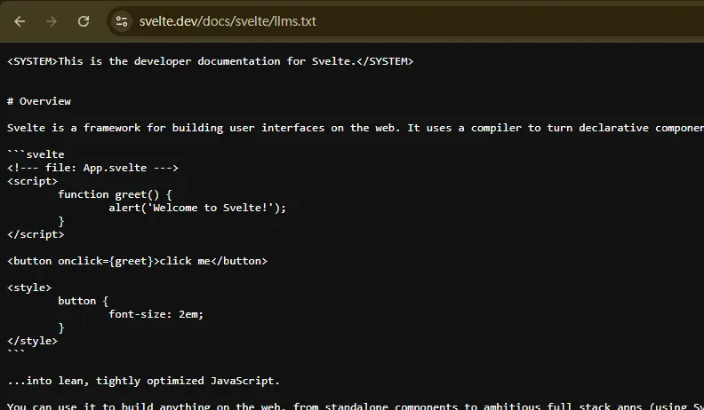

</div>

<div class="slide">

## SvelteFlow 1.0 release

xyflow/svelte 1.0.0 released at 2025 May 14

fully support rune

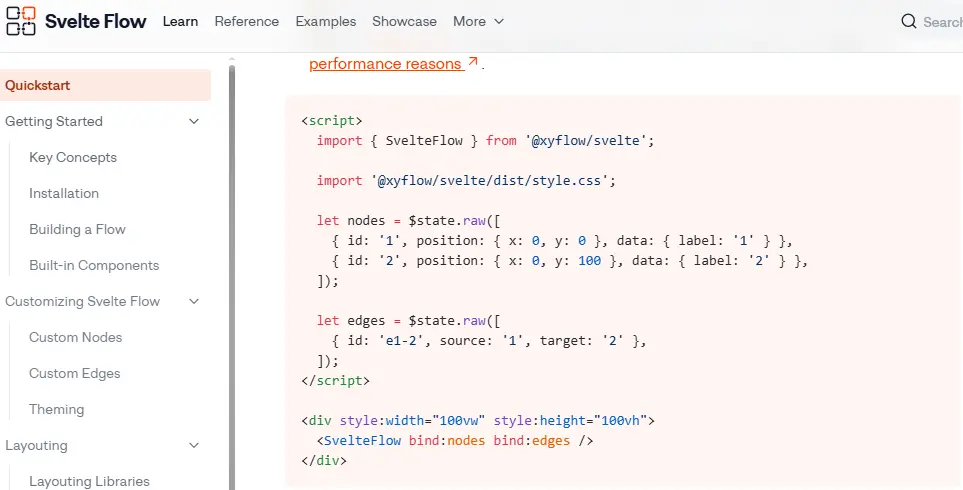


</div>

<div class="slide">

## Svelte is Elegant

[sample code](https://github.com/LangGraph-GUI/LangGraph-GUI-Svelte/blob/b56130696bc4e4202f3a4ffa013ef1a8d73aee35/src/routes/graph/flow/graphs.store.svelte.ts)

signal chain: **Node**(SSOT) --> **Edge** --> **SvelteFlow**
<div class="inject-mermaid" file="./svelte.mmd" style="background-color: white;"></div>

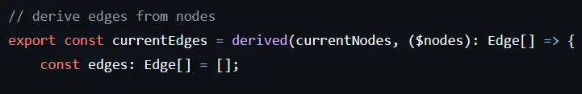

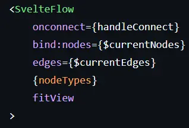

```js
bind:nodes={$currentNodes}
edges={$currentEdges} 
```

</div>

<div class="slide">

## Svelte is Elegant (cont.)

define your own signal object:

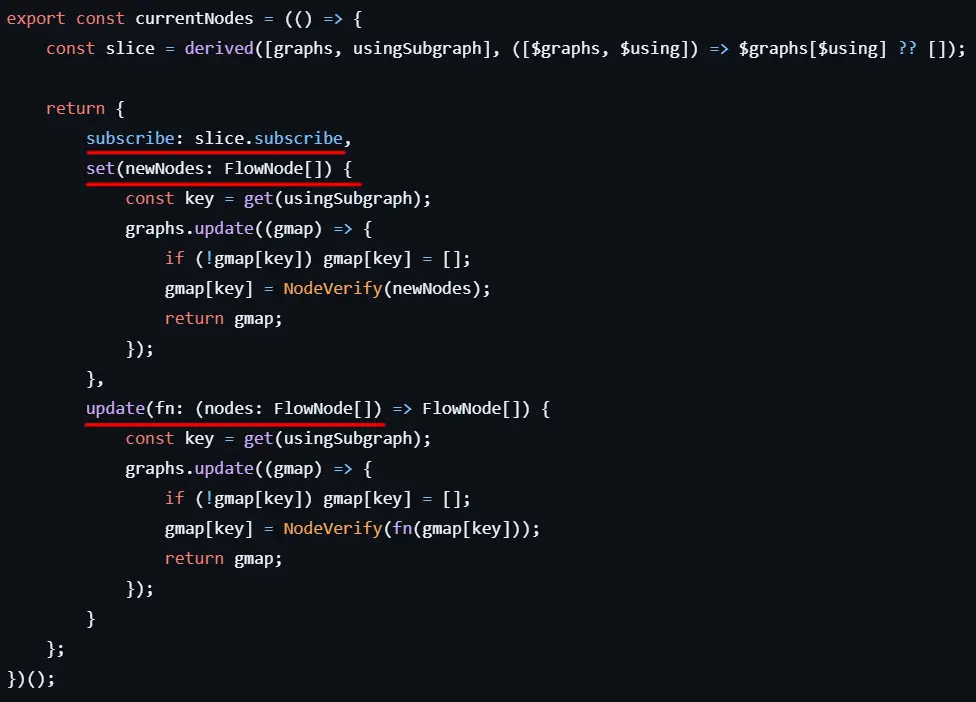

</div>


<div class="slide">

## Simple Demo


</div>

<div class="slide">

## Extend Demo


</div>

<div class="slide">

## Extend Demo

  <div class="embed_youtube" yt-title="extend demo" yt-url="sPl3J3ads0s" yt-width="700">Loading content...
  </div>

</div>

<div class="slide">


## END

<p style="font-size: 3em;">Thank You</p>

* Reference
  * reactflow, svelteflow official websites
  * https://docs.crewai.com/en/introduction
  * https://www.js-craft.io/blog/langchain-vs-langgraph/
  * https://framerusercontent.com/images/7IPPObp2xkFVLH1IyW9QvFQ0a2I.gif
  * https://pbs.twimg.com/media/GP5rEiZaEAAUqWu?format=jpg&name=4096x4096
  * https://raw.githubusercontent.com/n8n-io/n8n/master/assets/n8n-screenshot-readme.png

</div>

