# 01 - 註冊 AWS Global 帳號 / Register an AWS Global Account

您好 {{客戶稱呼}},非常感謝您撥冗協助我們設定 AWS 環境！這篇說明會帶您一步一步完成帳號註冊，預計只需要 30〜45 分鐘。遇到任何不清楚的地方，都歡迎直接來信詢問。

> 💡 **貼心提醒**：以下截圖可能因 AWS 介面更新略有差異，以實際畫面為準。若找不到某個按鈕，來信告訴我們，我們立刻協助您。

> ⚠️ **重要：請勿使用 AWS 中國區**
> 請從 `https://aws.amazon.com` 進入。若頁面出現「中國區 / 光環新網 / 西雲 / Sinnet / NWCD」字樣，請立即關閉視窗，重新輸入 `https://aws.amazon.com` 再試。
> （中國區是另一套獨立服務，與我們需要部署的系統不相容。）

---

## 預估 / Estimate

- **時間**：約 30〜45 分鐘
- **費用**：
  - AWS 會刷 $1 USD 驗證信用卡，**幾天內會退還**，屬正常流程
  - 帳號開立後 12 個月內有免費方案（Free Tier）可使用
- **需準備**：
  - 信用卡（VISA / Mastercard / JCB，能付美元外幣即可）
  - Email 信箱（建議使用公司 email）
  - 手機（接收 SMS 驗證碼）
  - 手機 App：**Authy** 或 **Google Authenticator**（用於最後的兩步驟驗證 MFA 設定）

---

## 名詞解說 / Glossary

| 名詞 | 說明 |
|------|------|
| AWS Global | Amazon 全球雲端平台，網址為 `aws.amazon.com`；與中國區完全獨立，本文件全部以此為準 |
| Root user（根使用者） | 您 AWS 帳號的最高權限主帳號，擁有完整控制權。僅用於初始設定，設定完後請妥善保管，不日常使用 |
| Console（管理主控台） | AWS 的網頁操作介面，登入後可以看到所有服務 |
| Region（區域） | AWS 機房的地理位置，就像選一個城市。建議選「東京 (ap-northeast-1)」，對台灣速度最快 |
| Free Tier（免費方案） | AWS 新帳號前 12 個月提供的免費使用額度，大部分基本服務在一定用量內免費 |
| MFA（多因素驗證） | Multi-Factor Authentication — 登入時除了密碼，還需要輸入手機 App 上的 6 位數字碼，大幅提升帳號安全性 |
| Account ID | 您 AWS 帳號的 12 位數編號，是我們辨識您帳號的方式。請在完成後提供給我們 |

---

## 操作步驟 / Steps

### 步驟 1：確認使用正確網址（Step 1: Verify You're on AWS Global）

1. 開啟瀏覽器（建議使用 Chrome 或 Edge），前往 `https://aws.amazon.com`

2. 頁面會依您的瀏覽器語言設定顯示中文或英文：

   **台灣中文版畫面**：
   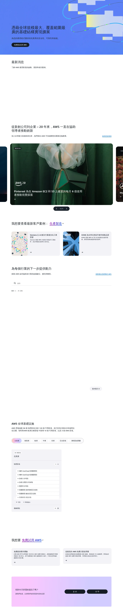
   *來源: [aws.amazon.com/tw](https://aws.amazon.com/tw/), 取用日期 2026-04-21*

   **英文版畫面**：
   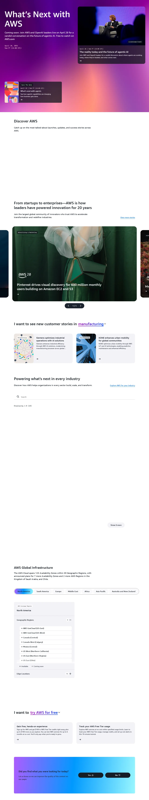
   *來源: [aws.amazon.com](https://aws.amazon.com/), 取用日期 2026-04-21*

3. ✅ 請確認瀏覽器網址列顯示的是 `aws.amazon.com`，**而不是** `amazonaws.com.cn`

4. 若頁面出現「西雲數據」、「光環新網」、「Sinnet」或「NWCD」等字樣，代表進入了 AWS 中國區。請立即關閉頁面，重新輸入 `https://aws.amazon.com` 進入正確的全球版：

   **中國區外觀（請勿使用）**：
   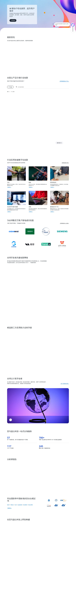
   *來源: [aws.amazon.com/tw](https://aws.amazon.com/tw/), 取用日期 2026-04-21*

---

### 步驟 2：開始建立帳號（Step 2: Create Your AWS Account）

1. 在 `https://aws.amazon.com` 首頁，點擊右上角橘色按鈕「建立 AWS 帳戶 (Create an AWS Account)」

2. 頁面會跳轉至 `https://portal.aws.amazon.com/billing/signup`，顯示如下表單：

   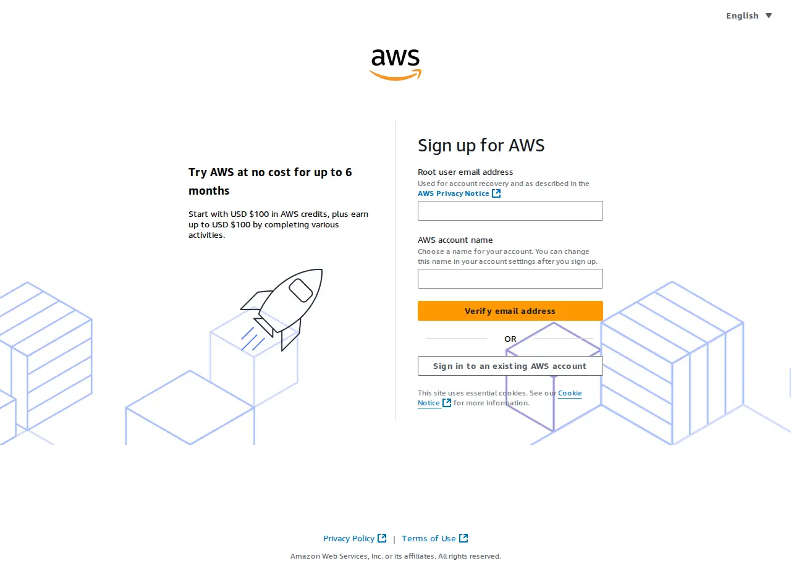
   *來源: [aws.amazon.com](https://aws.amazon.com/), 取用日期 2026-04-21*

   > 📌 **說明**：AWS 的註冊頁面固定以英文顯示，這是正常的，不影響後續操作。

3. 填寫以下兩個欄位：
   - **Root user email address**：輸入您的 email（這是帳號的主登入 email，請妥善保管）
   - **AWS account name**：輸入公司或組織名稱（例如 `MyCompany-AWS`）

4. 點擊「Verify email address」按鈕

5. 系統會寄送一封驗證碼 email（主旨為「AWS Email Verification」），請開啟信箱找到這封信，複製其中的 6 位數驗證碼

6. 回到 AWS 頁面，貼上驗證碼，點擊「Verify」

---

### 步驟 3：設定 Root 帳號密碼（Step 3: Create Your Password）

email 驗證通過後，頁面會跳到密碼設定頁：

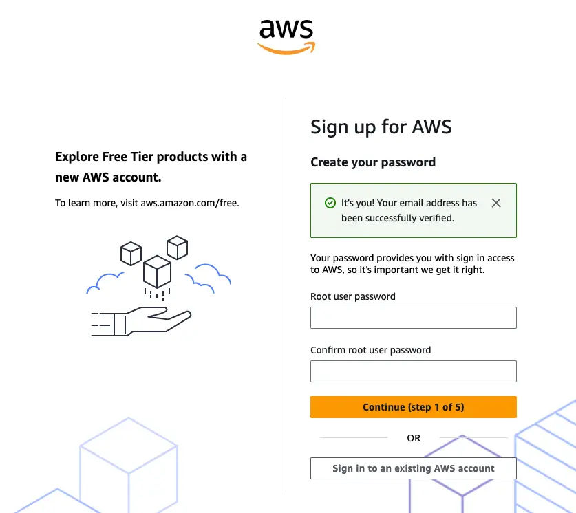
*來源: [AWS Docs — Set Up Your Environment, Module 1](https://docs.aws.amazon.com/hands-on/latest/setup-environment/module-one.html), 取用日期 2026-04-21*

1. 在「Root user password」欄位輸入密碼：
   - 建議長度 ≥ 16 字元，包含大寫、小寫、數字、符號
   - 範例格式：`MyAWS@2026!Secure`
   - **強烈建議**使用密碼管理器（1Password / Bitwarden）儲存，避免忘記

2. 在「Confirm root user password」欄位再輸入一次密碼確認

3. 點擊「Continue (step 1 of 5)」

---

### 步驟 4：填寫聯絡資訊與帳號類型（Step 4: Contact Information）

頁面跳到聯絡資訊頁：

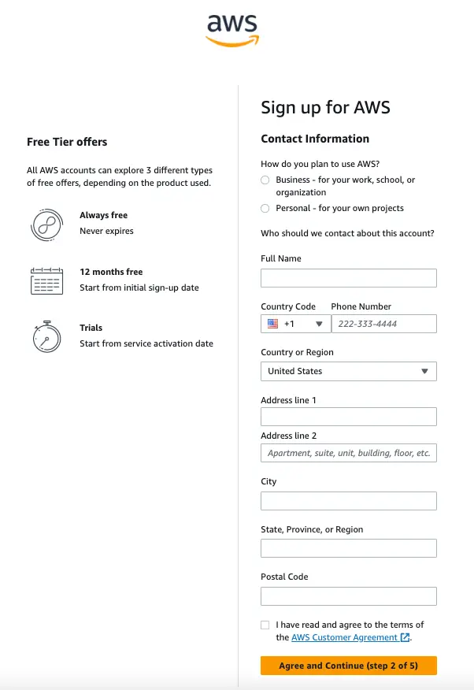
*來源: [AWS Docs — Set Up Your Environment, Module 1](https://docs.aws.amazon.com/hands-on/latest/setup-environment/module-one.html), 取用日期 2026-04-21*

1. 選擇帳號用途：
   - 公司使用 → 選「**Business** - for your work, school, or organization」
   - 個人使用 → 選「**Personal** - for your own projects」

2. 填寫以下欄位：
   - **Full Name**：持卡人或公司負責人姓名
   - **Country Code + Phone Number**：台灣請選 `+886`，手機號碼去掉開頭的 `0`（例如：`912345678`）
   - **Country or Region**：選 `Taiwan`
   - **Address line 1**：公司或個人地址（可用英文拼音）
   - **City / Postal Code**：城市與郵遞區號

3. 勾選「I have read and agree to the terms of the AWS Customer Agreement」

4. 點擊「Agree and Continue (step 2 of 5)」

---

### 步驟 5：綁定信用卡（Step 5: Billing Information）

頁面跳到信用卡綁定頁：

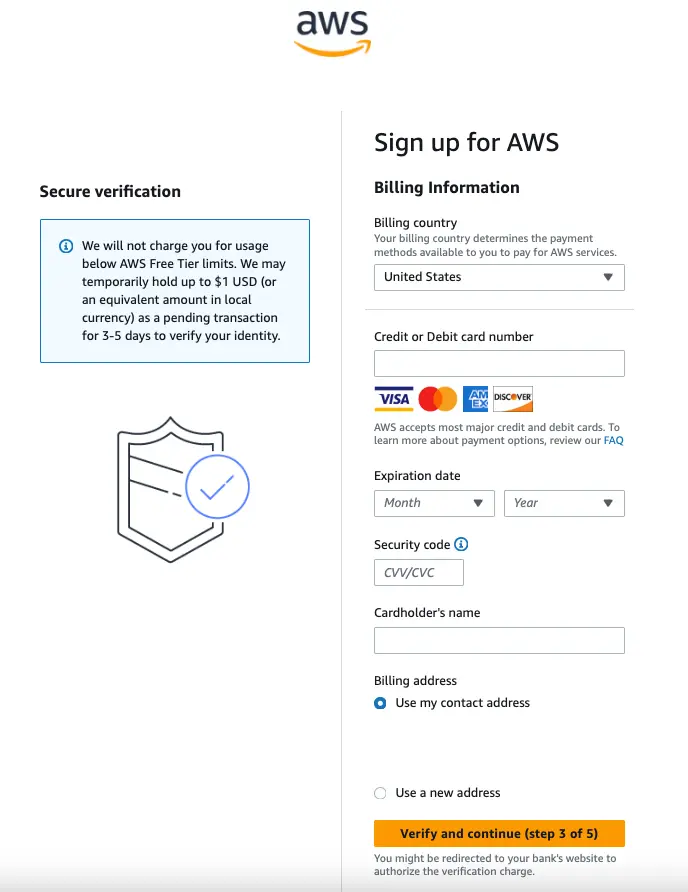
*來源: [AWS Docs — Set Up Your Environment, Module 1](https://docs.aws.amazon.com/hands-on/latest/setup-environment/module-one.html), 取用日期 2026-04-21*

1. 填寫信用卡資訊：
   - **Credit or Debit card number**：信用卡號碼（支援 VISA、Mastercard、AMEX、Discover）
   - **Expiration date**：信用卡到期年月
   - **Security code**：信用卡背面的 CVV / CVC 碼（3 位數）
   - **Cardholder's name**：信用卡上的持卡人姓名（與卡面相同）

2. 帳單地址選「Use my contact address」（使用剛才填的聯絡地址）

3. 點擊「Verify and continue (step 3 of 5)」

4. ⚠️ AWS 會對信用卡扣款 **$1 USD** 進行身份驗證，**此款項通常於 3〜5 個工作天內退還**，這是正常的流程，請放心。

---

### 步驟 6：手機身份驗證（Step 6: Identity Verification）

1. 頁面顯示一個驗證圖形文字（CAPTCHA）：

   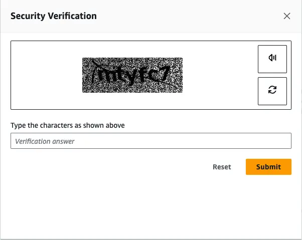
   *來源: [AWS Docs — Set Up Your Environment, Module 1](https://docs.aws.amazon.com/hands-on/latest/setup-environment/module-one.html), 取用日期 2026-04-21*

   請依畫面上的扭曲文字，輸入您看到的字元，然後點擊「Submit」

2. 接著選擇驗證方式，建議選「**Text message (SMS)**」（簡訊）

3. 輸入手機號碼（台灣格式：國碼選 `+886`，輸入 `912345678`，去掉開頭的 0）

4. 點擊「Send SMS」，手機會收到驗證碼簡訊

5. 輸入收到的驗證碼：

   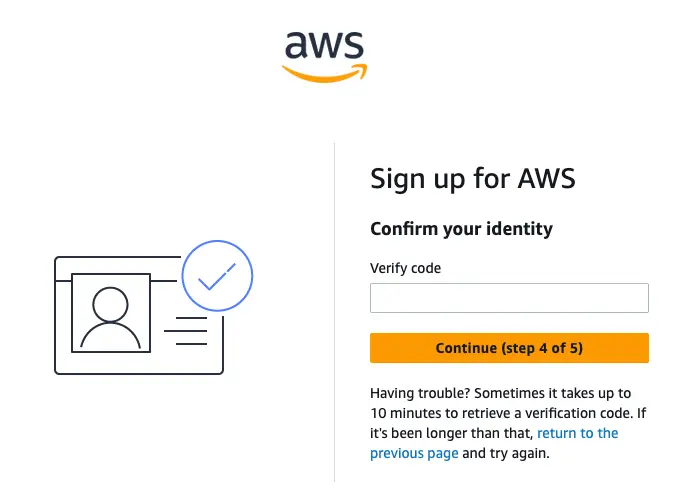
   *來源: [AWS Docs — Set Up Your Environment, Module 1](https://docs.aws.amazon.com/hands-on/latest/setup-environment/module-one.html), 取用日期 2026-04-21*

6. 點擊「Continue (step 4 of 5)」

---

### 步驟 7：選擇 Support Plan（Step 7: Select Support Plan）

頁面顯示三種支援方案：

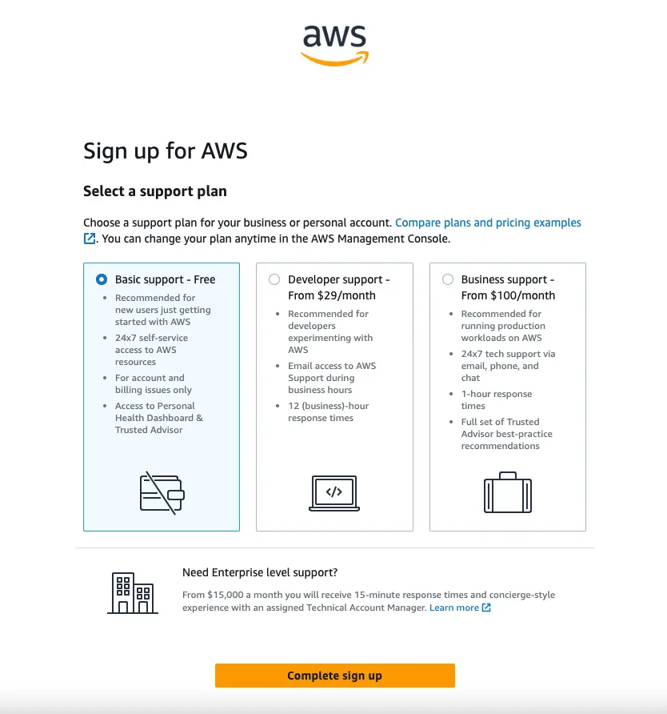
*來源: [AWS Docs — Set Up Your Environment, Module 1](https://docs.aws.amazon.com/hands-on/latest/setup-environment/module-one.html), 取用日期 2026-04-21*

1. 選擇「**Basic support - Free**」（免費方案，初期使用完全足夠）

2. 點擊「Complete sign up」

3. 等待頁面顯示「Congratulations! Your AWS account is now activated.」即代表帳號建立完成

---

### 步驟 8：登入 Console，找到 Account ID（Step 8: Sign In & Find Account ID）

1. 前往 `https://console.aws.amazon.com`

2. 頁面顯示登入選項，請選「**Root user**」，輸入您剛才設定的 email：

   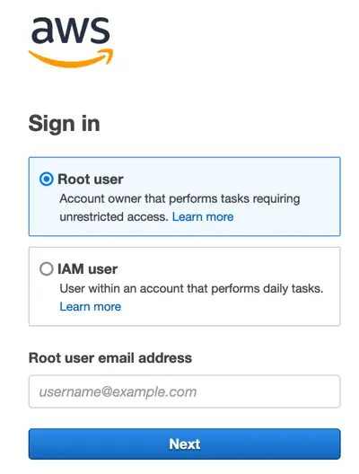
   *來源: [AWS Docs — Set Up Your Environment, Module 2](https://docs.aws.amazon.com/hands-on/latest/setup-environment/module-two.html), 取用日期 2026-04-21*

3. 輸入 email 後點擊「Next」，再輸入密碼登入

4. 登入成功後，點擊右上角您的帳號名稱，下拉選單中可以看到「Account ID」（12 位數字）以及「Security credentials」選項：

   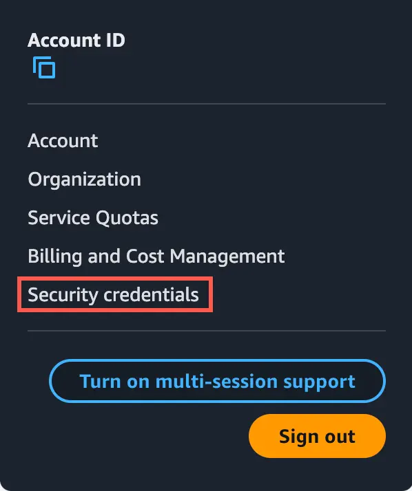
   *來源: [AWS Docs — Set Up Your Environment, Module 2](https://docs.aws.amazon.com/hands-on/latest/setup-environment/module-two.html), 取用日期 2026-04-21*

5. 請記下您的 **Account ID（12 位數）**，稍後需要提供給我們

6. 登入後，右上角也會顯示目前的 Region（區域）。建議選擇：
   - 🇯🇵 **ap-northeast-1（東京）**：對台灣連線速度最佳
   - 🇺🇸 **us-east-1（維吉尼亞北部）**：部分服務的首選區域
   - 請記下您選擇的 Region，後續部署會用到

---

### 步驟 9：啟用 Root 帳號兩步驟驗證（Step 9: Enable MFA — 非常重要 / Critical）

> 🔐 **強烈建議**：Root 帳號若沒有 MFA，一旦密碼外洩，AWS 上的所有資源都可能被盜用。請務必在此步驟完成 MFA 設定！

**準備工作**：請先在手機上安裝 **Authy**（免費，App Store / Google Play 均有）或 **Google Authenticator**

1. 在 Console 右上角，點擊帳號名稱 → 選「**Security credentials**」

2. 往下捲動，找到「**Multi-factor authentication (MFA)**」區塊，點擊「**Assign MFA device**」：

   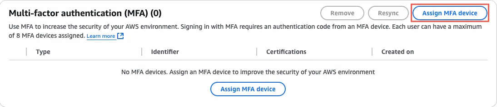
   *來源: [AWS Docs — Set Up Your Environment, Module 2](https://docs.aws.amazon.com/hands-on/latest/setup-environment/module-two.html), 取用日期 2026-04-21*

3. 頁面顯示裝置選擇，請選「**Authenticator app**」，並輸入一個裝置名稱（例如 `MyPhone`），然後點擊「Next」：

   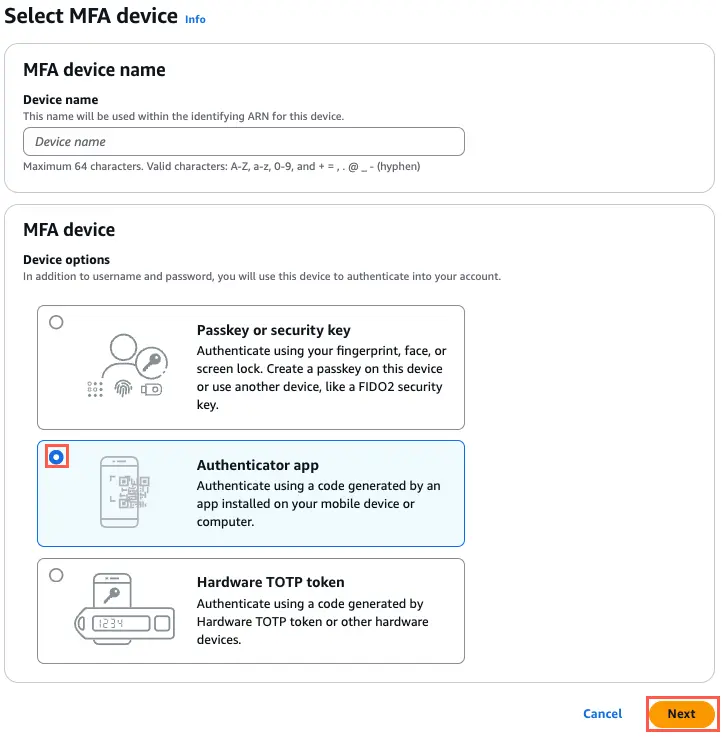
   *來源: [AWS Docs — Set Up Your Environment, Module 2](https://docs.aws.amazon.com/hands-on/latest/setup-environment/module-two.html), 取用日期 2026-04-21*

4. 頁面顯示 QR Code 設定畫面，請依下圖步驟操作：

   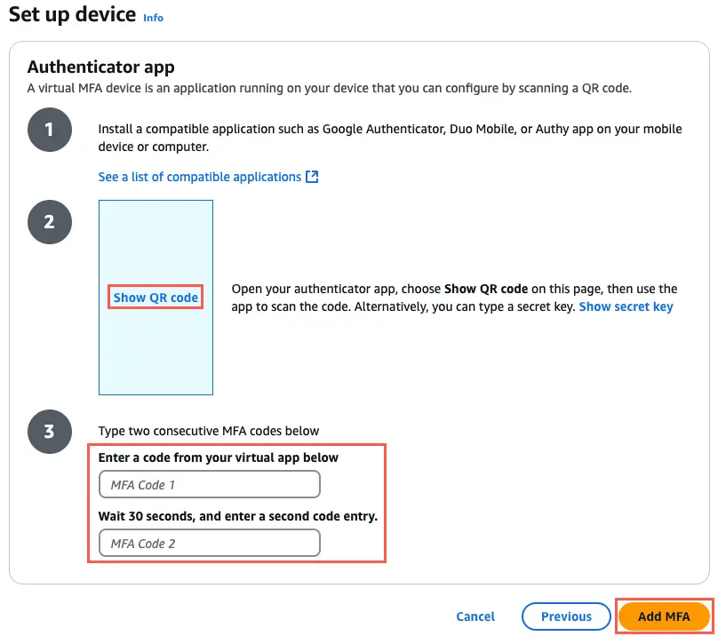
   *來源: [AWS Docs — Set Up Your Environment, Module 2](https://docs.aws.amazon.com/hands-on/latest/setup-environment/module-two.html), 取用日期 2026-04-21*

   - **步驟①**：在手機開啟 Authy 或 Google Authenticator，新增帳號
   - **步驟②**：點擊 AWS 頁面上的「Show QR code」，用手機 App 掃描 QR Code
   - **步驟③**：App 會開始顯示每 30 秒更新一次的 6 位數字碼
     - 在「MFA Code 1」填入第一組數字碼
     - 等待 30 秒後，在「MFA Code 2」填入下一組數字碼
   - 點擊「Add MFA」

5. 看到綠色成功提示「MFA device assigned」即完成：

   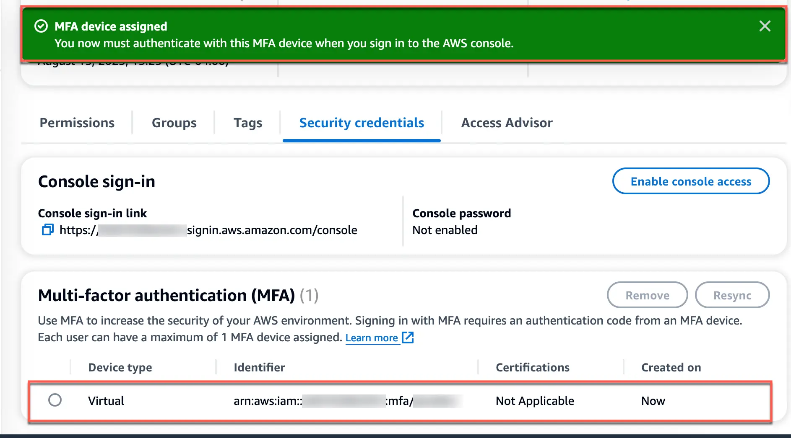
   *來源: [AWS Docs — Set Up Your Environment, Module 2](https://docs.aws.amazon.com/hands-on/latest/setup-environment/module-two.html), 取用日期 2026-04-21*

---

## 完成後請提供以下資訊 / Please Send Us

完成所有步驟後，麻煩您把以下資訊用安全方式傳給我們，收到後我們就可以開始幫您部署系統：

- **AWS Account ID（12 位數字）**
  - 取得方式：登入 Console → 點右上角帳號名稱 → 下拉選單中可看到「Account ID」
  - 格式範例：`123456789012`

> ⛔ **請不要傳送**：Root 帳號的 email 地址、密碼、MFA 設定資料。我們只需要 Account ID 即可。

**建議的安全傳遞方式**（任一即可）：
- 1Password 共享連結（若您有帳號）
- Bitwarden 共享
- ProtonMail 加密信件
- 若不確定如何安全傳送，來信告訴我們，**我們會提供 1Password 共享連結讓您填入**

📧 **聯絡信箱**：lifetreemastery@gmail.com

---

## 操作確認清單 / Checklist

完成後，歡迎逐項確認：

- [ ] 已從 `aws.amazon.com` 進入（網址無 `.cn`）
- [ ] 已完成 Email 驗證（收到驗證碼並輸入）
- [ ] 已設定 Root 帳號密碼並使用密碼管理器儲存
- [ ] 已填寫聯絡資訊與地址
- [ ] 已綁定信用卡（$1 USD 驗證扣款正常）
- [ ] 已完成手機 SMS 身份驗證
- [ ] 已選擇「Basic support - Free」方案
- [ ] 已成功登入 AWS Console
- [ ] 已確認並記錄 Account ID（12 位數）
- [ ] 已選擇並記錄使用的 Region（建議 ap-northeast-1 東京）
- [ ] 已在手機安裝 Authy 或 Google Authenticator
- [ ] 已啟用 Root 帳號 MFA（看到綠色「MFA device assigned」成功訊息）
- [ ] 已將 AWS Account ID 透過安全管道傳給我們

---

## 常見問題 / FAQ

**Q：信用卡一直刷不過怎麼辦？**
A：請確認信用卡已開通「境外交易」與「網路交易」功能，可聯絡發卡銀行開通後再試。部分預付卡（禮品卡/儲值卡）不支援，建議改用一般實體 VISA 或 Mastercard。

**Q：不小心進入中國區（.cn）了怎麼辦？**
A：完全沒關係，直接關閉視窗，重新輸入 `https://aws.amazon.com` 進入即可，不會產生任何費用或帳號問題。

**Q：收不到 Email 驗證碼？**
A：請先檢查垃圾信件夾（Spam / Junk）。等待 5 分鐘後可點「Resend email」重新寄送。若仍未收到，請確認 email 地址是否輸入正確。

**Q：$1 USD 扣款一直沒退？**
A：通常 3〜5 個工作天退還。若超過 7 天未退，可聯絡 AWS Support 或信用卡發卡銀行確認。

**Q：沒有 Authenticator App，可以跳過 MFA 嗎？**
A：技術上可以暫時跳過，但**強烈不建議**。Root 帳號沒有 MFA 等同將所有 AWS 資源暴露於風險中。Authy 可免費從 App Store 或 Google Play 下載，設定只需要 3 分鐘，非常值得！

**Q：不懂某個英文按鈕在哪裡怎麼辦？**
A：直接截圖寄給我們（lifetreemastery@gmail.com），我們立刻告訴您要點哪裡，不用擔心。

---

## 遇到問題請聯絡我們 / If Something Goes Wrong

📧 **lifetreemastery@gmail.com**

來信時若能附上畫面截圖（包含完整網址列），我們能更快協助您，通常當天回覆。

---

再次衷心感謝您協助我們完成這個步驟！帳號設定好之後，接下來的系統部署工作我們會全程處理，不會再麻煩您了。
