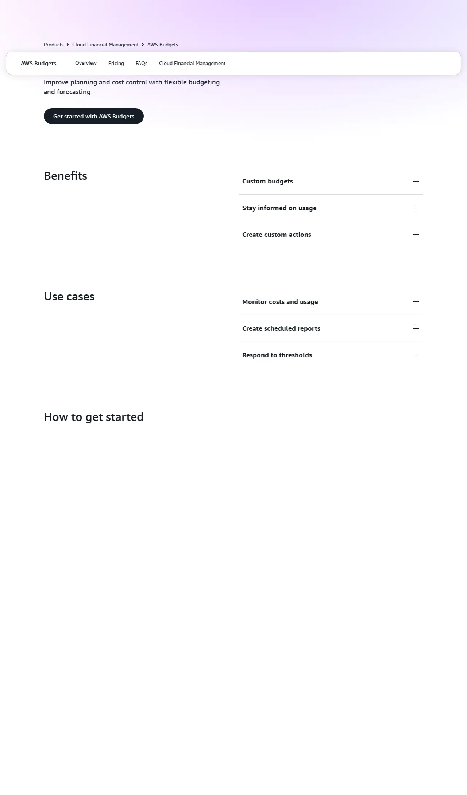
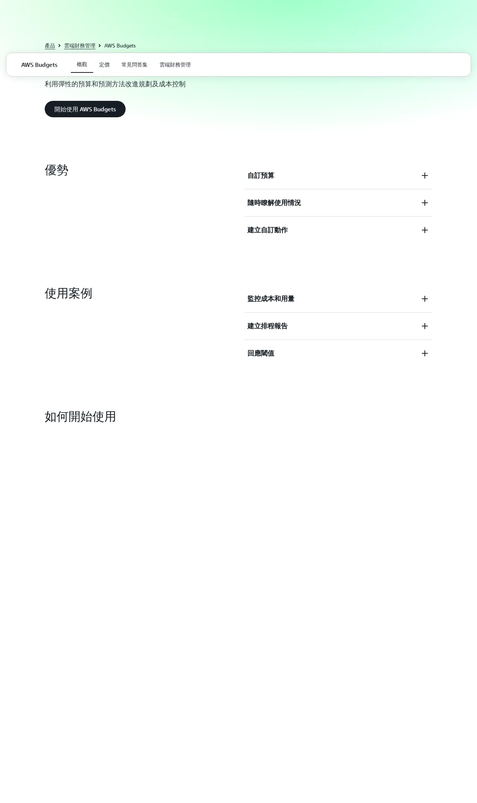
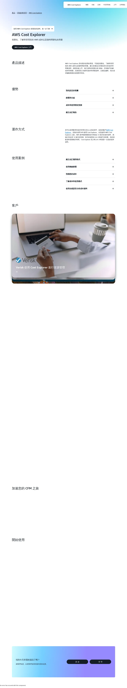

# 03 - 帳單告警與成本控管 / Billing Alerts & Cost Control

> ⚠️ **重要警告 / Critical Warning**
> 本教學僅適用 AWS Global(`aws.amazon.com`)。
> 若註冊頁出現「中國區 / 由光環新網或西雲營運 / Sinnet / NWCD」字樣,請立即關閉重來。
> This guide applies to AWS Global only. Close and restart if you see "China region / operated by Sinnet or NWCD".

---

## 為何這一步不能跳過 / Why This Step Matters

AWS 按用量計費,設定錯誤可能讓帳單暴增。以下是一個真實案例:

> 一位工程師測試 AI 訓練,選了 `p3.8xlarge`(每小時 USD $12.24),忘記關掉執行個體。
> 一個月後帳單超過 **USD $8,800**。AWS 不會自動停用,也不退款。

**帳單告警是最後一道防線**。設定完成後,花費達到門檻時您會收到 email,可以即時止損。

---

## 預估 / Estimate

- 時間 (Time):約 15 分鐘
- 費用 (Cost):免費(AWS Budgets 前 2 個預算免費;Cost Explorer 免費啟用)
- 需準備 (Prerequisites):
  - 已完成 01 帳號註冊(有可登入的 AWS 帳號)
  - 收 email 的信箱(接收告警通知)

---

## 名詞快查 / Glossary

| 中文 | English | 說明 |
|------|---------|------|
| 帳單 | Billing | AWS 向您收費的金額明細 |
| 預算 | Budget | 您設定的每月花費上限,超過時發通知 |
| 成本探索工具 | Cost Explorer | 圖形化顯示每日、每月費用趨勢 |
| 免費方案 | Free Tier | AWS 新帳號首年免費的用量額度 |
| 告警門檻 | Alert threshold | 費用達到幾 % 時觸發通知 |
| Root 帳號 | Root account | 註冊時建立的主帳號,擁有最高權限 |

---

## 操作步驟 / Steps

### 步驟 1:登入 AWS 主控台 (Step 1: Sign in to AWS Console)

1. 開啟瀏覽器,前往 `https://aws.amazon.com`
2. 點擊右上角「登入主控台 (Sign in to the Console)」
3. 輸入您的 Root 帳號 email 與密碼
4. 完成 MFA 驗證(如已啟用)

> 💡 確認網址列顯示 `console.aws.amazon.com`,**不含** `.cn`

---

### 步驟 2:前往 Budgets 建立預算 (Step 2: Navigate to Budgets)

1. 登入後,點擊頁面右上角的帳號名稱
2. 下拉選單選擇「帳單與成本管理 (Billing and Cost Management)」

   
   

3. 在左側選單找到「Budgets」,點擊進入
4. 點擊右上角「建立預算 (Create budget)」

   
   

---

### 步驟 3:設定預算類型與金額 (Step 3: Configure Budget Type & Amount)

1. 預算類型選擇「成本預算 (Cost budget)」— **不要**選 Usage 或 Savings Plans
2. 點擊「下一步 (Next)」
3. 填寫預算設定:
   - 預算名稱 (Budget name):`Monthly-Cost-Alert`(自訂即可)
   - 期間 (Period):選「每月 (Monthly)」
   - 預算金額 (Budgeted amount):輸入 `50`(USD $50,可依實際需求調整)
   - 貨幣預設為 USD,保持不變

   
   

4. 點擊「下一步 (Next)」

---

### 步驟 4:設定告警門檻 (Step 4: Set Alert Thresholds)

建議設定 **三個**門檻,分別在 50%、80%、100% 時告警:

**第一個告警(50%)**
1. 點擊「新增告警門檻 (Add alert threshold)」
2. 門檻類型選「實際費用 (Actual)」
3. 觸發條件:選「預算的 % (% of budget amount)」,填入 `50`
4. 告警收件人 (Email recipients):填入您的 email,例如 `yourname@company.com`
5. 點擊「新增 (Add)」

**重複上述步驟**,分別建立:
- 80% 實際費用告警
- 100% 實際費用告警

   
   

6. 三個門檻都設定完後,點擊「下一步 (Next)」

---

### 步驟 5:確認並建立預算 (Step 5: Confirm & Create Budget)

1. 檢視摘要頁面,確認:
   - 預算金額:USD $50 / 月
   - 告警:50% / 80% / 100%
   - 收件 email 正確
2. 點擊「建立預算 (Create budget)」

   
   

3. 畫面顯示「預算已建立 (Budget created)」表示成功

---

### 步驟 6:啟用 Cost Explorer (Step 6: Enable Cost Explorer)

Cost Explorer 讓您用圖表看到每日、每月的花費趨勢。首次使用需手動啟用。

**AWS Budgets 產品頁(參考):**

**AWS Cost Explorer 產品頁(參考):**

操作步驟:
1. 在左側選單點擊「Cost Explorer」
2. 若尚未啟用,頁面會顯示啟用按鈕
3. 點擊「啟用 Cost Explorer (Enable Cost Explorer)」
4. 等待約 24 小時,歷史數據才會完整顯示(正常現象)

   
   

---

### 步驟 7:啟用免費方案使用告警 (Step 7: Enable Free Tier Usage Alerts)

1. 在左側選單點擊「帳單偏好設定 (Billing preferences)」
2. 找到「免費方案使用告警 (Free Tier usage alerts)」
3. 勾選「接收免費方案告警 email (Receive Free Tier usage alerts)」
4. 確認 email 地址正確
5. 點擊「更新 (Update)」儲存

   
   

---

## 完成後請回報 / Deliverables to Send Us

操作完成後,請截圖以下畫面,透過安全管道(1Password / Bitwarden / ProtonMail)傳給我們:

1. **Budgets 建立成功頁面**截圖(顯示預算名稱與金額)
2. **告警 email**截圖(AWS 會在建立後發送測試通知;若未收到,請在 Budgets 頁面手動觸發)
3. 確認您的**收告警 email 地址**

**請勿**透過 LINE、Slack 明文、或普通 email 傳送帳號密碼。截圖本身不含敏感資訊,可正常傳送。

---

## 檢核清單 / Checklist

助理操作完後,逐項打勾,將本清單截圖回傳:

- [ ] 已確認使用 `aws.amazon.com`(網址列無 `.cn`)
- [ ] 已建立月預算 USD $50(或自訂金額)Cost budget
- [ ] 已設定 50% 告警,收件 email 正確
- [ ] 已設定 80% 告警,收件 email 正確
- [ ] 已設定 100% 告警,收件 email 正確
- [ ] 已成功建立預算(畫面顯示「Budget created」)
- [ ] 已啟用 Cost Explorer
- [ ] 已勾選 Free Tier usage alerts
- [ ] 已將告警 email 截圖傳給我方

---

## 常見問題 / FAQ

**Q: 設 USD $50 會不會真的扣款?**
A: 不會。預算只是「監控門檻」,達到後發 email 通知,**不會自動停用服務或扣款**。您仍需手動處理。

**Q: 我沒收到測試 email,是設定錯了嗎?**
A: 請先檢查垃圾郵件夾。AWS 告警 email 寄件人為 `no-reply@budgets.amazonaws.com`,部分郵件系統會過濾。確認 email 地址無誤後,可在 Budgets 頁面重新觸發。

**Q: Cost Explorer 開啟後為什麼沒有數據?**
A: 首次啟用後需等待最多 24 小時,AWS 才會匯入歷史費用數據。這是正常現象。

**Q: 免費方案使用告警在哪裡設定?**
A: 帳單主控台 → 左側選單「帳單偏好設定 (Billing preferences)」→ 找到「Free Tier usage alerts」區塊。

**Q: 我已超出免費方案額度但費用很小,需要擔心嗎?**
A: 少量費用(如每月 USD $1 以下)通常是 EC2 或 S3 的少量使用。建議設定告警後持續觀察,並確認沒有意外啟動的資源。

**Q: 可以設定多個預算嗎?**
A: 可以。AWS Budgets 前 2 個免費,超過 2 個每個 USD $0.02/天。建議新手先建 1 個月預算告警即可。

---

## 出問題時 / If Something Goes Wrong

請聯絡:lifetreemastery@gmail.com

回信時請附上:
- 錯誤訊息截圖
- 您操作到哪一步
- 您的 AWS 帳號 email(不要附密碼)

---

## 待補截圖 / Placeholder Screenshots

以下為 Console 內頁截圖,需登入操作後補充:

| Placeholder 檔名 | 對應步驟 | 說明 |
|---|---|---|
| `placeholder_03_billing_menu_zh.webp` | 步驟 2 | 帳號下拉選單中文版 |
| `placeholder_03_billing_menu_en.webp` | 步驟 2 | Account dropdown menu 英文版 |
| `placeholder_03_budgets_console_zh.webp` | 步驟 2 | Budgets 主控台頁面中文版 |
| `placeholder_03_budgets_console_en.webp` | 步驟 2 | Budgets landing page 英文版 |
| `placeholder_03_budget_config_zh.webp` | 步驟 3 | Cost Budget 設定頁中文版 |
| `placeholder_03_budget_config_en.webp` | 步驟 3 | Cost Budget config page 英文版 |
| `placeholder_03_alert_threshold_zh.webp` | 步驟 4 | 告警門檻設定頁中文版 |
| `placeholder_03_alert_threshold_en.webp` | 步驟 4 | Alert threshold setup 英文版 |
| `placeholder_03_budget_confirm_zh.webp` | 步驟 5 | 預算建立確認頁中文版 |
| `placeholder_03_budget_confirm_en.webp` | 步驟 5 | Budget creation confirm 英文版 |
| `placeholder_03_cost_explorer_enable_zh.webp` | 步驟 6 | 啟用 Cost Explorer 頁面中文版 |
| `placeholder_03_cost_explorer_enable_en.webp` | 步驟 6 | Enable Cost Explorer 英文版 |
| `placeholder_03_freetier_alert_zh.webp` | 步驟 7 | Free Tier 告警設定中文版 |
| `placeholder_03_freetier_alert_en.webp` | 步驟 7 | Free Tier alert setting 英文版 |
