# 03 - 帳單告警與成本控管 / Billing Alerts & Cost Control

您好 {{客戶稱呼}},感謝您協助我們設定 AWS 環境!這一步是幫您的帳戶設定「花費超過門檻就自動發 email 通知」的功能,只需要約 15 分鐘,設定完後就能安心讓系統在背後運作,不用擔心費用失控。

> 💡 **貼心提醒**:截圖可能因 AWS 介面更新略有差異,以實際畫面為準。若找不到某個按鈕,來信附上截圖,我們立刻協助。

> ⚠️ **重要:請勿使用 AWS 中國區**
> 請確認網址列為 `console.aws.amazon.com`(無 `.cn`)。若頁面出現「中國區 / 光環新網 / 西雲 / Sinnet / NWCD」字樣,請關閉視窗從 `https://aws.amazon.com` 重新進入。
> (中國區是完全獨立的服務系統,與我們要部署的環境不相容。)

---

## 預估 / Estimate

- **時間**:約 15 分鐘
- **費用**:完全免費(AWS Budgets 每帳號前 2 個預算不收費;Cost Explorer 啟用也免費)
- **需準備**:
  - 已完成第 01 篇的 AWS 帳號(能登入即可)
  - 接收告警通知用的 email 信箱

---

## 名詞解說 / Glossary

| 名詞 | 說明 |
|------|------|
| Billing(帳單) | AWS 向您收費的金額明細,就像電話帳單一樣 |
| Budgets(預算) | 您自己設定的每月花費上限;超過後 AWS 發 email 給您,**不會自動停用服務或扣款** |
| 告警門檻 (Alert threshold) | 費用達到預算的幾 % 時觸發通知(例如 80% 代表快到上限了) |
| Cost Explorer | 用圖表顯示每日、每月費用走勢,讓您一眼看出花在哪 |
| Free Tier(免費方案) | 新帳號頭 12 個月部分服務的免費額度;快用完時 AWS 可以發通知 |
| Root 帳號 | 您在第 01 篇建立的主帳號,這一篇操作需要以 Root 登入 |

---

## 為何這一步不可跳過 / Why This Matters

AWS 按用量計費——資源用了多少算多少。若有服務設定錯誤或忘記關閉,帳單可能在不知情的情況下累積。**帳單告警是最後一道防線**:費用一達到您設的門檻,就立刻發 email 給您,讓您有機會及時處理。

---

## 操作步驟 / Steps

### 步驟 1:登入 AWS 主控台 (Step 1: Sign in to the Console)

1. 開啟瀏覽器,前往 `https://aws.amazon.com`,點擊右上角「登入主控台 (Sign in to the Console)」
2. 選擇「Root 使用者 (Root user)」,輸入您在第 01 篇建立的 email 與密碼
3. 完成 MFA 驗證(若已啟用)
4. 登入後會看到 AWS 主控台首頁,如下圖所示

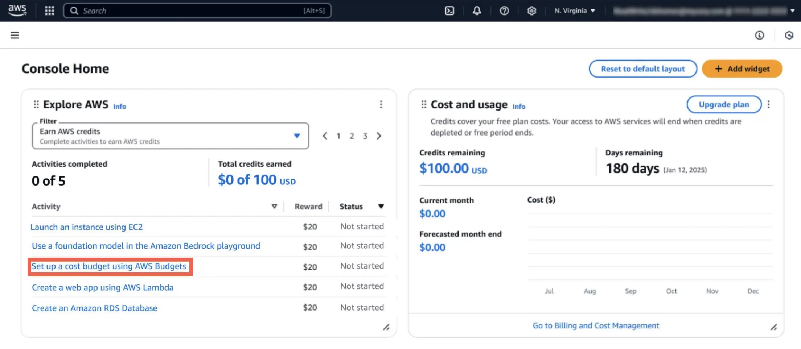
*來源: [AWS Hands-on — Control Your Costs with AWS Budgets](https://docs.aws.amazon.com/hands-on/latest/control-your-costs-free-tier-budgets/control-your-costs-free-tier-budgets.html), 取用日期 2026-04-21*

> 💡 確認網址列顯示 `console.aws.amazon.com`,不含 `.cn`

---

### 步驟 2:前往 Budgets(預算)頁面 (Step 2: Navigate to Budgets)

1. 在主控台頁面右上角,點擊您的**帳號名稱**
2. 從下拉選單選擇「帳單與成本管理 (Billing and Cost Management)」
3. 進入後,點擊左側選單的「Budgets」
4. 您會看到如下圖的 Budgets 首頁

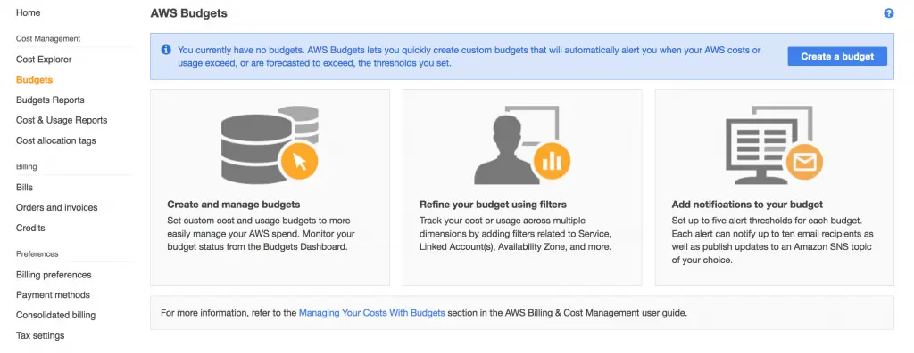
*來源: [AWS Blog — Getting Started with AWS Budgets](https://aws.amazon.com/blogs/aws-cloud-financial-management/getting-started-with-aws-budgets/), 取用日期 2026-04-21*

5. 點擊右上角橘色的「建立預算 (Create budget)」按鈕

---

### 步驟 3:選擇預算類型並填寫金額 (Step 3: Choose Budget Type & Amount)

AWS 現在提供兩種設定方式:「簡化範本 (Use a template - simplified)」與「自訂 (Customize - advanced)」。建議選**簡化範本**,最快速。

1. 預算設定方式選「使用範本 (Use a template)」
2. 範本選擇「每月花費預算 (Monthly cost budget)」
3. 您會看到如下圖的設定畫面,只需填寫三個欄位:

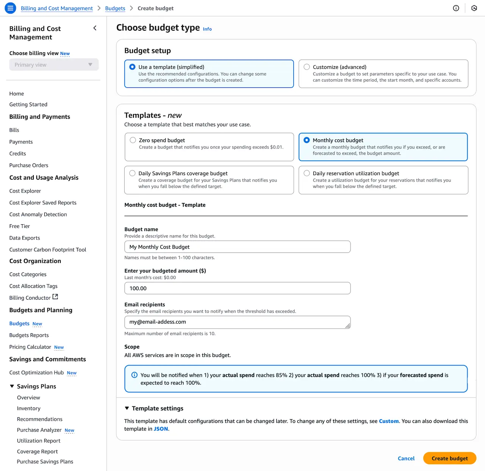
*來源: [AWS Hands-on — Control Your Costs with AWS Budgets](https://docs.aws.amazon.com/hands-on/latest/control-your-costs-free-tier-budgets/control-your-costs-free-tier-budgets.html), 取用日期 2026-04-21*

   - **預算名稱 (Budget name)**:填入 `Monthly-Cost-Alert`(可自訂,方便辨識即可)
   - **預算金額 (Enter your budgeted amount)**:填入 `50`(代表 USD $50;可依實際情況調整)
   - **收件 email (Email recipients)**:填入您的 email 地址

> 💡 **提醒**:USD $50 只是監控門檻,不會自動扣款或停用服務。建議先設一個偏低的金額,讓自己提早收到通知。

若您想要更細緻的控制(例如分別針對不同服務設告警),可選擇「自訂 (Customize)」模式——但初次使用選範本就足夠了。

以下為自訂模式的「選擇預算類型 (Select budget type)」畫面供參考:

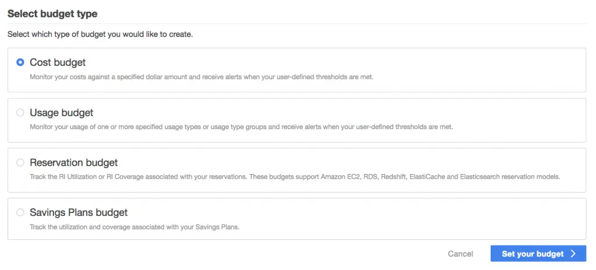
*來源: [AWS Blog — Getting Started with AWS Budgets](https://aws.amazon.com/blogs/aws-cloud-financial-management/getting-started-with-aws-budgets/), 取用日期 2026-04-21*

自訂模式下設定預算名稱與金額的畫面:

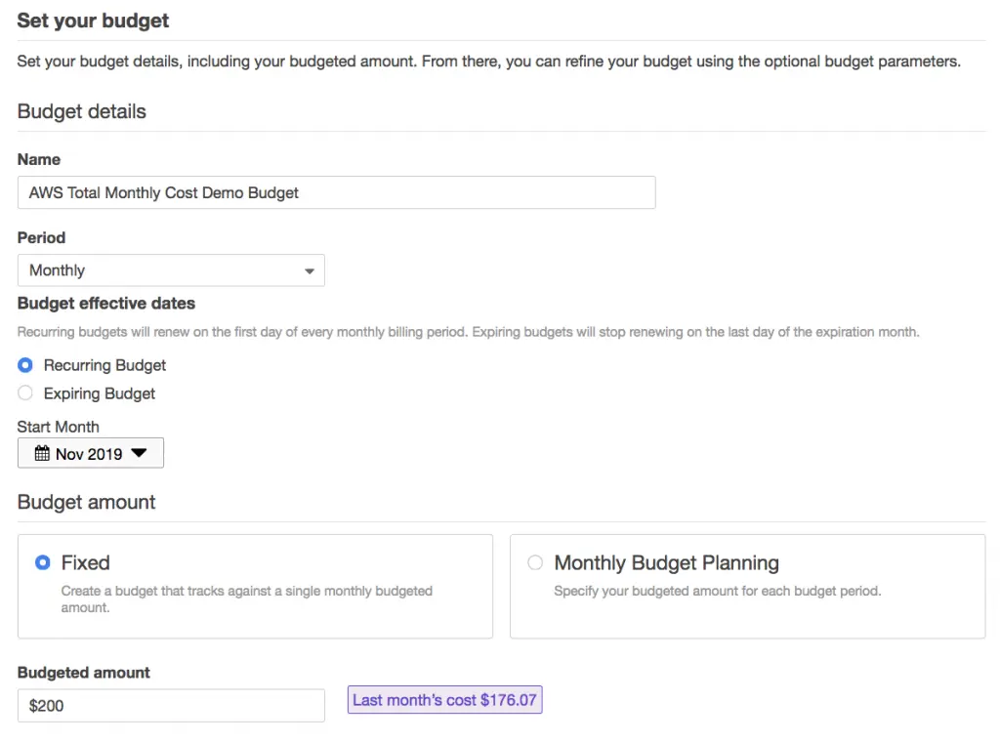
*來源: [AWS Blog — Getting Started with AWS Budgets](https://aws.amazon.com/blogs/aws-cloud-financial-management/getting-started-with-aws-budgets/), 取用日期 2026-04-21*

4. 填妥後點擊「建立預算 (Create budget)」

---

### 步驟 4:確認告警門檻已設定 (Step 4: Verify Alert Thresholds)

使用範本建立的預算預設在費用達到預算 **85%** 與 **100%** 時發通知。若您想要更早收到通知(例如 50%),可在建立後進入預算設定頁修改。

以下為告警設定的畫面(自訂模式):

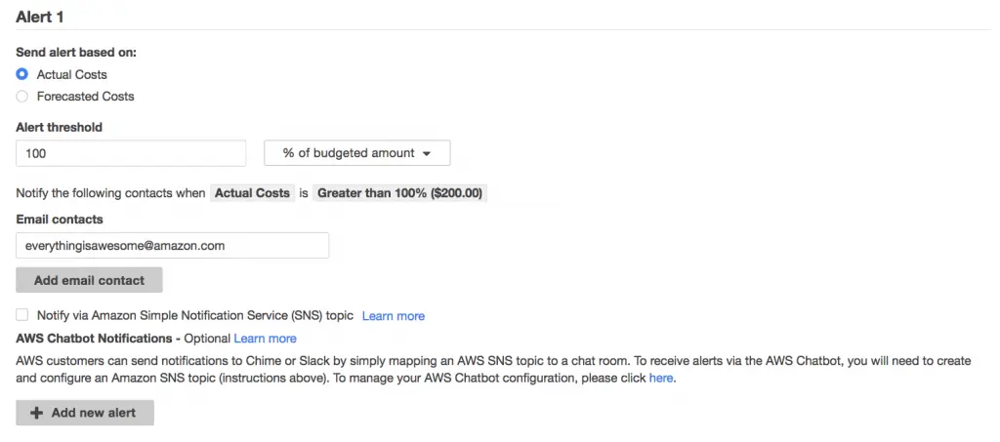
*來源: [AWS Blog — Getting Started with AWS Budgets](https://aws.amazon.com/blogs/aws-cloud-financial-management/getting-started-with-aws-budgets/), 取用日期 2026-04-21*

告警設定說明:
- **告警依據 (Send alert based on)**:選「實際費用 (Actual Costs)」
- **告警門檻 (%)**:例如填 `80` 代表當月花費達到 USD $40(80% × $50)時發 email
- **收件人 (Email contacts)**:填入您的 email

---

### 步驟 5:確認預算建立成功 (Step 5: Confirm Budget Created)

建立後,畫面會出現綠色成功訊息:

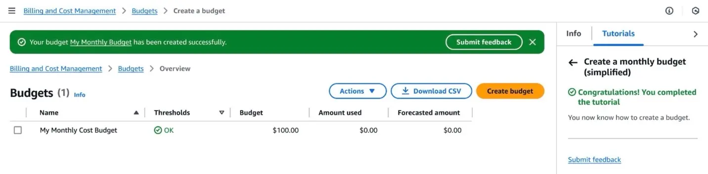
*來源: [AWS Hands-on — Control Your Costs with AWS Budgets](https://docs.aws.amazon.com/hands-on/latest/control-your-costs-free-tier-budgets/control-your-costs-free-tier-budgets.html), 取用日期 2026-04-21*

出現「**Your budget ___ has been created successfully.**」即代表完成。

此後可在 Budgets 總覽頁看到您建立的預算與目前使用狀況:

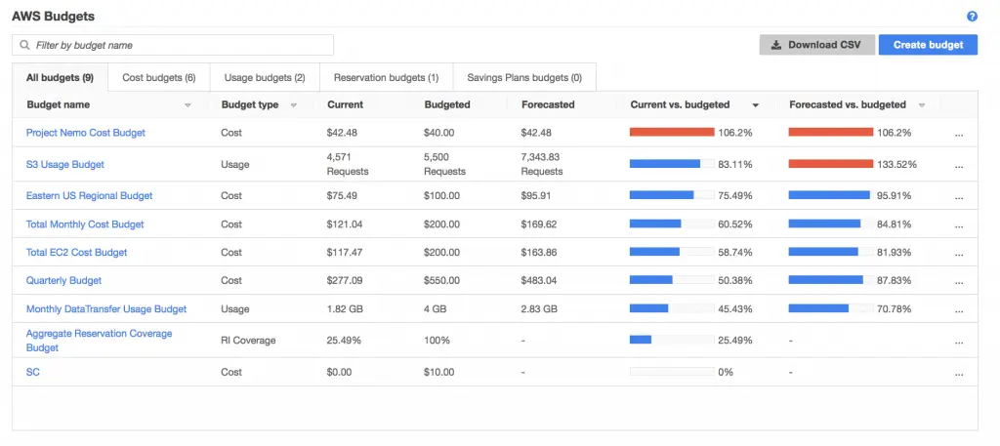
*來源: [AWS Blog — Getting Started with AWS Budgets](https://aws.amazon.com/blogs/aws-cloud-financial-management/getting-started-with-aws-budgets/), 取用日期 2026-04-21*

---

### 步驟 6:啟用 Cost Explorer(費用趨勢圖) (Step 6: Enable Cost Explorer)

Cost Explorer 是 AWS 免費提供的費用分析工具,讓您用圖表看到每天、每月的花費走勢。啟用一次即可,之後每天自動更新。

以下是 Cost Explorer 服務的簡介頁面:

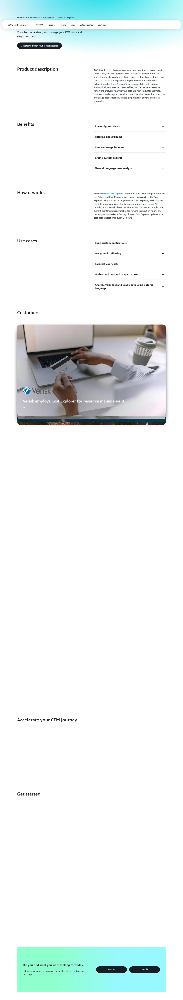
*來源: [AWS Cost Explorer 產品頁](https://aws.amazon.com/aws-cost-management/aws-cost-explorer/), 取用日期 2026-04-21*

操作步驟:
1. 在「帳單與成本管理 (Billing and Cost Management)」左側選單,找到「**Cost Explorer**」
2. 左側選單的樣子如下圖(「Cost Explorer」位於「Cost and Usage Analysis」區塊下方):

   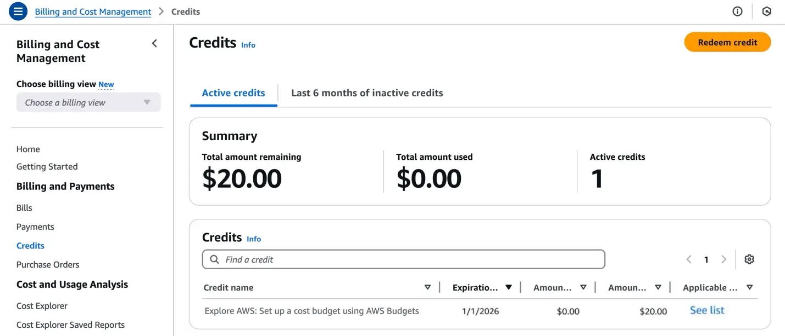
   *來源: [AWS Hands-on — Control Your Costs with AWS Budgets](https://docs.aws.amazon.com/hands-on/latest/control-your-costs-free-tier-budgets/control-your-costs-free-tier-budgets.html), 取用日期 2026-04-21*

3. 點擊「Cost Explorer」進入頁面
4. 若尚未啟用,頁面會顯示「啟用 Cost Explorer (Enable Cost Explorer)」按鈕,點擊一次即可
5. 啟用後約需 **24 小時**才會顯示完整歷史數據,這是正常現象

---

### 步驟 7:開啟 Free Tier 使用告警 (Step 7: Enable Free Tier Usage Alerts)

AWS 新帳號有 12 個月的免費方案(Free Tier),讓您在限額內免費使用部分服務。開啟告警後,一旦快要超出免費額度就會發 email 提醒您。

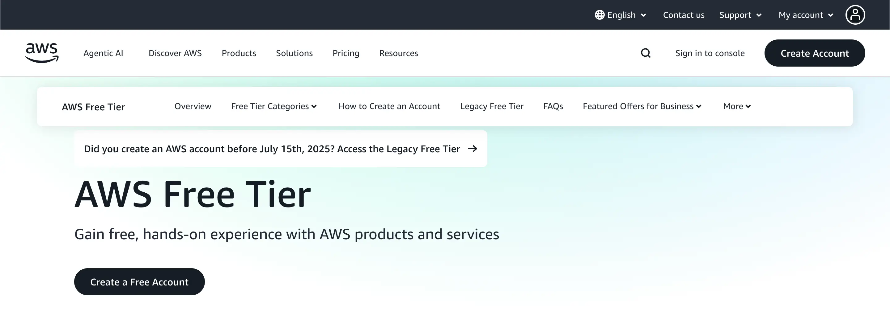
*來源: [AWS Free Tier 頁面](https://aws.amazon.com/free/), 取用日期 2026-04-21*

操作步驟:
1. 在「帳單與成本管理 (Billing and Cost Management)」左側選單,點擊「**帳單偏好設定 (Billing preferences)**」
2. 找到「**免費方案告警 (Free Tier usage alerts)**」區塊
3. 勾選「接收免費方案 email 告警 (Receive Free Tier usage alerts)」
4. 確認下方顯示的 email 地址正確
5. 點擊頁面底部「**更新 (Update)**」或「**儲存偏好設定 (Save preferences)**」

> 💡 若畫面找不到「Billing preferences」,請寄信告訴我們,我們協助您找到位置。

---

## 完成後請提供以下資訊 / Please Send Us

操作完成後,麻煩您把以下資訊傳給我們(用安全管道:1Password / Bitwarden / ProtonMail 加密信):

1. **Budgets 建立成功的截圖**:畫面顯示預算名稱與金額
2. **您設定告警通知的 email 地址**(確認我們日後若有異常可通知到您)

截圖本身不含帳號密碼等敏感資訊,可直接用一般 email 傳給我們:
📧 lifetreemastery@gmail.com

**若不確定如何安全傳送,來信告訴我們,我們會提供 1Password 共享連結。**

---

## 操作確認清單 / Checklist

完成後逐項確認,有疑問的地方來信即可:

- [ ] 已確認登入的是 `console.aws.amazon.com`(網址無 `.cn`)
- [ ] 已在 Budgets 建立至少一個月預算(Cost budget)
- [ ] 已設定預算金額(建議 USD $50 或符合您需求的金額)
- [ ] 已填入正確的告警收件 email
- [ ] 畫面已顯示「Budget created successfully」綠色訊息
- [ ] 已啟用 Cost Explorer
- [ ] 已在 Billing preferences 勾選「Free Tier usage alerts」
- [ ] 已將建立成功截圖與告警 email 傳給我們

---

## 常見問題 / FAQ

**Q:設 USD $50 的預算,AWS 會真的扣我 $50 嗎?**
A:不會。預算只是一個「監控門檻」,達到後發 email 通知您,**不會自動停用服務,也不會額外扣款**。實際費用取決於您(或我們)實際使用的資源量。

**Q:我沒收到 AWS 的告警 email,是哪裡錯了?**
A:請先查看垃圾郵件夾。AWS 告警 email 寄件人為 `no-reply@budgets.amazonaws.com`,部分郵件系統可能過濾。確認 email 地址填寫無誤後,可進入 Budgets 頁面重新確認設定。

**Q:Cost Explorer 開啟後為什麼沒有數據?**
A:這是正常現象。首次啟用後需等待最多 **24 小時**,AWS 才會匯入歷史費用數據。

**Q:Free Tier 已過 12 個月,還需要設告警嗎?**
A:仍建議保留 Budgets 告警。即使免費方案到期,告警依然有效,可持續監控月費用是否超過您的預期。

**Q:我想設多個告警(例如 50%、80%、100%)怎麼做?**
A:進入 Budgets 頁面 → 點擊您建立的預算名稱 → 點擊右上角「編輯 (Edit budget)」→ 在「Alert thresholds」區塊新增多筆告警門檻即可。

**Q:看不懂某個英文按鈕?**
A:直接截圖寄給我們(lifetreemastery@gmail.com),我們立刻告訴您要按哪裡。

---

## 遇到問題聯絡我們 / If Something Goes Wrong

📧 **lifetreemastery@gmail.com**

來信時請附上:
- 錯誤訊息或卡住步驟的截圖
- 您操作到哪一個步驟
- 您的 AWS 帳號 email(不需要密碼)

我們會儘快回覆協助您。

---

再次感謝您協助完成這部分的設定!帳單告警設定好之後,往後系統若有異常費用,您和我們都能第一時間收到通知。接下來我們會接手後續的部署工作,不會再麻煩您太多。
