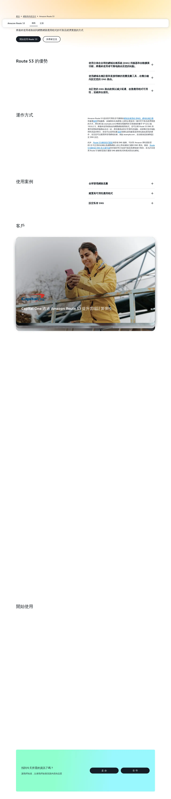
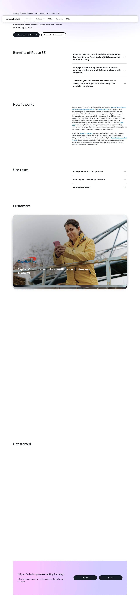
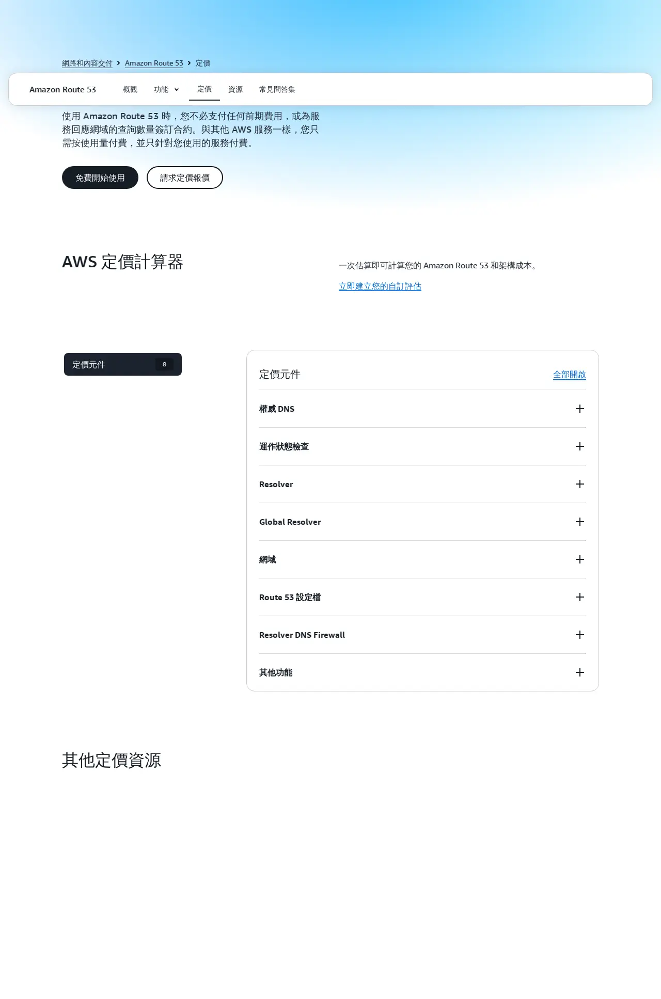
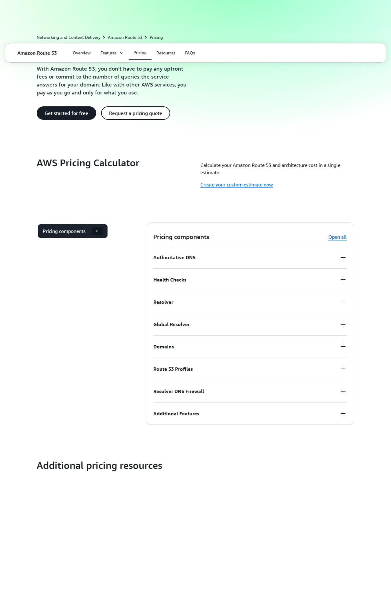

# 04 - Route 53 域名設置 / Route 53 Domain Setup

> ⚠️ **重要警告 / Critical Warning**
> 本教學僅適用 AWS Global(`aws.amazon.com`)。
> 若註冊頁出現「中國區 / 由光環新網或西雲營運 / Sinnet / NWCD」字樣,請立即關閉重來。
> This guide applies to AWS Global only. Close and restart if you see "China region / operated by Sinnet or NWCD".

---

## 預估 / Estimate

- 時間 (Time):
  - 方案 A(新域名):約 20 分鐘操作 + 1–3 天 AWS 驗證
  - 方案 B(轉入既有域名):約 30 分鐘操作 + 5–7 天轉移
  - 方案 C(僅托管 DNS):約 15 分鐘
- 費用 (Cost):
  - Hosted Zone:USD $0.50 / 月(每個 hosted zone)
  - 新域名:.com 約 USD $14 / 年;其他後綴請看定價頁
  - 轉入:費用約等於續約一年(各後綴不同)
  - DNS 查詢:前 10 億次 USD $0.40 / 百萬次(月費極低)
- 需準備 (Prerequisites):
  - 已完成 AWS 帳號註冊(見文章 01)
  - 信用卡(VISA / Master,需可付外幣)
  - 方案 B 額外需要:原 registrar 的帳號密碼 + auth code(EPP code)
  - 方案 C 額外需要:原 registrar 帳號(改 NS 用)

---

## 名詞快查 / Glossary

| 中文 | English | 說明 |
|------|---------|------|
| 域名 | Domain name | 網站地址,如 `example.com` |
| 域名註冊商 | Registrar | 出售與管理域名的機構(如 GoDaddy、Namecheap) |
| 托管區域 | Hosted Zone | Route 53 管理 DNS 記錄的容器 |
| 名稱伺服器 | Name Server (NS) | 回應 DNS 查詢的伺服器,共 4 組 |
| 轉移碼 | Auth Code / EPP Code | 域名轉移時原 registrar 給的密碼 |
| 轉入 | Transfer in | 把域名從其他 registrar 移到 Route 53 管理 |
| 自動續約 | Auto-renew | 到期前自動扣款續費 |
| 隱私保護 | Privacy Protection | 隱藏 WHOIS 聯絡資料(免費) |
| DNS 記錄 | DNS Record | 域名指向 IP 的設定(A, CNAME, MX…) |
| Hosted Zone ID | Hosted Zone ID | 每個 hosted zone 的唯一識別碼(Z開頭) |

---

## 三種方案說明 / Three Scenarios

| 方案 | 適合情況 | 費用 | 完成時間 |
|------|---------|------|---------|
| **A — 在 Route 53 註冊新域名** | 還沒有域名 | 域名年費 + $0.50/月 | 1–3 天 |
| **B — 轉入既有域名** | 已有域名在其他 registrar | 轉入費(約一年續費) + $0.50/月 | 5–7 天 |
| **C — 只托管 DNS(不轉入)** | 已有域名,只換 DNS 管理 | $0.50/月 | 15 分鐘 |

請對照自身情況選擇對應方案,按步驟操作後完成**方案結束後的通用步驟**。

---

## 方案 A:在 Route 53 註冊新域名 / Register a New Domain

### 步驟 1:進入 Route 53 Console (Step 1: Open Route 53 Console)

1. 開啟瀏覽器,登入 AWS Console:`https://console.aws.amazon.com`
2. 右上角確認區域 (Region) — **域名註冊是全球服務,不受 Region 限制**,但建議右上角切到「美國東部 (北維吉尼亞州) (US East (N. Virginia))」`us-east-1`
3. 頂部搜尋列輸入 `Route 53`,點擊「Route 53」服務

### 步驟 2:搜尋域名 (Step 2: Search for a Domain)

1. 左側選單點擊「已登錄域 (Registered domains)」
2. 點擊右上角「登錄域 (Register domain)」按鈕
3. 在搜尋欄輸入您想要的域名(只填名稱,不含 `.com`),點擊「搜尋 (Search)」

   > 例:想要 `mycompany.com` → 搜尋欄填 `mycompany`

4. 搜尋結果會列出可用域名與價格:
   - ✅ 「可用 (Available)」— 可以購買
   - ❌ 「不可用 (Unavailable)」— 已被他人註冊,換一個名稱或後綴

5. 選擇想要的域名,點擊「新增至購物車 (Add to cart)」

### 步驟 3:填寫聯絡資訊 (Step 3: Fill in Contact Information)

1. 點擊「繼續 (Continue)」進入聯絡資訊頁
2. 填寫以下欄位(**必須使用英文,與信用卡帳單地址一致**):

   | 欄位 | English Field | 說明 |
   |------|--------------|------|
   | 名字 | First name | 英文名 |
   | 姓氏 | Last name | 英文姓 |
   | 公司 | Organization | 公司英文名(無公司填個人名) |
   | 電子郵件 | Email | 聯絡用 email |
   | 電話 | Phone | 含國碼,如 `+886.912345678` |
   | 地址 1 | Address 1 | 英文地址 |
   | 城市 | City | 英文城市 |
   | 州/省 | State | 省份(台灣選 N/A 或填省名) |
   | 郵遞區號 | Postal code | 郵遞區號 |
   | 國家 | Country | 選擇國家 |

3. 「隱私保護 (Privacy protection)」確認勾選「啟用 (Enable)」— **強烈建議開啟**,可隱藏您的個人資料不被公開查詢
4. 點擊「繼續 (Continue)」

### 步驟 4:確認並付款 (Step 4: Review and Pay)

1. 「自動續約 (Auto-renew)」確認勾選「啟用 (Enable)」— 避免域名到期被他人搶走
2. 閱讀條款後勾選「我已閱讀並同意條款 (I have read and agree to the AWS Domain Name Registration Agreement)」
3. 點擊「完成訂單 (Complete Order)」
4. 系統會發送驗證 email 到您填寫的 email 地址,**請在 15 天內點擊驗證連結**,否則域名會被暫停

### 步驟 5:等待完成 (Step 5: Wait for Completion)

- 通常需要 **1–3 個工作天**
- 完成後會收到 email 通知
- 域名狀態可在「已登錄域 (Registered domains)」查看:
  - `PENDING_REGISTRATION` — 處理中
  - `ACTIVE` — ✅ 完成

> **Hosted Zone 會自動建立** — 域名註冊完成後,Route 53 會自動建立對應的 Hosted Zone,不需要手動建立。

**→ 完成後跳至本文末「通用步驟」**

---

## 方案 B:轉入既有域名 / Transfer an Existing Domain

### 步驟 1:在原 Registrar 解鎖域名 (Step 1: Unlock Domain at Current Registrar)

1. 登入您目前的域名服務商(GoDaddy、Namecheap、Google Domains 等)
2. 找到要轉出的域名,執行以下操作:
   - **關閉「轉移鎖定 / Transfer Lock」**:通常在域名設定的「安全 / Security」頁面
   - **取得「轉移授權碼 / Auth Code / EPP Code」**:通常在「轉移 / Transfer」選項下,系統會發送到您的 email

   > 不同 registrar 介面不同,若找不到請聯絡該 registrar 的客服

3. 確認域名 **距到期日 > 60 天**,否則部分 registrar 不允許轉出
4. 確認域名**已超過 60 天**自上次轉入(新域名不能立即轉出)

### 步驟 2:在 Route 53 發起轉入 (Step 2: Initiate Transfer in Route 53)

1. 登入 AWS Console → 搜尋「Route 53」
2. 左側選單點擊「已登錄域 (Registered domains)」
3. 點擊「轉移域 (Transfer domain)」

4. 輸入域名全名(含後綴,如 `mycompany.com`),點擊「搜尋 (Search)」
5. 確認域名顯示「可轉移 (Transferable)」後,點擊「新增至購物車 (Add to cart)」→「繼續 (Continue)」

### 步驟 3:輸入 Auth Code (Step 3: Enter Auth Code)

1. 在「授權碼 (Authorization code)」欄位貼上從原 registrar 取得的 EPP code
2. 點擊「繼續 (Continue)」

### 步驟 4:填寫聯絡資訊並付款 (Step 4: Contact Info and Payment)

1. 填寫聯絡資訊(同方案 A 步驟 3)
2. 確認費用(轉入費用約等於一年續費)
3. 點擊「完成訂單 (Complete Order)」

### 步驟 5:修改原 Registrar 的 NS 記錄 (Step 5: Update NS at Current Registrar)

轉移完成後,Route 53 會提供 **4 組 Name Server(NS)**。您需要到原 registrar 將域名的 NS 改為 Route 53 提供的 NS:

1. 在 Route 53 左側選單點擊「託管區域 (Hosted zones)」
2. 點擊您的域名
3. 找到「NS 記錄 (NS record)」,複製 4 組 NS 地址(格式類似 `ns-123.awsdns-45.com`)

4. 登入原 registrar → 找到域名 → 修改 Nameservers → 貼上這 4 組 NS

### 步驟 6:等待轉移完成 (Step 6: Wait for Transfer)

- 通常需要 **5–7 個工作天**
- 過程中原 registrar 可能發 email 確認授權,請盡快點擊確認
- 完成後域名狀態變為「ACTIVE」

**→ 完成後跳至本文末「通用步驟」**

---

## 方案 C:只托管 DNS(不轉入域名)/ DNS Hosting Only (No Transfer)

此方案適合:域名繼續在原 registrar 管理,只把 DNS 解析交給 Route 53 處理。

**優點**:免轉入費用、保留原 registrar 管理介面
**缺點**:域名續費仍需回原 registrar

### 步驟 1:建立 Hosted Zone (Step 1: Create Hosted Zone)

1. 登入 AWS Console → Route 53
2. 左側選單點擊「託管區域 (Hosted zones)」
3. 點擊「建立託管區域 (Create hosted zone)」

4. 填寫:
   - 「域名 (Domain name)」:填入您的域名,如 `mycompany.com`
   - 「類型 (Type)」:選「公有託管區域 (Public hosted zone)」
5. 點擊「建立託管區域 (Create hosted zone)」

### 步驟 2:複製 NS 記錄 (Step 2: Copy NS Records)

1. 進入剛建立的 Hosted Zone
2. 找到「類型 (Type)」為「NS」的記錄
3. 複製全部 4 組 NS 地址(格式類似 `ns-123.awsdns-45.com`)

### 步驟 3:到原 Registrar 修改 NS (Step 3: Update NS at Registrar)

1. 登入您的原域名服務商
2. 找到域名設定 → 名稱伺服器 (Name Servers / DNS Servers)
3. 將原本的 NS 全部**替換**為 Route 53 提供的 4 組 NS
4. 儲存設定

> DNS 生效通常需要 **24–48 小時**,全球各地快取清除後即正常解析。

**→ 完成後繼續「通用步驟」**

---

## 通用步驟:確認 Hosted Zone ID / Common Steps: Confirm Hosted Zone ID

無論使用哪個方案,完成後請確認 Hosted Zone ID:

1. Route 53 左側選單 →「託管區域 (Hosted zones)」
2. 點擊您的域名
3. 右側面板或頁面頂部可見「託管區域 ID (Hosted zone ID)」,格式為 `Z` 開頭,如 `Z1234567890ABC`
4. 記下此 ID — **這是交付給我方的重要資訊**

---

## 費用說明 / Pricing Reference

**主要費用項目**:
- **Hosted Zone**:USD $0.50 / 月(每個 hosted zone,前 25 個)
- **DNS 查詢**:前 10 億次 USD $0.40 / 百萬次
- **新域名**:.com USD ~$14 / 年;.net ~$11 / 年;詳見 [Route 53 定價頁](https://aws.amazon.com/route53/pricing/)
- **轉入域名**:費用約等於一年續費(各後綴不同)

---

## 完成後請回報 / Deliverables to Send Us

完成後請把以下資訊用安全管道(1Password / Bitwarden / ProtonMail 加密信)傳給我們:

1. **Hosted Zone ID**:格式 `Z` 開頭,如 `Z1234567890ABC`
2. **域名**:如 `mycompany.com`
3. **使用方案**:A(新域名) / B(轉入) / C(只托管 DNS)

> ⚠️ **禁止傳送方式**:LINE 明文、Slack 明文、普通 email 純文字、Google Doc
> **建議**:1Password 共享、Bitwarden 傳送、ProtonMail 加密信

---

## 檢核清單 / Checklist

助理操作完逐項打勾後回傳本文件:

- [ ] 已確認使用 `aws.amazon.com`(非 `.cn`)
- [ ] 已登入 AWS Console
- [ ] **方案 A**:域名已搜尋並加入購物車
- [ ] **方案 A**:聯絡資訊使用英文填寫,與信用卡地址一致
- [ ] **方案 A**:已啟用 Auto-renew
- [ ] **方案 A**:已啟用 Privacy protection
- [ ] **方案 A**:已完成付款
- [ ] **方案 A**:已點擊驗證 email 連結
- [ ] **方案 B**:原 registrar 已解鎖域名
- [ ] **方案 B**:已取得 Auth Code(EPP Code)
- [ ] **方案 B**:已在 Route 53 輸入 Auth Code 並完成訂單
- [ ] **方案 B**:已將原 registrar NS 更新為 Route 53 的 4 組 NS
- [ ] **方案 C**:已在 Route 53 建立 Public Hosted Zone
- [ ] **方案 C**:已將原 registrar NS 更新為 Route 53 的 4 組 NS
- [ ] 已確認 Hosted Zone 存在且狀態正常
- [ ] 已記下 Hosted Zone ID(Z 開頭)
- [ ] 已將 Hosted Zone ID + 域名 透過安全管道傳給我方

---

## 常見問題 / FAQ

**Q: 我不確定要選哪個方案?**
A: 沒有域名 → 方案 A;已有域名想全部移到 AWS → 方案 B;已有域名但只想讓 AWS 管 DNS → 方案 C。

**Q: 域名搜尋顯示「不可用」?**
A: 表示該域名已被他人註冊。嘗試換後綴(`.net`, `.io`, `.co`)或換名稱。

**Q: .com 域名一定要 USD $14 嗎?**
A: 這是 Route 53 的定價。若在其他 registrar(如 Namecheap)已有更便宜的方案,可考慮方案 C 只托管 DNS,域名繼續在原地續約。

**Q: Auto-renew 關掉會怎樣?**
A: 域名到期後若沒手動續約,會有幾天寬限期後**被釋放**,可能被他人搶走。強烈建議保持開啟。

**Q: Privacy Protection 要錢嗎?**
A: Route 53 提供的 Privacy Protection 免費,強烈建議開啟,可防止個人資料被 WHOIS 公開查詢。

**Q: 轉入後域名在 Route 53 顯示 PENDING 很久?**
A: 轉移最長可能需要 7 天。若超過 7 天仍 PENDING,請聯絡我們協助排查。

**Q: DNS 修改後多久生效?**
A: 一般 24–48 小時,取決於各地 DNS 快取 TTL。

**Q: 網址列出現 `.cn` 怎麼辦?**
A: 立即關閉,重新從 `https://aws.amazon.com` 進入,不要使用 `amazonaws.com.cn`。

---

## 待補截圖清單 / Placeholder Screenshots

以下為 Console 內頁截圖,需登入 AWS 帳號後由助理實際截圖補充:

| 檔名 | 說明 |
|------|------|
| `placeholder_04_route53_console_zh.webp` | Route 53 Console 首頁(繁中) |
| `placeholder_04_route53_console_en.webp` | Route 53 Console Home (English) |
| `placeholder_04_route53_search_result_zh.webp` | 域名搜尋結果頁(繁中) |
| `placeholder_04_route53_search_result_en.webp` | Domain Search Results (English) |
| `placeholder_04_route53_contact_zh.webp` | 聯絡資訊填寫頁(繁中) |
| `placeholder_04_route53_contact_en.webp` | Contact Info Form (English) |
| `placeholder_04_route53_order_zh.webp` | 訂單確認頁(繁中) |
| `placeholder_04_route53_order_en.webp` | Order Confirmation (English) |
| `placeholder_04_route53_transfer_btn_zh.webp` | Transfer Domain 按鈕(繁中) |
| `placeholder_04_route53_transfer_btn_en.webp` | Transfer Domain Button (English) |
| `placeholder_04_route53_authcode_zh.webp` | Auth Code 輸入頁(繁中) |
| `placeholder_04_route53_authcode_en.webp` | Auth Code Input (English) |
| `placeholder_04_route53_ns_zh.webp` | Hosted Zone NS 記錄(繁中) |
| `placeholder_04_route53_ns_en.webp` | Hosted Zone NS Records (English) |
| `placeholder_04_route53_create_hz_zh.webp` | Create Hosted Zone 頁面(繁中) |
| `placeholder_04_route53_create_hz_en.webp` | Create Hosted Zone (English) |
| `placeholder_04_route53_hz_ns_zh.webp` | NS Records 顯示(繁中) |
| `placeholder_04_route53_hz_ns_en.webp` | NS Records Display (English) |
| `placeholder_04_route53_hz_id_zh.webp` | Hosted Zone ID 位置(繁中) |
| `placeholder_04_route53_hz_id_en.webp` | Hosted Zone ID Location (English) |

---

## 出問題時 / If Something Goes Wrong

聯絡:lifetreemastery@gmail.com,附上錯誤訊息截圖與您目前停在哪個步驟。
