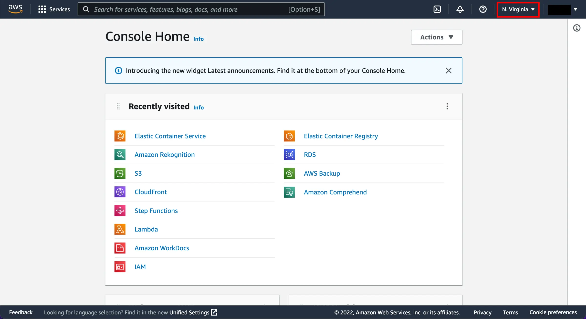
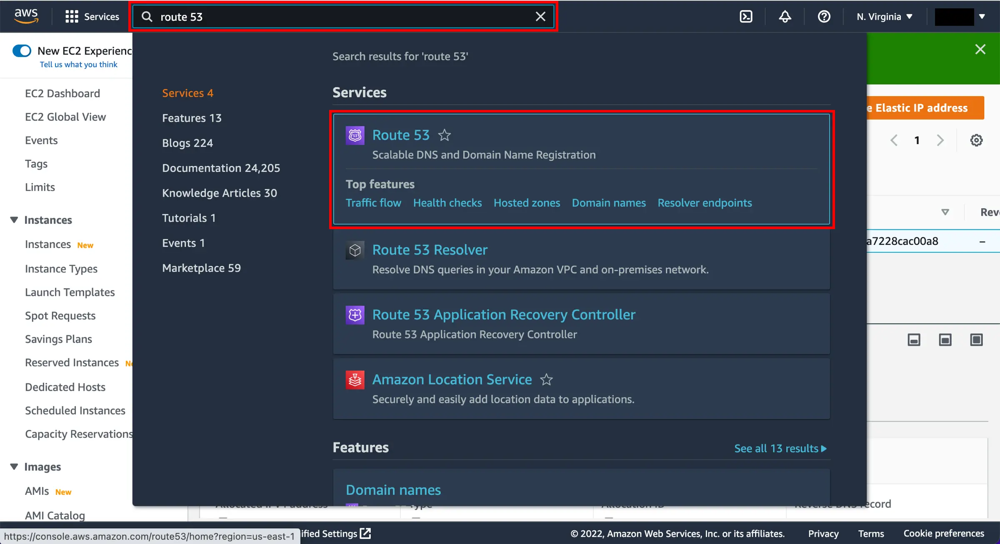
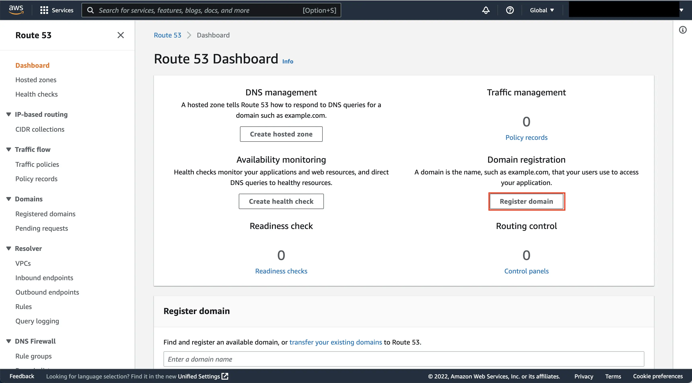
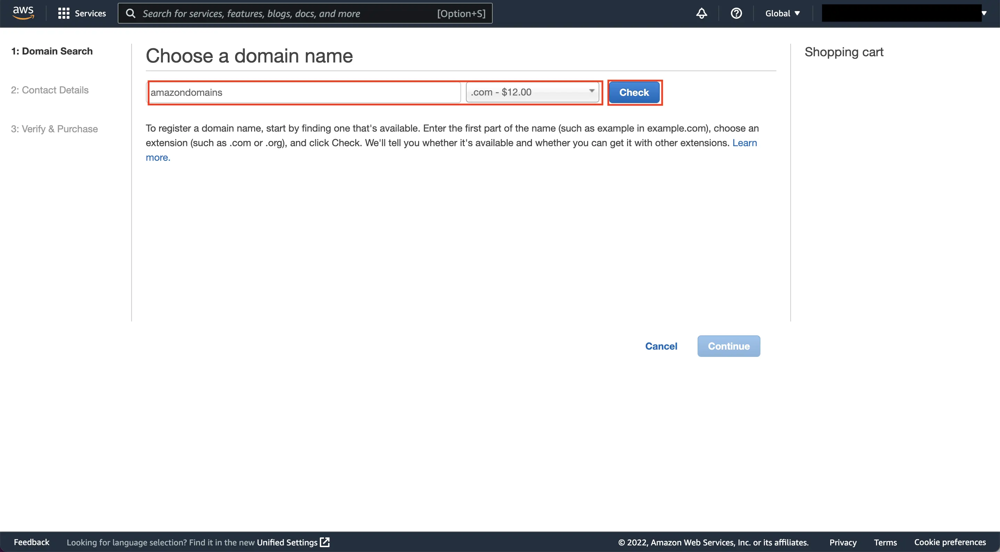
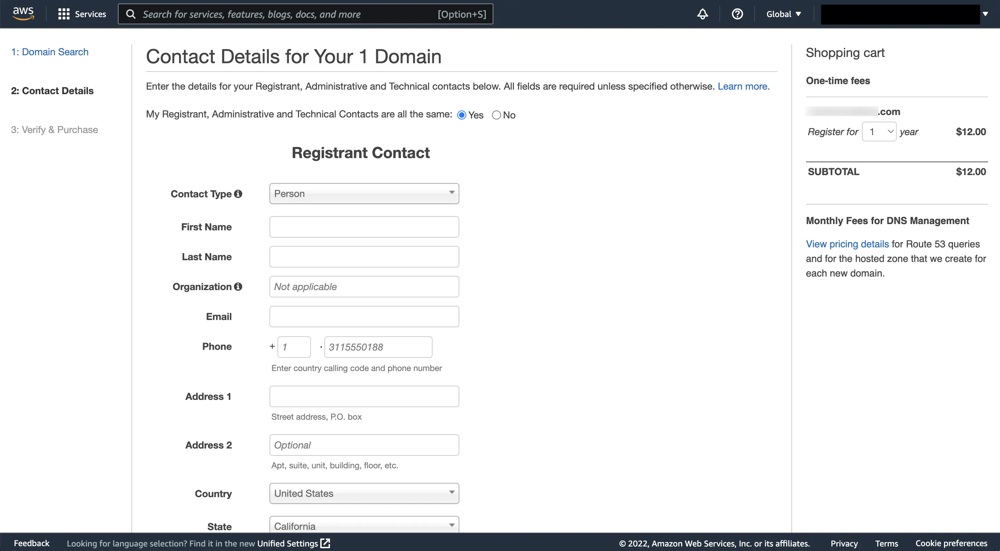
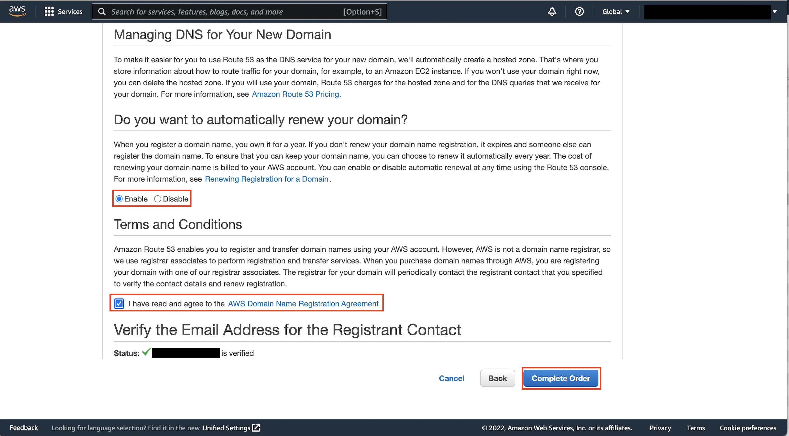
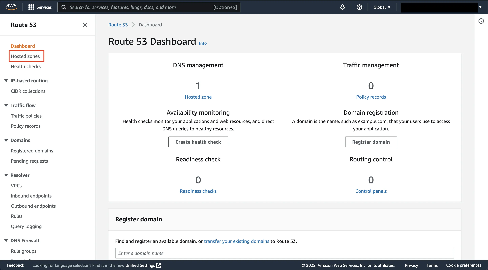
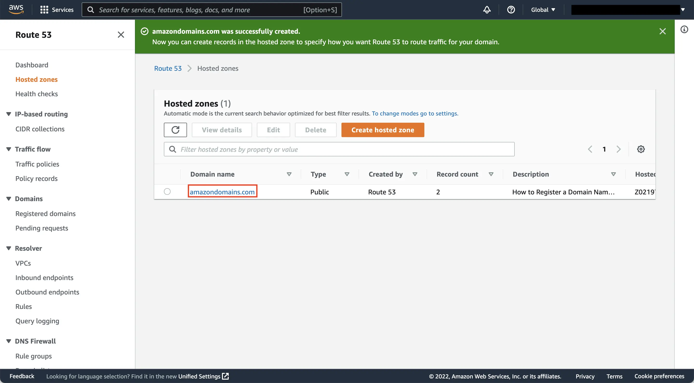
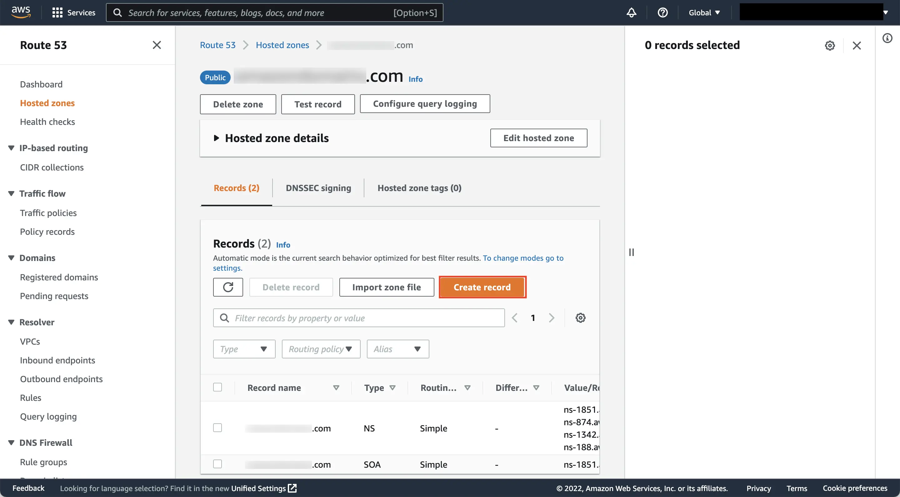

# 04 - Route 53 域名設置 / Route 53 Domain Setup

您好 {{客戶稱呼}},感謝您協助我們設定 AWS 的域名服務!這部分讓系統有正式的網址,是讓外部可以連線的關鍵步驟。以下說明有三種選擇方案,照您目前的情況擇一操作即可。遇到任何不清楚的地方,隨時來信,我們立刻協助。

> 💡 **貼心提醒**:截圖可能因 AWS 介面更新略有差異,以實際畫面為準。若畫面找不到按鈕,請寄信告訴我們,我們立刻協助。

> ⚠️ **重要:請勿使用 AWS 中國區**
> 請確認使用 `aws.amazon.com` 登入。若頁面出現「中國區 / 光環新網 / 西雲 / Sinnet / NWCD」字樣,請立即關閉視窗,重新從 `https://aws.amazon.com` 進入。
> (中國區是完全獨立的服務,與我們要架的系統不相容。)

---

## 預估 / Estimate

| | 方案 A — 在 AWS 註冊新域名 | 方案 B — 從其他服務商轉入 | 方案 C — 只把 DNS 交給 AWS |
|---|---|---|---|
| **操作時間** | 約 20 分鐘 | 約 30 分鐘 | 約 15 分鐘 |
| **等待時間** | 1–3 個工作天 | 5–7 個工作天 | 24–48 小時 |
| **費用** | 域名年費(`.com` 約 USD $14)+$0.50/月 | 轉入費(約等於一年續費)+$0.50/月 | $0.50/月(域名年費繼續在原服務商繳) |

- **需準備**:
  - 已完成 AWS 帳號註冊(見文章 01)
  - 信用卡(VISA / Master / JCB,需可付美元)
  - 方案 B 額外需要:原域名服務商帳號密碼 + 轉移授權碼(Auth Code / EPP Code)
  - 方案 C 額外需要:原域名服務商帳號(用來修改 DNS 設定)

---

## 名詞解說 / Glossary

| 名詞 | 說明 |
|------|------|
| **域名 (Domain name)** | 網站地址,例如 `example.com`。就像店面招牌,讓客人找得到您 |
| **Route 53** | AWS 的域名與 DNS 管理服務。Route 53 名字來自 TCP port 53(DNS 使用的通訊埠) |
| **Hosted Zone(托管區域)** | Route 53 用來存放您域名 DNS 設定的「資料夾」。可以想成一本電話簿 |
| **Name Server / NS(名稱伺服器)** | 告訴全世界「這個域名的 DNS 由誰負責」的伺服器,共 4 組 |
| **Hosted Zone ID** | 每個 Hosted Zone 的唯一識別碼,格式是 `Z` 開頭,例如 `Z1234567890ABC`。我們需要這個 ID 來設定系統 |
| **Auth Code / EPP Code(轉移授權碼)** | 域名從某服務商「轉出去」時,該服務商提供的一次性密碼 |
| **DNS 記錄** | Hosted Zone 裡的設定,告訴系統「這個網址對應到哪台伺服器的 IP」。類型有 A、CNAME、NS、SOA 等 |
| **Auto-renew(自動續約)** | 域名到期前自動扣款續費。建議開啟,否則域名到期可能被他人搶走 |
| **Privacy Protection(隱私保護)** | 隱藏您的個人資料,防止任何人透過 WHOIS 查詢到您的姓名電話。Route 53 此功能免費 |
| **Registrar(域名註冊商)** | 販售並管理域名的機構,例如 GoDaddy、Namecheap、Google Domains |

---

## 三種方案說明 / Which Scenario Applies to You?

| 方案 | 適用情況 | 建議 |
|------|---------|------|
| **A — 在 Route 53 註冊新域名** | 目前沒有任何域名 | 最簡單,一站完成 |
| **B — 把既有域名轉入 Route 53** | 已在 GoDaddy、Namecheap 等買了域名,想把管理全移到 AWS | 比較麻煩但統一管理較方便 |
| **C — 只把 DNS 托管給 Route 53** | 已有域名,但不想轉移,只需要 Route 53 管理 DNS | 操作最快,費用最低 |

不確定要選哪個?來信告訴我們您的情況,我們幫您決定。

---

## 方案 A:在 Route 53 註冊新域名 / Register a New Domain

### 步驟 1:進入 AWS Console (Step 1: Log In to AWS Console)

1. 開啟瀏覽器,前往 `https://console.aws.amazon.com` 並登入
2. 登入後會看到 Console 首頁,右上角確認 Region(區域)顯示「N. Virginia」或任意區域(域名註冊是全球服務,不受 Region 影響)

   
   *來源: [AWS Hands-on — Get a Domain](https://docs.aws.amazon.com/hands-on/latest/get-a-domain/get-a-domain.html), 取用日期 2026-04-21*

3. 頂部搜尋列輸入 `Route 53`,在搜尋結果中點擊「**Route 53**」

   
   *來源: [AWS Hands-on — Get a Domain](https://docs.aws.amazon.com/hands-on/latest/get-a-domain/get-a-domain.html), 取用日期 2026-04-21*

### 步驟 2:前往域名註冊頁 (Step 2: Go to Domain Registration)

1. 進入 Route 53 Dashboard 後,右側「**Domain registration(域名註冊)**」區域點擊「**Register domain(登錄域)**」

   
   *來源: [AWS Hands-on — Get a Domain](https://docs.aws.amazon.com/hands-on/latest/get-a-domain/get-a-domain.html), 取用日期 2026-04-21*

### 步驟 3:搜尋域名 (Step 3: Search for a Domain)

1. 在「**Choose a domain name(選擇域名)**」頁面,左方欄位輸入您想要的名稱(只需填名稱,不含 `.com`)
2. 右方下拉選擇後綴(如 `.com`),點擊「**Check(搜尋)**」

   > 例:想要 `mycompany.com` → 左欄填 `mycompany`,右欄選 `.com`

3. 搜尋結果會顯示:
   - ✅ 可用(Available)— 可以購買
   - ❌ 不可用(Unavailable)— 已被他人註冊,請換名稱或後綴

4. 確認域名可用後,點擊「**Continue(繼續)**」

   
   *來源: [AWS Hands-on — Get a Domain](https://docs.aws.amazon.com/hands-on/latest/get-a-domain/get-a-domain.html), 取用日期 2026-04-21*

### 步驟 4:填寫聯絡資訊 (Step 4: Fill in Contact Details)

1. 進入「**Contact Details for Your Domain(域名聯絡資訊)**」頁面
2. 請用**英文**填寫以下欄位(建議與信用卡帳單地址一致):

   | 欄位 | English Field | 說明 |
   |------|--------------|------|
   | 名字 | First Name | 英文名 |
   | 姓氏 | Last Name | 英文姓 |
   | 公司 | Organization | 公司英文名(無公司可填 N/A 或個人名) |
   | 電子郵件 | Email | 重要聯絡 email,AWS 驗證信會寄到這裡 |
   | 電話 | Phone | 含國碼,如 `+886.912345678` |
   | 地址 1 | Address 1 | 英文地址(街道/路名) |
   | 城市 | City | 英文城市名 |
   | 州/省 | State | 省份(台灣可選 N/A 或填 Taiwan) |
   | 郵遞區號 | Postal code | 5 碼郵遞區號 |
   | 國家 | Country | 選擇所在國家 |

3. 填完後點擊「**Continue(繼續)**」

   
   *來源: [AWS Hands-on — Get a Domain](https://docs.aws.amazon.com/hands-on/latest/get-a-domain/get-a-domain.html), 取用日期 2026-04-21*

### 步驟 5:確認並完成訂單 (Step 5: Review and Complete Order)

1. 進入「**Verify & Purchase(確認與購買)**」頁面
2. 「**Do you want to automatically renew your domain?(自動續約)**」— 確認選「**Enable(啟用)**」,避免域名到期被他人搶走
3. 「**Privacy Protection(隱私保護)**」— 若有此選項,建議開啟(免費,保護個人資料)
4. 勾選「**I have read and agree to the AWS Domain Name Registration Agreement(我已閱讀並同意條款)**」
5. 點擊右下角「**Complete Order(完成訂單)**」

   
   *來源: [AWS Hands-on — Get a Domain](https://docs.aws.amazon.com/hands-on/latest/get-a-domain/get-a-domain.html), 取用日期 2026-04-21*

### 步驟 6:驗證 Email (Step 6: Verify Your Email)

- 付款後,AWS 會發送驗證信到您填寫的 email
- **請在 15 天內點擊驗證連結**,否則域名會被暫停
- 域名通常在 **1–3 個工作天**內完成啟用,完成後會再收到 email 通知
- 可在左側「**Domains → Registered domains(已登錄域)**」確認狀態:
  - `PENDING_REGISTRATION` — 處理中
  - `ACTIVE` — ✅ 完成

> 📌 **Hosted Zone 會自動建立** — 域名完成後,Route 53 自動建立對應的 Hosted Zone,不需要手動建立。

**→ 完成後請跳至文末「通用步驟:確認 Hosted Zone ID」**

---

## 方案 B:把既有域名轉入 Route 53 / Transfer an Existing Domain

> 此方案適合:已在 GoDaddy、Namecheap、Google Domains 等服務商購買了域名,想把域名管理整合到 AWS。
> 轉入後,域名的續費、DNS 管理全部在 AWS Console 完成。

### 步驟 1:在原服務商解鎖域名 (Step 1: Unlock Domain at Current Registrar)

1. 登入您目前的域名服務商(GoDaddy / Namecheap / Google Domains / 其他)
2. 找到要轉出的域名,執行以下兩件事:

   **a. 關閉「轉移鎖定 / Transfer Lock」**
   - 通常在域名設定的「安全 (Security)」或「設定 (Settings)」頁面
   - 將「Transfer Lock」切換為「Disabled / Off」

   **b. 取得「轉移授權碼 / Auth Code / EPP Code」**
   - 通常在「轉移 (Transfer)」或「授權碼 (Auth Code)」選項下
   - 系統會寄到您的 email,或直接顯示在頁面上

   > 不同服務商介面不同。若找不到,請聯絡原服務商客服,告知「我想把域名轉出 (transfer out),需要 Auth Code 和解除 Transfer Lock」

3. 確認以下兩點,否則無法轉出:
   - 域名距到期日 **超過 60 天**
   - 域名自上次轉入後 **已超過 60 天**

### 步驟 2:在 Route 53 發起轉入 (Step 2: Initiate Transfer in Route 53)

1. 登入 AWS Console → 搜尋「Route 53」進入 Dashboard

   
   *來源: [AWS Hands-on — Get a Domain](https://docs.aws.amazon.com/hands-on/latest/get-a-domain/get-a-domain.html), 取用日期 2026-04-21*

2. 左側選單點擊「**Domains → Registered domains(已登錄域)**」
3. 點擊「**Transfer domain(轉移域)**」按鈕
4. 輸入域名全名(含後綴,如 `mycompany.com`),點擊「**Check(搜尋)**」
5. 確認域名顯示「**Transferable(可轉移)**」後,點擊「**Add to cart(加入購物車)**」→「**Continue(繼續)**」

### 步驟 3:輸入 Auth Code (Step 3: Enter Auth Code)

1. 在「**Authorization code(授權碼)**」欄位貼上從原服務商取得的 EPP Code
2. 確認「**Import name server records(匯入現有 NS 記錄)**」為「**Yes**」(保留現有 DNS 設定)
3. 點擊「**Continue(繼續)**」

### 步驟 4:填寫聯絡資訊並付款 (Step 4: Contact Info and Payment)

1. 填寫聯絡資訊(同方案 A 步驟 4 的表格)
2. 確認費用(轉入費用約等於一年續費)
3. 點擊「**Complete Order(完成訂單)**」

### 步驟 5:等待並確認轉移完成 (Step 5: Wait for Transfer to Complete)

- 轉移通常需要 **5–7 個工作天**
- 過程中原服務商可能發 email 確認授權,請盡快點擊確認
- 完成後域名狀態在「Registered domains」變為「**ACTIVE**」
- Route 53 也會自動建立對應的 Hosted Zone

**→ 完成後請跳至文末「通用步驟:確認 Hosted Zone ID」**

---

## 方案 C:只把 DNS 托管給 Route 53(不轉移域名)/ DNS Hosting Only

> 此方案適合:域名繼續在原服務商續費管理,只把 DNS 解析交給 Route 53 處理。
> 優點:免轉入費用、操作最快(15 分鐘)。
> 缺點:域名續費仍需回原服務商操作。

### 步驟 1:在 Route 53 建立 Hosted Zone (Step 1: Create Hosted Zone)

1. 登入 AWS Console → 搜尋「Route 53」
2. 左側選單點擊「**Hosted zones(託管區域)**」,或在 Dashboard 點「**Create hosted zone(建立託管區域)**」

   
   *來源: [AWS Hands-on — Get a Domain](https://docs.aws.amazon.com/hands-on/latest/get-a-domain/get-a-domain.html), 取用日期 2026-04-21*

3. 點擊右上角「**Create hosted zone(建立託管區域)**」橘色按鈕
4. 填寫:
   - 「**Domain name(域名)**」:填入您的域名,如 `mycompany.com`(不含 `http://` 或 `www.`)
   - 「**Type(類型)**」:選「**Public hosted zone(公有託管區域)**」
5. 點擊「**Create hosted zone(建立託管區域)**」

   
   *來源: [AWS Hands-on — Get a Domain](https://docs.aws.amazon.com/hands-on/latest/get-a-domain/get-a-domain.html), 取用日期 2026-04-21*

### 步驟 2:複製 NS 記錄 (Step 2: Copy the 4 NS Records)

1. 建立完成後,點擊您的域名進入 Hosted Zone 詳細頁
2. 在 Records 列表中找到「**Type: NS**」的那一筆記錄
3. 複製右側「**Value/Route traffic to**」欄位內的 **4 組 NS 地址**
   - 格式類似:`ns-123.awsdns-45.com`、`ns-456.awsdns-78.net`、`ns-789.awsdns-90.org`、`ns-012.awsdns-34.co.uk`

   
   *來源: [AWS Hands-on — Get a Domain](https://docs.aws.amazon.com/hands-on/latest/get-a-domain/get-a-domain.html), 取用日期 2026-04-21*

### 步驟 3:到原服務商修改 NS (Step 3: Update NS at Your Current Registrar)

1. 登入您的原域名服務商(GoDaddy / Namecheap 等)
2. 找到域名設定 →「**Nameservers(名稱伺服器)**」或「**DNS Servers**」
3. 將原本的 NS 全部**替換**為 Route 53 提供的 4 組 NS(每組一行)
4. 儲存設定

> ⏱️ DNS 生效通常需要 **24–48 小時**,全球快取清除後即正常解析。

**→ 完成後請繼續「通用步驟:確認 Hosted Zone ID」**

---

## 通用步驟:確認 Hosted Zone ID / Confirm Your Hosted Zone ID

無論使用哪個方案,最後請確認並記下 Hosted Zone ID:

1. Route 53 左側選單 →「**Hosted zones(託管區域)**」
2. 您會看到剛建立(或自動建立)的 Hosted Zone 列表
3. **Hosted zone ID** 欄位就是我們需要的 ID,格式為 `Z` 開頭,例如 `Z0219XXXXXX`

   
   *來源: [AWS Hands-on — Get a Domain](https://docs.aws.amazon.com/hands-on/latest/get-a-domain/get-a-domain.html), 取用日期 2026-04-21*

4. 也可以點擊域名進入詳細頁,上方「**Hosted zone details**」展開後可看到完整 Hosted Zone ID

   
   *來源: [AWS Hands-on — Get a Domain](https://docs.aws.amazon.com/hands-on/latest/get-a-domain/get-a-domain.html), 取用日期 2026-04-21*

---

## 費用參考 / Pricing Reference

*來源: [AWS Route 53 產品頁](https://aws.amazon.com/tw/route53/), 取用日期 2026-04-21*

主要費用項目:
- **Hosted Zone**:USD $0.50 / 月(每個 Hosted Zone,每月固定費用)
- **DNS 查詢**:前 10 億次每月 USD $0.40 / 百萬次(月費極低,一般用量幾乎忽略不計)
- **新域名**:`.com` 約 USD $14 / 年;`.net` 約 USD $11 / 年
- **轉入域名**:費用約等於一年續費(各後綴不同,可在 AWS 定價頁查詢)

詳細定價請參考:[Route 53 定價頁](https://aws.amazon.com/route53/pricing/)

*來源: [AWS Route 53 定價頁](https://aws.amazon.com/tw/route53/pricing/), 取用日期 2026-04-21*

---

## 完成後請提供以下資訊 / Please Send Us

完成設定後,麻煩您把以下資訊用安全方式傳給我們,收到後我們就可以幫您把 lattice-cast 系統架起來:

1. **Hosted Zone ID** — 格式 `Z` 開頭,例如 `Z1234567890ABC`
2. **域名** — 例如 `mycompany.com`
3. **使用方案** — A(新域名) / B(轉入) / C(只托管 DNS)

> ⚠️ **請使用安全管道傳送,避免資料外洩**
> - ✅ 建議:1Password 共享連結、Bitwarden Send、ProtonMail 加密信
> - ❌ 請勿:LINE 純文字、普通 email 明文、Google Doc 連結

**若不確定如何安全傳送,請來信告知,我們會提供 1Password 共享連結讓您填入。**

---

## 操作確認清單 / Checklist

完成後逐項確認,方便我們雙方對照進度:

**共用項目**
- [ ] 已確認使用 `aws.amazon.com`(非 `.cn` 結尾)
- [ ] 已登入 AWS Console
- [ ] Hosted Zone 已建立,狀態正常
- [ ] 已記下 Hosted Zone ID(Z 開頭)
- [ ] 已將 Hosted Zone ID + 域名 透過安全管道傳給我們

**方案 A — 新域名**
- [ ] 域名搜尋確認可用
- [ ] 聯絡資訊已用英文填寫
- [ ] Auto-renew 已啟用
- [ ] Privacy Protection 已啟用
- [ ] 已完成付款
- [ ] 已點擊驗證 email 連結

**方案 B — 轉入**
- [ ] 原服務商 Transfer Lock 已關閉
- [ ] 已取得 Auth Code(EPP Code)
- [ ] 已在 Route 53 輸入 Auth Code 並完成訂單
- [ ] 轉移狀態已變為 ACTIVE

**方案 C — 只托管 DNS**
- [ ] 已在 Route 53 建立 Public Hosted Zone
- [ ] 已複製 4 組 NS 地址
- [ ] 已在原服務商更新 Nameservers 為 Route 53 的 4 組 NS
- [ ] DNS 生效後可正常解析(通常 24–48 小時)

---

## 常見問題 / FAQ

**Q:我不確定要選哪個方案?**
A:沒有域名 → 方案 A;已有域名想全部移到 AWS → 方案 B;已有域名但只想讓 AWS 管 DNS → 方案 C。不確定的話來信告訴我們,我們幫您決定。

**Q:域名搜尋顯示「不可用 (Unavailable)」?**
A:表示該域名已被他人註冊。請嘗試換後綴(`.net`、`.io`、`.co`)或換名稱。

**Q:Auto-renew 關掉會怎樣?**
A:域名到期後若沒手動續約,經過幾天寬限期後域名會被釋放,可能被他人搶走。強烈建議保持開啟。

**Q:Privacy Protection 要收費嗎?**
A:Route 53 提供的 Privacy Protection 完全免費,強烈建議開啟,可防止個人姓名、電話、地址被公開查詢。

**Q:轉入後 Route 53 顯示 PENDING 很久?**
A:轉移最長可能需要 7 天,這是正常的。若超過 7 天仍在 PENDING,請來信告訴我們,我們協助排查。

**Q:修改 NS 後多久生效?**
A:一般 24–48 小時,取決於各地 DNS 快取 TTL。若 48 小時後仍無法解析,請來信告知。

**Q:信用卡刷不過怎麼辦?**
A:AWS 有時會先刷 $1 美金驗證卡片。若被銀行擋下,請聯絡發卡銀行開通境外扣款功能,或換另一張卡嘗試。

**Q:不小心進到 AWS 中國區怎麼辦?**
A:沒關係,關閉視窗重開,從 `https://aws.amazon.com` 重新進入即可,不會有任何費用。

**Q:看不懂某個英文按鈕?**
A:截圖寄給我們(lifetreemastery@gmail.com),我們立刻告訴您要按哪裡。

---

## 遇到問題聯絡我們 / If Something Goes Wrong

📧 **lifetreemastery@gmail.com**

來信時請附上畫面截圖以及您目前停在哪個步驟,我們會盡快回覆並協助您。

---

再次感謝您協助完成這部分!設定完成後,我們會接手把 lattice-cast 系統架起來,不會再打擾您進行其他操作。
