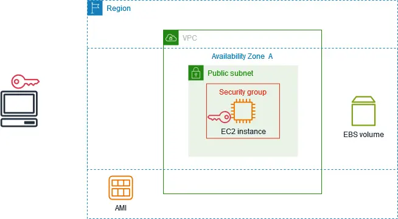
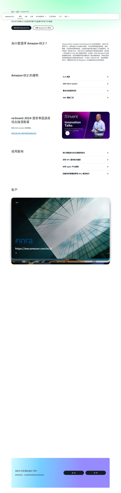
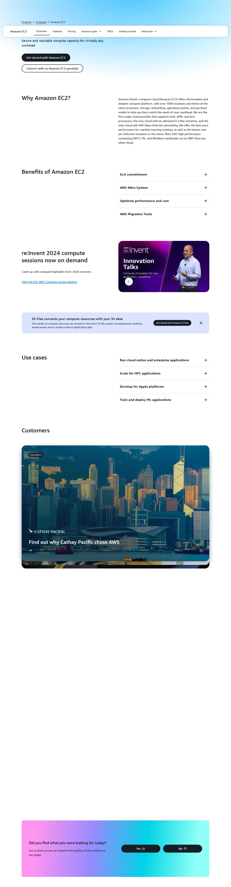
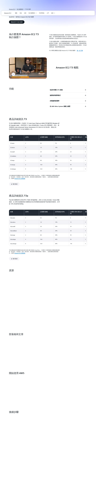
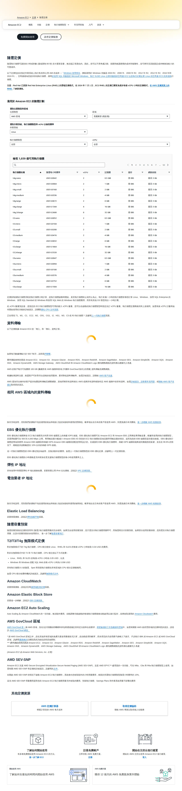
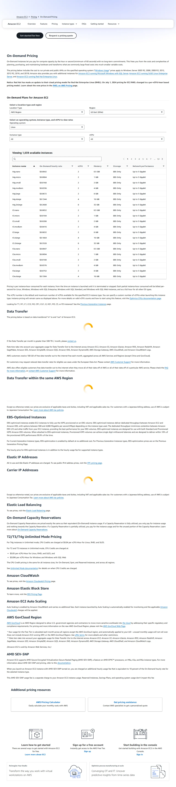

# 05 - 啟動 EC2 執行個體 / Launch an EC2 Instance

您好 {{客戶稱呼}},非常感謝您協助我們設定這台伺服器！EC2 是 AWS 上的虛擬電腦，我們的系統 lattice-cast 就會跑在上面。以下是完整的操作說明，約需 25 分鐘，遇到任何不清楚的地方都歡迎來信，我們立刻協助您。

> 💡 **貼心提醒**：截圖可能因 AWS 介面更新略有差異，以實際畫面為準。若畫面找不到按鈕，請寄信告訴我們，我們立刻協助。

> ⚠️ **重要：請勿使用 AWS 中國區**
> 請使用 `aws.amazon.com`。若頁面出現「中國區 / 光環新網 / 西雲 / Sinnet / NWCD」字樣，請關閉視窗從 `aws.amazon.com` 重新進入。
> （中國區是另一個獨立服務，與我們要的系統不相容。）

---

## 預估 / Estimate

- **時間**：約 25 分鐘
- **費用**：t3.small 約 USD $15 / 月（依實際執行時間計費；首年 750 小時免費方案可用）
- **需準備**：
  - 已完成教學 02（IAM 使用者與 Access Key 已建立）
  - 已登入 AWS Console（使用 IAM 使用者，**請勿用 Root 帳號**）
  - 瀏覽器可開啟 `https://console.aws.amazon.com`
  - 電腦可下載並儲存 `.pem` 金鑰檔（下載後無法重取，請務必備份）

---

## 名詞解說 / Glossary

| 名詞 | 說明 |
|------|------|
| EC2（Elastic Compute Cloud）| AWS 上的虛擬電腦，可以選擇規格、作業系統，就像租一台遠端主機 |
| 執行個體 (Instance) | 一台正在執行的虛擬電腦 |
| Region（區域）| AWS 機房的地理位置，就像選一個城市。我們建議選「東京 (ap-northeast-1)」，台灣連線速度最快 |
| AMI（Amazon Machine Image）| 虛擬電腦的作業系統安裝光碟，我們用 Ubuntu 22.04 LTS |
| 金鑰對 (Key Pair) | 一組數位鎖鑰，用來讓我們遠端登入伺服器。您下載後交給我們 |
| 安全群組 (Security Group) | 防火牆規則，設定哪些網路請求可以進出這台主機 |
| EBS 磁碟 (Elastic Block Store) | 虛擬硬碟，存放系統與資料 |
| gp3 | 目前最新的通用型 SSD，速度好又省錢 |
| vCPU | 虛擬處理器核心，t3.small 有 2 個，足夠一般應用 |
| 彈性 IP (Elastic IP) | 固定不變的公開 IP，讓外界能持續找到這台主機 |

---

## EC2 架構示意 / Architecture Overview

啟動完成後，您的 AWS 環境會長成下圖的樣子：


*來源：[AWS Docs — Get started with Amazon EC2](https://docs.aws.amazon.com/AWSEC2/latest/UserGuide/EC2_GetStarted.html)，取用日期 2026-04-21*

- 您的電腦（左方筆電圖示）透過金鑰對 SSH 連線到 EC2 Instance
- EC2 Instance 被安全群組（Security Group）保護，在 VPC 的公開子網路中
- EBS Volume 是這台主機的硬碟
- AMI 是建立主機時使用的作業系統映像

---

## 操作步驟 / Steps

### 步驟 1：確認 Region（選與 RDS、S3 相同的區域）(Step 1: Confirm Region)

若您已完成 RDS（教學 07）或 S3（教學 06）的設定，請確認 EC2 放在同一個 Region，可避免跨區流量費用。

1. 登入 AWS Console：`https://console.aws.amazon.com`
2. 畫面**右上角**有一個地點名稱，例如「亞太區域 (東京) Asia Pacific (Tokyo)」
3. 若需要更換，點擊該名稱，從下拉選單選擇正確的 Region

> ⚠️ **Region 非常重要**：EC2、RDS、S3 必須在同一個 Region，否則資料傳輸會產生額外費用且連線延遲增加。

---

### 步驟 2：進入 EC2 服務（Step 2: Navigate to EC2）


*來源：[Amazon EC2 產品頁（中文）](https://aws.amazon.com/tw/ec2/)，取用日期 2026-04-21*


*來源：[Amazon EC2 Product Page (English)](https://aws.amazon.com/ec2/)，取用日期 2026-04-21*

1. 在 AWS Console 頂部搜尋欄位輸入「`EC2`」
2. 點擊搜尋結果中的「**EC2**」進入服務
3. 在左側導覽列找到「**執行個體 (Instances)**」→「**執行個體 (Instances)**」
4. 點擊右上角的橘色按鈕「**啟動執行個體 (Launch instances)**」

---

### 步驟 3：填寫名稱與標籤（Step 3: Name & Tags）

1. 在「**名稱和標籤 (Name and tags)**」欄位輸入：
   ```
   lattice-cast-app
   ```
2. 標籤（選填，建議加入方便後續識別費用）：
   - Key：`Project`
   - Value：`lattice-cast`

---

### 步驟 4：選擇 AMI（作業系統）(Step 4: Choose AMI)

1. 找到「**應用程式和作業系統映像 (Application and OS Images (Amazon Machine Image))**」區塊
2. 確認已選「**快速入門 (Quick Start)**」標籤
3. 點擊「**Ubuntu**」圖示
4. 在下拉確認選取：**Ubuntu Server 22.04 LTS (HVM), SSD Volume Type**
5. 架構 (Architecture) 選「**64 位元 (x86)（64-bit (x86)）**」

> ⚠️ 請選 **22.04 LTS**，而非 24.04 或其他版本。LTS（Long Term Support）= 長期支援版本，穩定性更高，我們的系統相依於此版本。

---

### 步驟 5：選擇執行個體類型（Step 5: Choose Instance Type）


*來源：[Amazon EC2 T3 執行個體](https://aws.amazon.com/tw/ec2/instance-types/t3/)，取用日期 2026-04-21*


*來源：[Amazon EC2 T3 Instances](https://aws.amazon.com/ec2/instance-types/t3/)，取用日期 2026-04-21*

1. 在「**執行個體類型 (Instance type)**」搜尋欄位輸入「`t3.small`」
2. 選擇 **t3.small**

| 類型 | vCPU | 記憶體 (RAM) | 建議用途 |
|------|------|------------|---------|
| t3.small | 2 | 2 GB | lattice-cast 標準部署 |
| t3.medium | 2 | 4 GB | 若日後 RAM 不足可升級 |

> 💡 **費用參考**：t3.small 在東京 Region 約 USD $0.0208 / 小時，全月約 $15。

---

### 步驟 6：EC2 定價參考（Step 6: Pricing Reference）


*來源：[EC2 隨需執行個體定價（中文）](https://aws.amazon.com/tw/ec2/pricing/on-demand/)，取用日期 2026-04-21*


*來源：[EC2 On-Demand Instance Pricing (English)](https://aws.amazon.com/ec2/pricing/on-demand/)，取用日期 2026-04-21*

定價頁可確認最新 t3.small 費率。頁面上方可切換 Region 查看各地區的價格差異。

---

### 步驟 7：建立金鑰對（Step 7: Create Key Pair）

> ⚠️ **金鑰只能下載一次！** 下載後請立即存入安全位置（1Password / USB 備份）。AWS 不保留私鑰，遺失即無法 SSH 登入主機。

```
操作流程示意：

  [金鑰對（登入）區塊]
        |
        ↓
  點擊「建立新的金鑰對 (Create new key pair)」
        |
        ↓
  填寫名稱：lattice-cast-key
  類型：RSA
  格式：.pem
        |
        ↓
  點擊「建立金鑰對 (Create key pair)」
        |
        ↓
  瀏覽器自動下載 lattice-cast-key.pem  ← 請立即備份
```

1. 在「**金鑰對（登入）(Key pair (login))**」區塊，點擊「**建立新的金鑰對 (Create new key pair)**」
2. 填寫金鑰對名稱：`lattice-cast-key`
3. 金鑰對類型 (Key pair type)：選「**RSA**」
4. 私有金鑰檔案格式 (Private key file format)：選「**`.pem`**」
5. 點擊「**建立金鑰對 (Create key pair)**」— 瀏覽器會自動下載 `lattice-cast-key.pem`
6. 請立即將此 `.pem` 檔移至安全位置，稍後透過 1Password 傳給我們

---

### 步驟 8：設定網路與安全群組（Step 8: Network & Security Group）

> 安全群組就像防火牆規則：決定哪些人可以從哪個「門（Port）」進出這台主機。

1. 在「**網路設定 (Network settings)**」區塊，點擊「**編輯 (Edit)**」展開設定
2. VPC：保持預設（Default VPC）
3. 子網路 (Subnet)：保持預設
4. 自動指派公有 IP (Auto-assign public IP)：設為「**啟用 (Enable)**」
5. 防火牆（安全群組）(Firewall (security groups))：選「**建立安全群組 (Create security group)**」
6. 安全群組名稱輸入：`lattice-cast-sg`
7. 按「**新增安全群組規則 (Add security group rule)**」，依下表逐條新增：

| 類型 (Type) | 通訊協定 (Protocol) | 連接埠 (Port) | 來源 (Source) | 說明 |
|------------|-------------------|-------------|-------------|------|
| SSH | TCP | 22 | **我的 IP (My IP)** | 只允許您目前的 IP SSH 登入 |
| HTTP | TCP | 80 | Anywhere (0.0.0.0/0) | 允許所有人 HTTP 存取 |
| HTTPS | TCP | 443 | Anywhere (0.0.0.0/0) | 允許所有人 HTTPS 存取 |

> ⚠️ **SSH 來源請務必選「我的 IP (My IP)」**，不要選 Anywhere（0.0.0.0/0），否則全球任何人都可嘗試暴力破解您的主機。
>
> 📝 與 RDS 的互通設定（安全群組到安全群組的規則）會在完成 RDS 教學（07）後由我們協助您新增，現在不需要設定。

---

### 步驟 9：設定儲存（Step 9: Configure Storage）

1. 在「**設定儲存體 (Configure storage)**」區塊
2. 將預設的 8 GB 改為 **30 GB**
3. 確認儲存類型為 **gp3**（若顯示 gp2，請手動切換）

> 💡 AWS 免費方案包含每月 30 GB gp2/gp3 SSD（首年適用）。設定 30 GB 即可在免費額度內使用。

---

### 步驟 10：確認摘要並啟動（Step 10: Review & Launch）

```
右側「摘要 (Summary)」面板確認：

  執行個體數量 (Number of instances)：1
  AMI：Ubuntu Server 22.04 LTS
  執行個體類型：t3.small
  金鑰對：lattice-cast-key
        |
        ↓
  點擊橘色「啟動執行個體 (Launch instance)」按鈕
        |
        ↓
  出現「您的執行個體目前正在啟動 (Your instance is now launching)」→ 成功！
```

1. 在畫面右側「**摘要 (Summary)**」面板確認所有設定無誤
2. 點擊橘色「**啟動執行個體 (Launch instance)**」按鈕
3. 看到「**您的執行個體目前正在啟動 (Your instance is now launching)**」訊息即表示成功

---

### 步驟 11：取得執行個體資訊（Step 11: Get Instance Info）

1. 點擊「**檢視所有執行個體 (View all instances)**」
2. 等待「**執行個體狀態 (Instance state)**」變為「**執行中 (Running)**」（約 1–2 分鐘）
3. 點擊執行個體 ID（例如 `i-0abc123def456789`）進入詳細頁
4. 記錄以下資訊，稍後傳給我們：
   - **執行個體 ID (Instance ID)**
   - **公有 IPv4 位址 (Public IPv4 address)**
   - **安全群組 ID (Security group ID)**

---

## 完成後請提供以下資訊 / Please Send Us

完成後，麻煩您把以下資訊用安全方式（1Password / Bitwarden / 加密 email）傳給我們，我們收到後就可以幫您把 lattice-cast 架起來：

1. **EC2 執行個體 ID (Instance ID)**：格式如 `i-xxxxxxxxxxxxxxxxx`
2. **公有 IPv4 位址 (Public IPv4 address)**：格式如 `x.x.x.x`
3. **金鑰檔 `lattice-cast-key.pem`**（透過 1Password 共享傳送）
4. **AWS Region**：例如 `ap-northeast-1`（東京）
5. **安全群組 ID (Security Group ID)**：格式如 `sg-xxxxxxxxxxxxxxxxx`

> ⚠️ **請勿透過以下管道傳送**：純文字 email、LINE、Slack 明文、Telegram、Google Doc
> ✅ **請使用**：1Password 共享、Bitwarden、ProtonMail 加密信

**若不知道如何用加密方式傳送，來信告訴我們（lifetreemastery@gmail.com），我們提供 1Password 共享連結，引導您操作。**

---

## 操作確認清單 / Checklist

以下項目完成了請打勾，方便您和我們對照進度：

- [ ] 已使用 `aws.amazon.com`（不是 `.cn` 結尾的網址）
- [ ] Region 已確認與 RDS / S3 相同
- [ ] EC2 名稱設為 `lattice-cast-app`
- [ ] AMI 選擇 Ubuntu Server 22.04 LTS (x86_64)
- [ ] 執行個體類型選擇 t3.small
- [ ] 金鑰對類型 RSA、格式 .pem、已下載 `lattice-cast-key.pem` 並備份
- [ ] 安全群組 SSH (Port 22) 來源設為「我的 IP (My IP)」
- [ ] 安全群組 HTTP (Port 80) 與 HTTPS (Port 443) 來源設為 Anywhere
- [ ] 儲存設定為 30 GB gp3
- [ ] 執行個體狀態已顯示「執行中 (Running)」
- [ ] 已記錄 Instance ID、Public IPv4 位址、Security Group ID
- [ ] 已將上方「請提供以下資訊」透過加密管道傳給我們

---

## 常見問題 / FAQ

**Q：啟動後一直顯示「暫待 (Pending)」怎麼辦？**
A：通常 1–3 分鐘後會變為「執行中 (Running)」，請稍候後再刷新頁面。若超過 5 分鐘仍未變更，請截圖告知我們。

**Q：我的 IP 是動態 IP，換了網路後 SSH 連不進去怎麼辦？**
A：請到 EC2 → 安全群組 → 找到 `lattice-cast-sg` → 「**編輯輸入規則 (Edit inbound rules)**」→ 更新 SSH (Port 22) 的來源為目前 IP。若不確定怎麼做，來信告知，我們幫您調整。

**Q：.pem 檔下載後要怎麼使用？**
A：請直接透過 1Password 傳給我們，我們會用它設定部署連線。您不需要自己 SSH 登入。

**Q：費用是每天扣嗎？還是每月？**
A：EC2 依執行時間計費，每小時計算一次。執行個體在「執行中 (Running)」狀態就會計費；停止 (Stop) 後不計算 CPU 費用，但磁碟 (EBS) 費用仍持續計算。

**Q：可以先停止執行個體嗎？**
A：可以。點擊執行個體 → 「**執行個體狀態 (Instance state)**」→「**停止 (Stop)**」。需要重啟時選「**啟動 (Start)**」。注意：停止後重啟，公有 IP 可能改變（除非已設定彈性 IP）。

**Q：什麼是彈性 IP (Elastic IP)？需要設定嗎？**
A：彈性 IP 是固定不變的公有 IP，讓外部服務（例如 DNS）能持續找到這台主機。若您已完成 Route 53（教學 04）的設定，我們會告訴您是否需要申請。目前不需要自行操作。

**Q：設定頁出現 .cn 網址怎麼辦？**
A：立即關閉，從 `https://aws.amazon.com` 重新進入即可，不會產生費用或影響已有的設定。

**Q：看不懂某個英文按鈕？**
A：直接把畫面截圖寄給我們（lifetreemastery@gmail.com），我們立刻告訴您要按哪裡。

---

## 遇到問題請聯絡我們 / If Something Goes Wrong

📧 lifetreemastery@gmail.com — 附上畫面截圖，我們會盡快回覆協助您。

---

再次感謝您協助完成這部分！設定完成後，我們會接手把系統架起來，不會再打擾您。如有任何疑問，隨時來信，我們很樂意幫忙。
