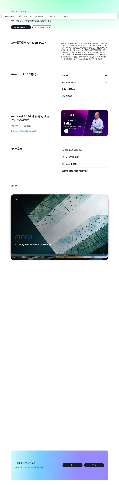
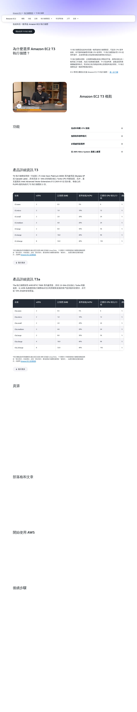
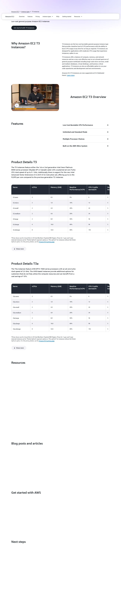
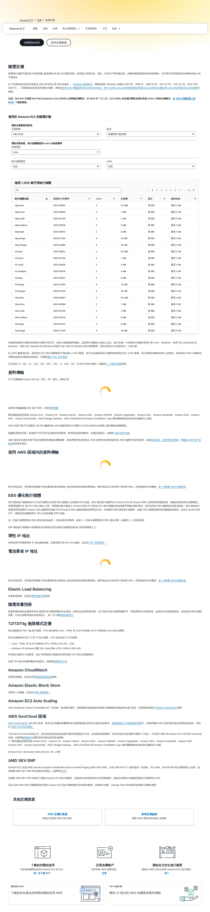

# 05 - 啟動 EC2 執行個體 / Launch EC2 Instance

> ⚠️ **重要警告 / Critical Warning**
> 本教學僅適用 AWS Global（`aws.amazon.com`）。
> 若註冊頁出現「中國區 / 由光環新網或西雲營運 / Sinnet / NWCD」字樣，請立即關閉重來。
> This guide applies to AWS Global only. Close and restart if you see "China region / operated by Sinnet or NWCD".

---

## 預估 / Estimate

- **時間 (Time)**：約 25 分鐘
- **費用 (Cost)**：t3.small 約 USD $15 / 月（隨需定價，未使用時停機可節費）
- **需準備 (Prerequisites)**：
  - 已完成教學 02：IAM 使用者與 Access Key 已建立
  - 已登入 AWS Console（使用 IAM 使用者，**非 Root**）
  - 瀏覽器已開啟，可存取 `https://console.aws.amazon.com`
  - 電腦可下載並儲存 `.pem` 金鑰檔（**下載後不可重取，請務必備份**）

---

## 名詞快查 / Glossary

| 中文 | English | 說明 |
|------|---------|------|
| 執行個體 | Instance | 一台虛擬主機 |
| 區域 | Region | AWS 機房地理位置（如：ap-northeast-1 = 東京）|
| 可用區域 | Availability Zone (AZ) | 區域內的獨立機房單元 |
| AMI | Amazon Machine Image | 作業系統映像檔（類似安裝光碟）|
| 金鑰對 | Key Pair | SSH 登入用的公私鑰配對 |
| 安全群組 | Security Group (SG) | 防火牆規則，控制哪些 IP/Port 可連入 |
| 彈性 IP | Elastic IP | 固定公開 IP 位址 |
| gp3 | General Purpose SSD v3 | 通用型 SSD 儲存，效能佳且成本低 |
| vCPU | Virtual CPU | 虛擬處理器核心數 |

---

## 操作步驟 / Steps

### 步驟 1：確認 Region（選擇與 RDS、S3 相同的區域）(Step 1: Confirm Region)

與資料庫（RDS）、儲存（S3）放在同一 Region，可避免跨區域流量費用。

1. 登入 AWS Console：`https://console.aws.amazon.com`
2. 畫面右上角確認目前 Region，例如「亞太區域（東京）(Asia Pacific (Tokyo)）`ap-northeast-1`」
3. 若要更換，點擊右上角 Region 名稱，從下拉選單選擇與 RDS/S3 相同的 Region


> ⚠️ **確認 Region 非常重要**：若 EC2、RDS、S3 不在同一 Region，資料傳輸將產生額外費用，且延遲增加。

---

### 步驟 2：進入 EC2 服務（Step 2: Navigate to EC2）




1. 在 AWS Console 頂部搜尋欄位輸入「`EC2`」
2. 點擊搜尋結果中的「EC2」進入服務頁
3. 在左側導覽列找到「執行個體 (Instances)」→「執行個體 (Instances)」
4. 點擊右上角橘色按鈕「啟動執行個體 (Launch instances)」


---

### 步驟 3：填寫名稱與標籤（Step 3: Name & Tags）

1. 在「名稱和標籤 (Name and tags)」欄位輸入：
   ```
   lattice-cast-app
   ```
2. 標籤（選填）可加入：Key = `Project`，Value = `lattice-cast`，方便後續辨識費用


---

### 步驟 4：選擇 AMI（作業系統）(Step 4: Choose AMI)

1. 在「應用程式和作業系統映像（Amazon Machine Image）(Application and OS Images (Amazon Machine Image))」區塊
2. 確認已選取「快速入門 (Quick Start)」標籤
3. 點擊「Ubuntu」
4. 在下拉選單確認選取：**Ubuntu Server 22.04 LTS (HVM), SSD Volume Type**
5. 架構 (Architecture) 選「**64 位元 (x86) (64-bit (x86))**」

> ⚠️ 請確認是 **22.04 LTS**，非 24.04 或其他版本。LTS = 長期支援，穩定性更高。


---

### 步驟 5：選擇執行個體類型（Step 5: Choose Instance Type）




1. 在「執行個體類型 (Instance type)」搜尋欄位輸入「`t3.small`」
2. 選擇 **t3.small**（2 vCPU / 2 GB RAM）
3. 若應用程式稍後回報記憶體不足，可升級至 **t3.medium**（2 vCPU / 4 GB RAM）

| 類型 | vCPU | 記憶體 (RAM) | 建議用途 |
|------|------|------------|---------|
| t3.small | 2 | 2 GB | lattice-cast 標準部署 |
| t3.medium | 2 | 4 GB | 若 RAM 不足時升級 |

> 💡 **費用參考**：t3.small 在東京 Region 約 USD $0.0208/小時，全月約 $15。




---

### 步驟 6：建立金鑰對（Step 6: Create Key Pair）

> ⚠️ **金鑰只能下載一次！** 下載後請立即存入安全位置（1Password / USB 備份）。AWS 不保留私鑰副本，遺失即無法 SSH 登入。

1. 在「金鑰對（登入）(Key pair (login))」區塊，點擊「建立新的金鑰對 (Create new key pair)」
2. 填寫金鑰對名稱：`lattice-cast-key`
3. 金鑰對類型 (Key pair type)：選「**RSA**」
4. 私有金鑰檔案格式 (Private key file format)：選「**`.pem`**」（Mac/Linux/Windows 10+ 使用）
5. 點擊「建立金鑰對 (Create key pair)」— 瀏覽器會**自動下載** `lattice-cast-key.pem`
6. 將此 `.pem` 檔移至安全位置，後續傳給我方時請使用 1Password


---

### 步驟 7：設定網路與安全群組（Step 7: Network & Security Group）

1. 在「網路設定 (Network settings)」區塊，點擊「編輯 (Edit)」展開設定
2. VPC：保持預設（Default VPC）
3. 子網路 (Subnet)：保持預設
4. 自動指派公有 IP (Auto-assign public IP)：**啟用 (Enable)**
5. 防火牆（安全群組）(Firewall (security groups))：選「**建立安全群組 (Create security group)**」
6. 安全群組名稱：`lattice-cast-sg`
7. 規則設定如下（點擊「新增安全群組規則 (Add security group rule)」逐條新增）：

| 類型 (Type) | 通訊協定 (Protocol) | 連接埠 (Port) | 來源 (Source) | 說明 |
|------------|-------------------|-------------|-------------|------|
| SSH | TCP | 22 | **我的 IP (My IP)** | 只允許您的 IP SSH 登入 |
| HTTP | TCP | 80 | Anywhere (0.0.0.0/0) | 允許所有人 HTTP 存取 |
| HTTPS | TCP | 443 | Anywhere (0.0.0.0/0) | 允許所有人 HTTPS 存取 |

> ⚠️ **SSH 來源必須選「我的 IP (My IP)」**，勿選 Anywhere，否則全球任何人都可嘗試暴力破解。
>
> 📝 **備注**：RDS 互通設定（SG-to-SG rule）將在 RDS 教學（07）完成後補充，目前無需設定。


---

### 步驟 8：設定儲存（Step 8: Configure Storage）

1. 在「設定儲存體 (Configure storage)」區塊
2. 將預設的 8 GB 改為 **30 GB**
3. 儲存類型確認為 **gp3**（若顯示 gp2，請手動切換為 gp3）

> 💡 AWS 免費方案包含每月 30 GB gp2/gp3 SSD，設定 30 GB 可在免費額度內使用（首年）。


---

### 步驟 9：檢視並啟動（Step 9: Review & Launch）

1. 在右側「摘要 (Summary)」面板確認所有設定：
   - 執行個體數量 (Number of instances)：`1`
   - AMI：Ubuntu Server 22.04 LTS
   - 執行個體類型：t3.small
   - 金鑰對：lattice-cast-key
2. 確認無誤後，點擊橘色「**啟動執行個體 (Launch instance)**」按鈕
3. 看到「您的執行個體目前正在啟動 (Your instance is now launching)」訊息即成功


---

### 步驟 10：取得執行個體資訊（Step 10: Get Instance Information）

1. 點擊「檢視所有執行個體 (View all instances)」
2. 等待「執行個體狀態 (Instance state)」變為「**執行中 (Running)**」（約 1-2 分鐘）
3. 點擊執行個體 ID（如 `i-0abc123def456789`）
4. 記錄以下資訊（完成後回報）：
   - **執行個體 ID (Instance ID)**：`i-xxxxxxxxxxxxxxxxx`
   - **公有 IPv4 位址 (Public IPv4 address)**：`x.x.x.x`
   - **安全群組 ID (Security group ID)**：`sg-xxxxxxxxxxxxxxxxx`


---

## 完成後請回報 / Deliverables to Send Us

完成後請把以下資訊用安全管道（1Password / Bitwarden / 加密 email）傳給我們：

1. **EC2 執行個體 ID (Instance ID)**：`i-xxxxxxxxxxxxxxxxx`
2. **公有 IPv4 位址 (Public IPv4 address)**：`x.x.x.x`
3. **`.pem` 金鑰檔**：`lattice-cast-key.pem`（透過 1Password 共享）
4. **AWS Region**：例如 `ap-northeast-1`（東京）
5. **安全群組 ID (Security Group ID)**：`sg-xxxxxxxxxxxxxxxxx`

> ⚠️ **嚴禁透過以下管道傳送**：純文字 email、LINE、Slack 明文、Telegram、Google Doc
> ✅ **請使用**：1Password 共享、Bitwarden、ProtonMail 加密信

---

## 檢核清單 / Checklist

助理操作完逐項打勾後回傳本文件：

- [ ] 已確認使用 `aws.amazon.com`（非 .cn）
- [ ] Region 已確認與 RDS/S3 相同
- [ ] EC2 名稱設為 `lattice-cast-app`
- [ ] AMI 選擇 Ubuntu Server 22.04 LTS (x86_64)
- [ ] 執行個體類型選擇 t3.small
- [ ] 金鑰對類型 RSA、格式 .pem、已下載並備份 `lattice-cast-key.pem`
- [ ] 安全群組 SSH(22) 來源設為「我的 IP」（非 Anywhere）
- [ ] 安全群組 HTTP(80) 與 HTTPS(443) 設為 Anywhere
- [ ] 儲存設定為 30 GB gp3
- [ ] 執行個體狀態顯示「執行中 (Running)」
- [ ] 已記錄 Instance ID、Public IPv4、SG ID
- [ ] 已將上方「完成後請回報」的資訊透過 1Password 傳給我方

---

## 常見問題 / FAQ

**Q: 啟動後一直顯示「暫待 (Pending)」怎麼辦？**
A: 通常 1-3 分鐘內會變為「執行中 (Running)」，請稍候刷新頁面。若超過 5 分鐘仍未變更，請截圖告知。

**Q: 我的 IP 是動態 IP，換網路後 SSH 連不進去怎麼辦？**
A: 到 EC2 → 安全群組 → 找到 `lattice-cast-sg` → 編輯輸入規則 (Edit inbound rules) → 更新 SSH(22) 的來源為目前的 IP。

**Q: .pem 檔下載後要怎麼用？**
A: 請直接傳給我們（使用 1Password），我們會用它設定部署連線。您不需要自己 SSH 登入。

**Q: 費用是否會自動計算？**
A: 是的，EC2 依執行時間計費。若執行個體在「執行中 (Running)」狀態即計費。停止 (Stop) 後不計算 CPU 費用，但 EBS 儲存費用仍持續。

**Q: 可以先停止執行個體再啟動嗎？**
A: 可以。點擊執行個體 → 「執行個體狀態 (Instance state)」→「停止 (Stop)」。重新啟動選「啟動 (Start)」。注意：停止後重啟，公有 IP 可能改變（除非已設定彈性 IP）。

**Q: 什麼是彈性 IP？需要設定嗎？**
A: 彈性 IP (Elastic IP) 是固定不變的公有 IP，每月費用約 USD $0（綁定執行中的執行個體時免費，未綁定則收費）。若需要固定 IP 供 DNS 設定，可告知我們協助設定。

**Q: 設定頁出現 .cn 網址怎麼辦？**
A: 立即關閉，從 `https://aws.amazon.com` 重新進入。

---

## 待補截圖 / Pending Screenshots (Console)

以下截圖需登入 Console 後實際操作時補充，請助理操作時截圖傳回：

| 檔名 | 說明 |
|------|------|
| `placeholder_05_ec2_step1_region_zh.webp` | 右上角 Region 選擇器（中文 UI）|
| `placeholder_05_ec2_step1_region_en.webp` | Region selector top-right (English UI) |
| `placeholder_05_ec2_step2_launch_btn_zh.webp` | EC2 Dashboard 左側選單與啟動按鈕（中文）|
| `placeholder_05_ec2_step2_launch_btn_en.webp` | EC2 Dashboard left menu & Launch button (English) |
| `placeholder_05_ec2_step3_name_zh.webp` | 名稱與標籤填寫（中文）|
| `placeholder_05_ec2_step3_name_en.webp` | Name and Tags input (English) |
| `placeholder_05_ec2_step4_ami_zh.webp` | AMI 選擇 Ubuntu 22.04（中文）|
| `placeholder_05_ec2_step4_ami_en.webp` | AMI selection Ubuntu 22.04 (English) |
| `placeholder_05_ec2_step6_keypair_zh.webp` | 建立金鑰對設定（中文）|
| `placeholder_05_ec2_step6_keypair_en.webp` | Create key pair settings (English) |
| `placeholder_05_ec2_step7_sg_zh.webp` | 安全群組規則設定（中文）|
| `placeholder_05_ec2_step7_sg_en.webp` | Security Group rules (English) |
| `placeholder_05_ec2_step8_storage_zh.webp` | 儲存 30 GB gp3 設定（中文）|
| `placeholder_05_ec2_step8_storage_en.webp` | Storage 30 GB gp3 (English) |
| `placeholder_05_ec2_step9_launch_zh.webp` | 啟動摘要與 Launch 按鈕（中文）|
| `placeholder_05_ec2_step9_launch_en.webp` | Launch summary & button (English) |
| `placeholder_05_ec2_step10_details_zh.webp` | 執行個體詳細資訊頁（中文）|
| `placeholder_05_ec2_step10_details_en.webp` | Instance details page (English) |

---

## 出問題時 / If Something Goes Wrong

聯絡：lifetreemastery@gmail.com，附上錯誤訊息截圖。
