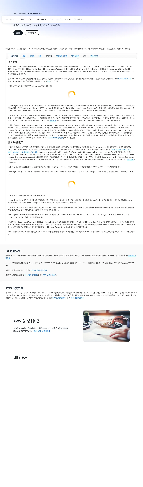
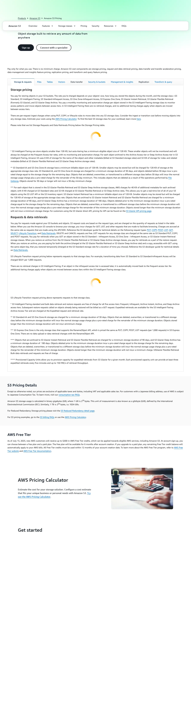

# 06 - 建立 S3 儲存桶 / Create S3 Bucket

> ⚠️ **重要警告 / Critical Warning**
> 本教學僅適用 AWS Global（`aws.amazon.com`）。
> 若註冊頁出現「中國區 / 由光環新網或西雲營運 / Sinnet / NWCD」字樣，請立即關閉重來。
> This guide applies to AWS Global only. Close and restart if you see "China region / operated by Sinnet or NWCD".

---

## 預估 / Estimate

- **時間 (Time)**：約 15 分鐘
- **費用 (Cost)**：免費額度 (Free Tier) — 前 12 個月每月 5 GB 標準儲存免費；超出部分約 USD $0.023 / GB / 月
- **需準備 (Prerequisites)**：
  - IAM 使用者帳號已建立（參考文件 02）
  - 已知道 EC2 所在的 Region（參考文件 05）
  - 客戶的網域名稱（設定 CORS 時會用到）


---

## 名詞快查 / Glossary

| 中文 | English | 說明 |
|------|---------|------|
| 儲存桶 | Bucket | S3 的頂層容器，存放所有檔案 |
| 物件 | Object | Bucket 內的每一個檔案（含metadata） |
| 區域 | Region | AWS 機房地理位置，需與 EC2 相同 |
| 封鎖公開存取 | Block Public Access | 防止 Bucket 被外部直接公開讀取的安全設定 |
| 版本控制 | Versioning | 保留檔案每一版本，可還原舊版 |
| 加密 | Encryption (SSE-S3) | 伺服器端自動加密，AWS 管理金鑰 |
| CORS | Cross-Origin Resource Sharing | 允許網頁從不同網域存取 S3 資源 |
| Presigned URL | Presigned URL | 有時效性的臨時下載／上傳連結，不需公開 Bucket |
| IAM | Identity and Access Management | AWS 帳號與權限管理 |

---

## 操作步驟 / Steps

### 步驟 1：登入 AWS Console 並進入 S3（Step 1: Sign in and open S3）

1. 開啟瀏覽器，前往 `https://console.aws.amazon.com`
2. 使用 **IAM 使用者帳號**（非 Root）登入
   > 若忘記如何建立 IAM 使用者，請先完成文件 02。
3. 登入後，在頂部搜尋欄輸入 `S3`，點擊出現的「S3」服務
4. 確認頁面左上角顯示 `Amazon S3`，**不是** `Amazon S3 (China)`

> 📌 若頁面顯示「Amazon S3 (China)」或網址含 `amazonaws.com.cn`，請立即關閉，重新從 `https://console.aws.amazon.com` 進入。


---

### 步驟 2：建立 Bucket（Step 2: Create Bucket）

1. 點擊橘色按鈕「建立儲存桶 (Create bucket)」


---

### 步驟 3：設定 Bucket 名稱（Step 3: Set Bucket Name）

1. 在「儲存桶名稱 (Bucket name)」欄位輸入：
   ```
   lattice-cast-<客戶名>-blob
   ```
   **範例**：`lattice-cast-acmecorp-blob`

   > ⚠️ **注意**：
   > - Bucket 名稱為**全球唯一**，若名稱已被使用會顯示錯誤，請加上數字或縮寫調整
   > - 只能使用小寫英文、數字、連字號（`-`），不能有底線或大寫
   > - 名稱一旦建立**無法更改**，請謹慎命名

2. 「AWS 區域 (AWS Region)」選擇與 EC2 **相同的 Region**（例如 `ap-northeast-1 (Tokyo)` 或 `us-east-1 (N. Virginia)`）


---

### 步驟 4：封鎖所有公開存取（Step 4: Block All Public Access）

1. 往下捲動到「封鎖此儲存桶的公開存取設定 (Block Public Access settings for this bucket)」區塊
2. 確認以下**全部打勾**（預設應已勾選）：
   - [x] 封鎖所有公開存取 (Block all public access)
   - [x] 封鎖透過新 ACL 授予之公開存取 (Block public access granted through new ACLs)
   - [x] 封鎖透過任何 ACL 授予之公開存取 (Block public access granted through any ACLs)
   - [x] 封鎖透過新公有儲存桶政策或接入點政策所授予之公開存取 (Block public and cross-account access through new public bucket or access point policies)
   - [x] 封鎖透過任何公有儲存桶政策或接入點政策所授予之公開存取 (Block public and cross-account access through any public bucket or access point policies)

   > 💡 **為什麼全部封鎖？**
   > lattice-cast 透過「Presigned URL（預先簽署的 URL）」讓使用者安全下載上傳檔案，**不需要公開 Bucket**。
   > 全部封鎖是最安全的做法。


---

### 步驟 5：開啟版本控制（Step 5: Enable Bucket Versioning）

1. 往下捲動到「儲存桶版本控制 (Bucket Versioning)」區塊
2. 選擇「啟用 (Enable)」

   > 💡 **為什麼開啟版本控制？**
   > 可以保留每次上傳的舊版本檔案，若意外刪除或覆蓋，可以還原。


---

### 步驟 6：加密設定（Step 6: Default Encryption）

1. 往下捲動到「預設加密 (Default encryption)」區塊
2. 確認加密類型為「Amazon S3 受管金鑰 (SSE-S3) (Amazon S3 managed keys (SSE-S3))」（預設值，不需更改）

   > 💡 SSE-S3 是 AWS 自動管理金鑰的伺服器端加密，適合一般使用情境，不需額外費用。


---

### 步驟 7：建立 Bucket（Step 7: Create the Bucket）

1. 確認所有設定無誤後，點擊最底部的橘色按鈕「建立儲存桶 (Create bucket)」
2. 頁面會跳回 S3 Bucket 清單，可以看到剛建立的 Bucket 名稱


---

### 步驟 8：設定 CORS（Step 8: Configure CORS）

CORS 設定讓客戶的網站可以安全地存取 S3 的檔案。

1. 在 S3 Bucket 清單中，點擊剛建立的 Bucket 名稱進入
2. 點擊上方分頁「許可 (Permissions)」
3. 往下捲動到「跨來源資源共用 (CORS) (Cross-origin resource sharing (CORS))」區塊
4. 點擊右側的「編輯 (Edit)」按鈕
5. 清空現有內容，貼上以下 JSON（**將 `<客戶域名>` 替換成實際網域，例如 `https://acmecorp.com`**）：

```json
[
  {
    "AllowedHeaders": ["*"],
    "AllowedMethods": ["GET", "PUT", "POST", "DELETE", "HEAD"],
    "AllowedOrigins": ["https://<客戶域名>"],
    "ExposeHeaders": ["ETag"]
  }
]
```

**範例**（若客戶網域為 `acmecorp.com`）：
```json
[
  {
    "AllowedHeaders": ["*"],
    "AllowedMethods": ["GET", "PUT", "POST", "DELETE", "HEAD"],
    "AllowedOrigins": ["https://acmecorp.com"],
    "ExposeHeaders": ["ETag"]
  }
]
```

6. 點擊「儲存變更 (Save changes)」

   > ⚠️ `AllowedOrigins` 必須是完整網址，包含 `https://`，**不含**結尾的斜線 `/`


---

### 步驟 9：確認 IAM 權限（Step 9: Verify IAM Permissions）

lattice-cast 使用的 IAM 使用者需要以下最小權限才能操作此 Bucket：

```json
{
  "Version": "2012-10-17",
  "Statement": [
    {
      "Effect": "Allow",
      "Action": [
        "s3:GetObject",
        "s3:PutObject",
        "s3:DeleteObject",
        "s3:ListBucket",
        "s3:GetBucketLocation"
      ],
      "Resource": [
        "arn:aws:s3:::lattice-cast-<客戶名>-blob",
        "arn:aws:s3:::lattice-cast-<客戶名>-blob/*"
      ]
    }
  ]
}
```

> 📌 若您在文件 02 已建立 IAM 使用者，請將此 Policy 加入該使用者的權限。
> 不需要給予 `AmazonS3FullAccess`，最小權限最安全。




---

## 完成後請回報 / Deliverables to Send Us

完成後請把以下資訊用安全管道（1Password / Bitwarden / 加密 email）傳給我們：

- **Bucket 名稱 (Bucket name)**：例如 `lattice-cast-acmecorp-blob`
- **AWS 區域 (AWS Region)**：例如 `ap-northeast-1`

> ⚠️ **安全提醒**：
> - ✅ 建議管道：1Password / Bitwarden 共享連結、ProtonMail、PGP 加密 email
> - ❌ 禁止管道：純文字 email、LINE / Slack 明文、Telegram、Google Doc

---

## 檢核清單 / Checklist

助理操作完逐項打勾後回傳本文件：

- [ ] 已確認使用 `aws.amazon.com`（非 `.cn`）
- [ ] 使用 IAM 使用者帳號登入（非 Root）
- [ ] Bucket 名稱為 `lattice-cast-<客戶名>-blob` 格式
- [ ] Bucket Region 與 EC2 相同
- [ ] 「封鎖所有公開存取 (Block all public access)」全部勾選
- [ ] 「版本控制 (Bucket Versioning)」設為「啟用 (Enable)」
- [ ] 「加密 (Default encryption)」確認為 SSE-S3（預設值）
- [ ] CORS 設定已貼入並替換客戶域名，已儲存
- [ ] 已將「完成後請回報」的 Bucket 名稱 + Region 用安全管道傳給我方

---

## 常見問題 / FAQ

**Q：Bucket 名稱顯示「already exists（已存在）」怎麼辦？**
A：Bucket 名稱為全球唯一。請在名稱後加上數字或縮寫，例如 `lattice-cast-acmecorp-blob-01`，再試一次。

**Q：可以不開啟版本控制嗎？**
A：技術上可以，但我們建議開啟。版本控制可以在檔案誤刪或誤覆蓋時還原，對業務資料保護很重要。

**Q：CORS 設定要填哪個網域？**
A：填寫您的網站網址（例如 `https://acmecorp.com`）。若有多個網域（如測試環境），可以新增多筆 `AllowedOrigins`：
```json
"AllowedOrigins": ["https://acmecorp.com", "https://staging.acmecorp.com"]
```

**Q：封鎖公開存取後，網站還能看到 S3 裡的圖片嗎？**
A：可以。lattice-cast 會透過「Presigned URL（預先簽署的臨時連結）」讓使用者安全存取，不需要公開 Bucket。

**Q：Bucket 建好後可以改名字嗎？**
A：不行。Bucket 名稱一旦建立就無法更改。若需要改名，必須建立新 Bucket 並搬移資料。

**Q：頁面顯示中文但網址有 `.cn`？**
A：立即關閉，從 `https://console.aws.amazon.com` 重新進入，確認是 Global 帳號。

---

## 出問題時 / If Something Goes Wrong

聯絡：lifetreemastery@gmail.com，附上錯誤訊息截圖。

---

## 待補截圖清單 / Placeholder Screenshots (Console Pages)

以下截圖需要助理在實際操作時截圖後傳給我們補充：

| Placeholder 檔名 | 說明 |
|------------------|------|
| `placeholder_06_s3_console_zh.webp` | S3 Console 首頁（繁體中文 UI） |
| `placeholder_06_s3_console_en.webp` | S3 Console Home（English UI） |
| `placeholder_06_s3_create_btn_zh.webp` | 「建立儲存桶」按鈕（繁體中文 UI） |
| `placeholder_06_s3_create_btn_en.webp` | "Create bucket" button（English UI） |
| `placeholder_06_s3_name_region_zh.webp` | Bucket 名稱與 Region 設定（繁體中文 UI） |
| `placeholder_06_s3_name_region_en.webp` | Bucket name and Region setting（English UI） |
| `placeholder_06_s3_block_public_zh.webp` | 封鎖公開存取設定（繁體中文 UI） |
| `placeholder_06_s3_block_public_en.webp` | Block Public Access settings（English UI） |
| `placeholder_06_s3_versioning_zh.webp` | 版本控制設定（繁體中文 UI） |
| `placeholder_06_s3_versioning_en.webp` | Versioning setting（English UI） |
| `placeholder_06_s3_encryption_zh.webp` | 預設加密設定（繁體中文 UI） |
| `placeholder_06_s3_encryption_en.webp` | Default encryption setting（English UI） |
| `placeholder_06_s3_created_zh.webp` | Bucket 建立成功畫面（繁體中文 UI） |
| `placeholder_06_s3_created_en.webp` | Bucket created success（English UI） |
| `placeholder_06_s3_cors_zh.webp` | CORS 設定畫面（繁體中文 UI） |
| `placeholder_06_s3_cors_en.webp` | CORS configuration（English UI） |
