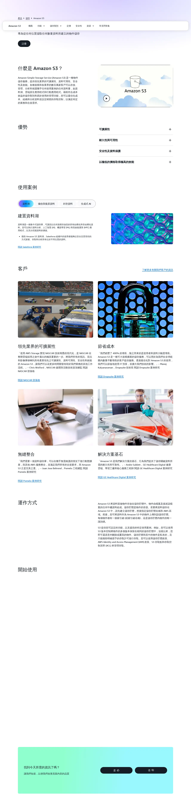
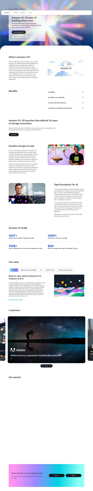
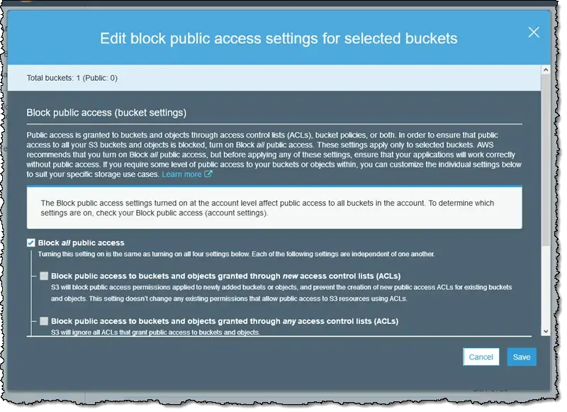
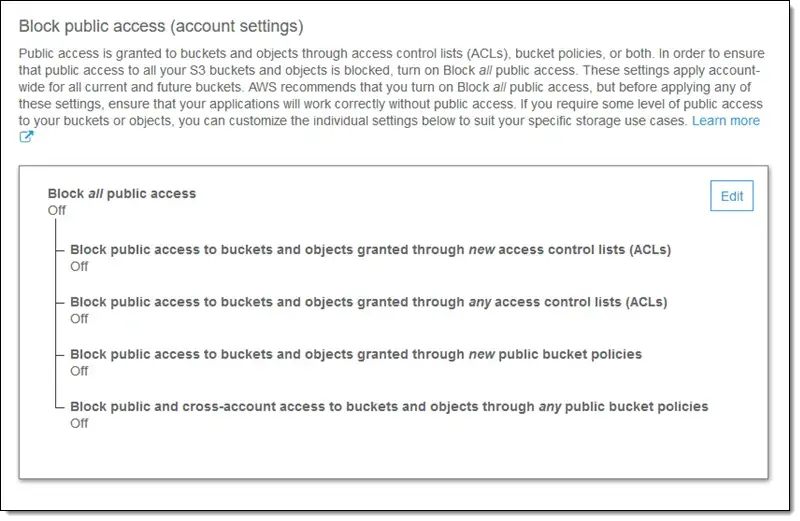

# 06 - 建立 S3 儲存桶 / Create S3 Bucket

您好 {{客戶稱呼}},感謝您協助我們完成這個步驟！S3 是 AWS 的檔案儲存服務,我們用它來存放系統上傳的圖片、附件等檔案。整個流程只需要大約 15–20 分鐘,以下是詳細說明,有任何疑問都歡迎來信。

> 💡 **貼心提醒**:截圖可能因 AWS 介面更新略有差異,以實際畫面為準。若畫面找不到按鈕,請寄信告訴我們,我們立刻協助。

> ⚠️ **重要:請勿使用 AWS 中國區**
> 註冊請使用 `aws.amazon.com`。若頁面出現「中國區 / 光環新網 / 西雲 / Sinnet / NWCD」字樣,請關閉視窗從 `https://aws.amazon.com` 重新進入。
> (中國區是另一個獨立服務,與我們要的系統不相容。)

---

## 預估 / Estimate

- **時間**:約 15–20 分鐘
- **費用**:
  - 免費方案 (Free Tier)：前 12 個月每月 **5 GB** 標準儲存免費
  - 超出部分：約 **USD $0.023 / GB / 月**
  - 一般初期用量幾乎不會超出免費額度
- **需準備**:
  - IAM 使用者帳號(已在文件 02 建立)
  - EC2 所在的 Region 名稱(已在文件 05 完成,例如 `ap-northeast-1`)
  - 您網站的網域名稱(CORS 設定時會用到,例如 `https://yourdomain.com`)


*來源: [Amazon S3 — 雲端物件儲存](https://aws.amazon.com/tw/s3/), 取用日期 2026-04-21*


*來源: [Amazon S3 — Cloud Object Storage](https://aws.amazon.com/s3/), 取用日期 2026-04-21*

---

## 名詞解說 / Glossary

| 名詞 | 說明 |
|------|------|
| S3 (Simple Storage Service) | AWS 的雲端檔案儲存服務,就像一個超大、永不當機的網路硬碟 |
| 儲存桶 (Bucket) | S3 的頂層容器,相當於一個「資料夾」,所有上傳的檔案都放在裡面 |
| 物件 (Object) | Bucket 內的每一個檔案(含附加資訊) |
| 區域 (Region) | AWS 機房所在城市。S3 的 Region 需與 EC2 相同,速度最快 |
| 封鎖公開存取 (Block Public Access) | 防止 Bucket 被外部直接公開讀取的安全設定,我們會全部開啟 |
| 版本控制 (Versioning) | 保留每一次上傳的舊版本,可隨時還原被覆蓋或刪除的檔案 |
| 加密 (SSE-S3) | AWS 自動在伺服器端為檔案加密,無需額外費用 |
| CORS (Cross-Origin Resource Sharing) | 允許您的網站向 S3 存取圖片和附件的安全設定 |
| Presigned URL | 有時效性的臨時下載/上傳連結,讓使用者安全存取 S3,不需公開 Bucket |
| IAM | AWS 帳號與權限管理,我們在文件 02 已設定 |

---

## 操作步驟 / Steps

### 步驟 1：登入 AWS Console 並進入 S3（Step 1: Sign in and open S3）

1. 開啟瀏覽器,前往 `https://console.aws.amazon.com`
2. 使用在**文件 02 建立的 IAM 使用者帳號**登入(不是 Root 帳號)
   > 若忘記如何登入 IAM 使用者,請先完成文件 02,或來信告訴我們。
3. 登入後,在頁面頂部的搜尋欄輸入 `S3`,點擊搜尋結果中的「S3」服務

```
登入流程示意圖:

  瀏覽器開啟
  console.aws.amazon.com
        │
        ▼
  輸入 IAM 使用者帳號 + 密碼
        │
        ▼
  頂部搜尋欄輸入「S3」
        │
        ▼
  點擊「S3」→ 進入 S3 主控台
```

4. 確認頁面左上角顯示 `Amazon S3`(不含「China」字樣)
   > 📌 若頁面顯示「Amazon S3 (China)」或網址含 `amazonaws.com.cn`,請立即關閉,從 `https://console.aws.amazon.com` 重新進入。

---

### 步驟 2：建立 Bucket（Step 2: Create Bucket）

1. 進入 S3 主控台後,點擊右上角橘色按鈕「建立儲存桶 (Create bucket)」

```
S3 主控台頁面:

  ┌─────────────────────────────────────┐
  │  Amazon S3 > 儲存桶 (Buckets)       │
  │                                     │
  │  [搜尋儲存桶]        [建立儲存桶 ▶] │
  │                        (橘色按鈕)   │
  │  目前沒有儲存桶                     │
  └─────────────────────────────────────┘
```

---

### 步驟 3：設定 Bucket 名稱與區域（Step 3: Set Bucket Name and Region）

1. 在「儲存桶名稱 (Bucket name)」欄位輸入：
   ```
   lattice-cast-<您的公司縮寫>-blob
   ```
   **範例**：若公司名稱為 Acme Corp，輸入 `lattice-cast-acmecorp-blob`

   > ⚠️ **命名規則**（AWS 強制要求）：
   > - 名稱必須**全球唯一**,若已被他人使用會顯示紅色錯誤，請在後面加數字，例如 `-01`
   > - 只能使用**小寫英文、數字、連字號（`-`）**
   > - 不能有底線（`_`）或大寫英文
   > - 名稱一旦建立**無法更改**,請謹慎輸入

2. 「AWS 區域 (AWS Region)」請選擇和 EC2 **相同的 Region**
   - 若 EC2 在東京：選 `ap-northeast-1 (亞太區域 (東京) / Asia Pacific (Tokyo))`
   - 若 EC2 在美東：選 `us-east-1 (美國東部 (維吉尼亞北部) / US East (N. Virginia))`

```
建立儲存桶 精靈:

  ┌──────────────────────────────────────────┐
  │ 一般組態 (General configuration)         │
  │                                          │
  │ 儲存桶名稱 (Bucket name):                │
  │ [lattice-cast-acmecorp-blob          ]   │
  │                                          │
  │ AWS 區域 (AWS Region):                   │
  │ [▼ ap-northeast-1 (Tokyo)            ]   │
  └──────────────────────────────────────────┘
```

---

### 步驟 4：封鎖所有公開存取（Step 4: Block All Public Access）

繼續往下捲動,找到「封鎖此儲存桶的公開存取設定 (Block Public Access settings for this bucket)」區塊。

1. 確認「封鎖所有公開存取 (Block all public access)」**已勾選**（預設應已勾選）
2. 勾選後,下方四個子項目也會自動全部勾選


*來源: [AWS Blog — Amazon S3 Block Public Access](https://aws.amazon.com/blogs/aws/amazon-s3-block-public-access-another-layer-of-protection-for-your-accounts-and-buckets/), 取用日期 2026-04-21*


*來源: [AWS Blog — Amazon S3 Block Public Access](https://aws.amazon.com/blogs/aws/amazon-s3-block-public-access-another-layer-of-protection-for-your-accounts-and-buckets/), 取用日期 2026-04-21*

> 💡 **為什麼全部封鎖？**
> lattice-cast 透過「Presigned URL（預先簽署的臨時連結）」讓使用者安全上傳、下載檔案,**不需要 Bucket 公開**。全部封鎖是最安全的做法,可防止資料外洩。

---

### 步驟 5：開啟版本控制（Step 5: Enable Bucket Versioning）

繼續往下捲動,找到「儲存桶版本控制 (Bucket Versioning)」區塊。

1. 選擇「啟用 (Enable)」

```
儲存桶版本控制 (Bucket Versioning):

  ○ 停用 (Disable)
  ● 啟用 (Enable)   ← 選這個
```

> 💡 **為什麼開啟版本控制？**
> 萬一有人不小心刪除或覆蓋了檔案,版本控制可以讓我們把檔案還原到之前的版本,保護重要資料。

---

### 步驟 6：確認加密設定（Step 6: Default Encryption）

繼續往下捲動,找到「預設加密 (Default encryption)」區塊。

1. 確認加密類型顯示為「Amazon S3 受管金鑰 (SSE-S3) (Amazon S3 managed keys (SSE-S3))」
2. 這是**預設值**,不需要更改

```
預設加密 (Default encryption):

  加密類型:
  ● SSE-S3   (Amazon S3 managed keys)   ← 預設值,保持不動
  ○ SSE-KMS  (AWS KMS managed keys)
  ○ DSSE-KMS (Dual-layer...)
```

> 💡 SSE-S3 是 AWS 自動管理金鑰的伺服器端加密,安全且不需額外費用。

---

### 步驟 7：完成建立（Step 7: Create the Bucket）

1. 確認所有設定後,點擊頁面最底部的橘色按鈕「建立儲存桶 (Create bucket)」
2. 頁面會跳回 S3 Bucket 清單,您會看到剛才建立的 Bucket 出現在列表中

```
建立成功後畫面:

  儲存桶 (Buckets)                [建立儲存桶]

  ✓ 名稱                      區域           建立日期
    lattice-cast-acmecorp-blob ap-northeast-1 2026-04-21
```

---

### 步驟 8：設定 CORS（Step 8: Configure CORS）

CORS 設定讓您的網站能夠安全地透過瀏覽器向 S3 存取檔案。

1. 在 S3 Bucket 清單中,點擊剛建立的 Bucket 名稱進入
2. 點擊上方分頁「許可 (Permissions)」
3. 往下捲動到「跨來源資源共用 (CORS) (Cross-origin resource sharing (CORS))」區塊
4. 點擊右側的「編輯 (Edit)」按鈕
5. 清空現有內容,貼上以下 JSON

   > **請將 `https://yourdomain.com` 替換成您實際的網站網址**（例如 `https://acmecorp.com`）：

```json
[
  {
    "AllowedHeaders": ["*"],
    "AllowedMethods": ["GET", "PUT", "POST", "DELETE", "HEAD"],
    "AllowedOrigins": ["https://yourdomain.com"],
    "ExposeHeaders": ["ETag"]
  }
]
```

**範例**（若網站為 `acmecorp.com`）：
```json
[
  {
    "AllowedHeaders": ["*"],
    "AllowedMethods": ["GET", "PUT", "POST", "DELETE", "HEAD"],
    "AllowedOrigins": ["https://acmecorp.com"],
    "ExposeHeaders": ["ETag"]
  }
]
```

6. 點擊「儲存變更 (Save changes)」

```
許可 (Permissions) 分頁:

  跨來源資源共用 (CORS)
  ┌──────────────────────────────────────────┐
  │ [                                      ] │
  │   貼入上方 JSON 後點「儲存變更」         │
  │                                [儲存變更]│
  └──────────────────────────────────────────┘
```

   > ⚠️ `AllowedOrigins` 必須包含 `https://`,且**結尾不加斜線 `/`**
   > 若有多個網域(例如正式站 + 測試站),可新增多筆：
   > ```json
   > "AllowedOrigins": ["https://acmecorp.com", "https://staging.acmecorp.com"]
   > ```

---

### 步驟 9：確認 IAM 使用者權限（Step 9: Verify IAM Permissions）

我們在文件 02 已建立的 IAM 使用者,需要以下最小權限才能操作此 Bucket。請確認已將以下 Policy 加入 IAM 使用者。

> 📌 若在文件 02 我們已協助您設定好這段 Policy,您可以**跳過**此步驟,直接前往「完成後請提供以下資訊」。

IAM Policy（最小權限,將 `<您的Bucket名稱>` 替換成實際名稱）：

```json
{
  "Version": "2012-10-17",
  "Statement": [
    {
      "Effect": "Allow",
      "Action": [
        "s3:GetObject",
        "s3:PutObject",
        "s3:DeleteObject",
        "s3:ListBucket",
        "s3:GetBucketLocation"
      ],
      "Resource": [
        "arn:aws:s3:::lattice-cast-acmecorp-blob",
        "arn:aws:s3:::lattice-cast-acmecorp-blob/*"
      ]
    }
  ]
}
```

**加入方式**：
1. 前往 AWS Console → 搜尋「IAM」
2. 左側選「使用者 (Users)」→ 點擊我們在文件 02 建立的使用者名稱
3. 點「新增許可 (Add permissions)」→「直接連接政策 (Attach policies directly)」→「建立內嵌政策 (Create inline policy)」
4. 切換到「JSON」分頁,貼入上方 JSON(記得替換 Bucket 名稱)
5. 點「下一步 (Next)」→ 輸入政策名稱 `lattice-cast-s3-policy`→「建立政策 (Create policy)」

---

## 完成後請提供以下資訊 / Please Send Us

完成後,麻煩您把以下資訊用安全方式傳給我們(1Password / Bitwarden 共享連結、或加密 email),我們收到後就可以幫您把系統設定好:

- **Bucket 名稱 (Bucket name)**：例如 `lattice-cast-acmecorp-blob`
- **AWS 區域 (AWS Region)**：例如 `ap-northeast-1`

**若不知道如何安全傳送,請來信告訴我們(lifetreemastery@gmail.com),我們會提供 1Password 共享連結給您。**

> ⚠️ **安全提醒**:
> - ✅ 建議管道:1Password / Bitwarden 共享連結、ProtonMail 加密信件
> - ❌ 請避免:純文字 email、LINE / Slack 明文、Telegram、Google Doc 明文

---

## 操作確認清單 / Checklist

完成後可以逐項打勾,方便您和我們核對進度：

- [ ] 已使用 `aws.amazon.com`(非 `.cn` 結尾的網址)
- [ ] 使用 IAM 使用者帳號登入(非 Root 帳號)
- [ ] Bucket 名稱格式為 `lattice-cast-<公司縮寫>-blob`
- [ ] Bucket 所在 Region 與 EC2 相同
- [ ] 「封鎖所有公開存取 (Block all public access)」已全部勾選
- [ ] 「版本控制 (Bucket Versioning)」已設為「啟用 (Enable)」
- [ ] 「預設加密 (Default encryption)」確認為 SSE-S3(預設值即可)
- [ ] CORS 設定已貼入並填入正確網域,已點「儲存變更 (Save changes)」
- [ ] IAM 使用者已具備 S3 操作所需最小權限
- [ ] 已將 Bucket 名稱 + Region 透過安全管道傳給我們

---

## 常見問題 / FAQ

**Q：Bucket 名稱顯示「已存在 (already exists)」怎麼辦？**
A：S3 的 Bucket 名稱是全球唯一的,可能被其他人先用了。請在名稱後加上數字,例如 `lattice-cast-acmecorp-blob-01`,再試一次。

**Q：可以不開啟版本控制嗎？**
A：技術上可以跳過,但我們建議開啟。版本控制能在檔案意外刪除或覆蓋時幫您還原,保護重要業務資料。

**Q：CORS 的「AllowedOrigins」要填什麼網址？**
A：填寫您公開網站的網址(例如 `https://acmecorp.com`)。必須包含 `https://`,且結尾不加 `/`。若有多個測試/正式網址,來信告訴我們,我們協助您一起填寫。

**Q：封鎖公開存取後,網站使用者還能看到 S3 的圖片嗎？**
A：可以。我們的系統會透過「Presigned URL（有時效的臨時連結）」讓使用者安全存取,完全不需要把 Bucket 設成公開。

**Q：Bucket 建好後可以改名字嗎？**
A：不行,Bucket 名稱一旦建立就無法更改。若需要改名,必須建立新 Bucket 並搬移所有資料,過程較麻煩。請一開始就填好名稱。

**Q：Region 選錯怎麼辦？**
A：S3 的 Region 建立後也無法更改。若選錯了,需要刪除 Bucket 並重新建立。若已在舊 Bucket 存放資料,需先搬移。請來信告訴我們,我們協助您處理。

**Q：頁面顯示中文但網址有 `.cn`？**
A：沒關係,立即關閉視窗,從 `https://console.aws.amazon.com` 重新進入,確認是 Global 帳號即可。

---

## 遇到問題聯絡我們 / If Something Goes Wrong

📧 **lifetreemastery@gmail.com**

任何問題都歡迎來信,附上畫面截圖,我們會盡快回覆協助您。

---

再次感謝您協助完成這個步驟！S3 設定完成後,我們就可以幫您把 lattice-cast 系統的檔案儲存功能接起來了,不會再打擾您太多。
