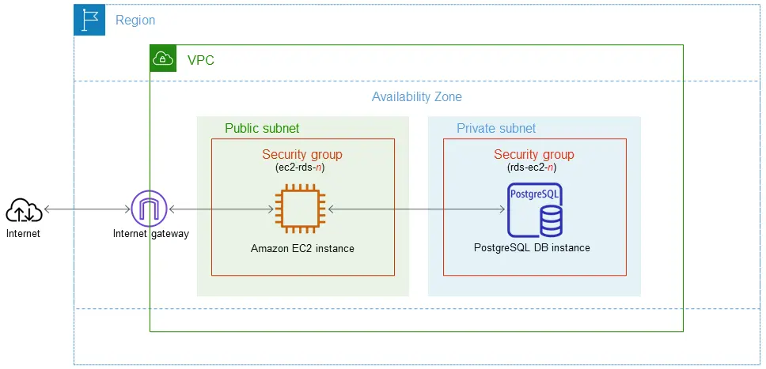
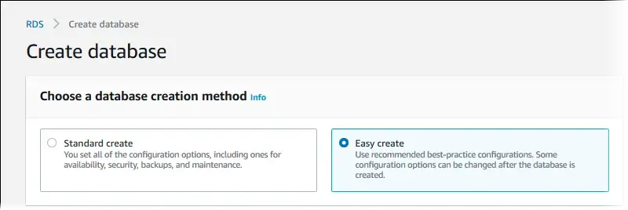
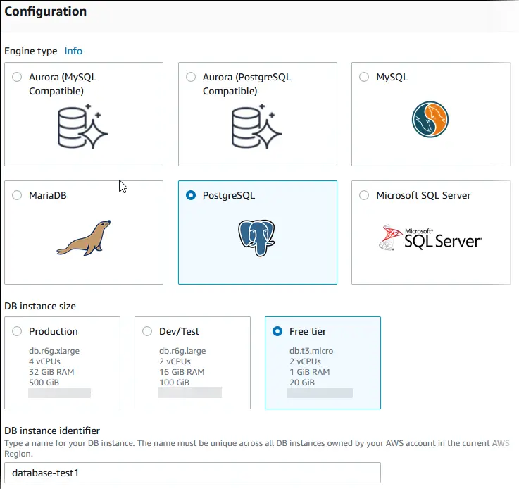
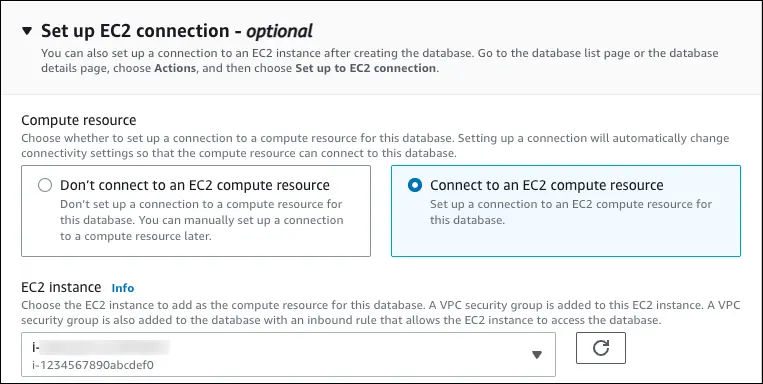
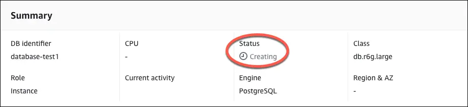
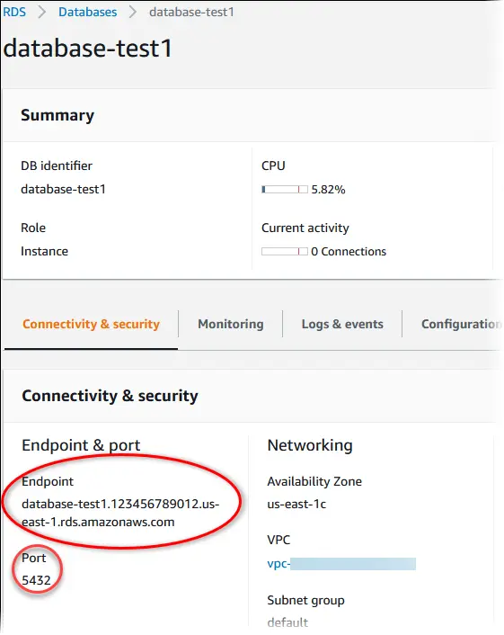

# 07 - 建立 RDS PostgreSQL 資料庫 / Create RDS PostgreSQL Database

您好 {{客戶稱呼}},非常感謝您協助我們設定 AWS 環境!這個步驟將為我們建立一個 PostgreSQL 資料庫,是 lattice-cast 系統運作的核心元件之一。操作過程約 20 分鐘,遇到任何疑問都歡迎隨時來信,我們會立即協助。

> 💡 **貼心提醒**:截圖可能因 AWS 介面更新略有差異,以實際畫面為準。若畫面找不到某個按鈕,請附上截圖來信告訴我們,我們立刻協助您。

> ⚠️ **重要:請勿使用 AWS 中國區**
> 本教學僅適用 AWS Global(`aws.amazon.com`)。
> 若頁面出現「中國區 / 光環新網 / 西雲 / Sinnet / NWCD」字樣,請關閉視窗從 `aws.amazon.com` 重新進入。
> (中國區是另一個完全獨立的服務,與我們要部署的系統不相容。)
>
> This guide applies to AWS Global only. Close and restart if you see "China region / operated by Sinnet or NWCD".

---

## 預估 / Estimate

- **時間 (Time)**:操作約 10 分鐘;等待資料庫建立完成另需約 8–10 分鐘
- **費用 (Cost)**:
  - **免費方案 (Free Tier)**:新帳號前 12 個月,db.t4g.micro 每月 750 小時免費
  - **免費方案到期後**:db.t4g.micro 約 USD $15 / 月 + 儲存費用約 USD $2.30 / 月(20 GB gp3)
- **需準備 (Prerequisites)**:
  - AWS 帳號已建立(參閱第 01 篇)
  - EC2 執行個體已在相同 Region 建立(參閱第 05 篇),並知道 EC2 所屬的 Security Group ID
  - 1Password 或 Bitwarden 等密碼管理工具,用來安全儲存資料庫密碼

---

## 名詞解說 / Glossary

| 名詞 | 說明 |
|------|------|
| RDS (Relational Database Service) | AWS 提供的全託管資料庫服務 — 就像請 AWS 幫您管一台資料庫伺服器,自動備份、更新都包含在內,您不需要自己維護 |
| PostgreSQL | 我們系統使用的資料庫種類,一種開放原始碼的關聯式資料庫 |
| DB 執行個體 (DB Instance) | 一台資料庫伺服器。建立 RDS 就是在 AWS 租一台資料庫伺服器 |
| VPC (Virtual Private Cloud) | AWS 的隔離虛擬網路 — 就像在 AWS 裡圍一個私有空間。EC2 和 RDS 必須在同一個 VPC 才能互相連線 |
| 安全群組 (Security Group) | 防火牆規則,控制哪些服務或 IP 可以連進資料庫。我們要設定只有 EC2 可以連入 RDS |
| 端點 (Endpoint) | 連接資料庫的網址,格式如 `xxxxxx.rds.amazonaws.com`。我們部署時會用這個網址連到您的資料庫 |
| 公開存取 (Public Access) | 是否允許網際網路直接連進資料庫。我們設定為「否」,只讓 EC2 連入,更安全 |
| Free Tier | 新帳號前 12 個月的免費用量方案 |
| gp3 | AWS 的 SSD 磁碟類型,兼顧效能與費用 |

---

## 架構說明 / Architecture Overview

在開始操作之前,這張圖說明了我們要建立的架構:EC2 執行個體放在公開子網路,PostgreSQL 資料庫放在私有子網路,兩者都在同一個 VPC 和 Region 裡,透過 Security Group 規則讓 EC2 能連到資料庫,但網際網路無法直接存取資料庫。

*來源: [AWS Docs — Get started with Amazon RDS](https://docs.aws.amazon.com/AmazonRDS/latest/UserGuide/CHAP_GettingStarted.CreatingConnecting.PostgreSQL.html), 取用日期 2026-04-21*

---

## 服務介紹 / About Amazon RDS for PostgreSQL

Amazon RDS for PostgreSQL 是 AWS 的全託管 PostgreSQL 資料庫服務,您不需要安裝或維護任何資料庫軟體。

*來源: [AWS — Amazon RDS for PostgreSQL](https://aws.amazon.com/tw/rds/postgresql/), 取用日期 2026-04-21*

---

## 操作步驟 / Steps

### 步驟 1:進入 RDS 控制台 (Step 1: Open the RDS Console)

1. 開啟瀏覽器,前往 `https://console.aws.amazon.com/rds/`
   - 若詢問登入,請使用您的 AWS 帳號登入
2. **重要**:確認右上角顯示的 **區域 (Region)** 與您在第 05 篇建立 EC2 時選擇的相同
   - 例:若 EC2 在「亞太地區(東京)/ Asia Pacific (Tokyo)」,此處也請選東京
   - Region 就像選一個機房城市,EC2 和 RDS 必須在同一個城市才能互通
3. 點擊左側選單的「**資料庫 (Databases)**」
4. 點擊右上角橘色按鈕「**建立資料庫 (Create database)**」

---

### 步驟 2:選擇建立方式 (Step 2: Choose a Creation Method)

進入「建立資料庫 (Create database)」畫面後:

1. 在「**選擇資料庫建立方法 (Choose a database creation method)**」區塊,選擇「**標準建立 (Standard create)**」
   - 請不要選「輕鬆建立 (Easy create)」— 那個選項隱藏了許多重要設定,我們需要自己設定才能確保安全與正確

*來源: [AWS Docs — Get started with Amazon RDS](https://docs.aws.amazon.com/AmazonRDS/latest/UserGuide/CHAP_GettingStarted.CreatingConnecting.PostgreSQL.html), 取用日期 2026-04-21*

> 💡 圖中顯示的是「Easy create」被選中的狀態,請點選左邊的「**Standard create**」。

---

### 步驟 3:選擇資料庫引擎 (Step 3: Select the Database Engine)

在「**引擎類型 (Engine type)**」區塊:

1. 點選「**PostgreSQL**」(大象圖示)
2. 引擎版本 (Engine version) 選擇最新的 **PostgreSQL 16.x**
   - 清單中版本號最高的 16.x 即可,例如「PostgreSQL 16.3」

*來源: [AWS Docs — Get started with Amazon RDS](https://docs.aws.amazon.com/AmazonRDS/latest/UserGuide/CHAP_GettingStarted.CreatingConnecting.PostgreSQL.html), 取用日期 2026-04-21*

---

### 步驟 4:選擇使用範本 (Step 4: Select a Template)

在「**範本 (Templates)**」區塊,依情況選擇:

| 情境 | 選擇 | 說明 |
|------|------|------|
| 帳號建立未滿 12 個月 | **免費方案 (Free tier)** | 前 12 個月 db.t3.micro 免費使用 |
| 帳號建立已超過 12 個月 | **生產 (Production)** | 正式環境建議,有更高可用性選項 |

> 💡 若您不確定,請先選「**免費方案 (Free tier)**」。之後我們可以協助您升級。

---

### 步驟 5:設定資料庫名稱與帳號密碼 (Step 5: Configure Identifier and Credentials)

請依照下方填入各欄位:

| 欄位 | 填入值 | 說明 |
|------|--------|------|
| 資料庫執行個體識別碼 (DB instance identifier) | `lattice-cast-pg` | 這台資料庫伺服器的名稱 |
| 主使用者名稱 (Master username) | `lattice_admin` | 資料庫的管理員帳號 |
| 主密碼 (Master password) | (自行產生 16 碼隨機密碼) | 請見下方說明 |
| 確認密碼 (Confirm master password) | (與上方相同) | 再輸入一次確認 |

**關於密碼**:
- 請使用您的 1Password 或 Bitwarden 產生一組 **16 碼隨機密碼**(大小寫英數 + 特殊符號)
- **⚠️ 立即將密碼存入 1Password / Bitwarden 保管庫**,設定完成後 AWS 畫面不會再顯示此密碼
- 請不要使用容易猜測的密碼,或直接用您其他服務的密碼

---

### 步驟 6:選擇執行個體規格與儲存空間 (Step 6: Instance Class and Storage)

1. **DB 執行個體類別 (DB instance class)**:
   - 點選「**高載類別 (Burstable classes (includes t classes))**」
   - 下拉選擇 **db.t4g.micro**(免費方案)或 **db.t4g.small**(正式環境)
2. **儲存類型 (Storage type)**:選「**gp3**」
3. **分配儲存空間 (Allocated storage)**:填入 `20` GB
4. **儲存自動擴展 (Enable storage autoscaling)**:可保留預設勾選,並將上限設為 `100` GB

---

### 步驟 7:設定 EC2 連線方式 (Step 7: Configure EC2 Connection)

在「**連線 (Connectivity)**」區段,找到「**設定 EC2 連線 — 選用 (Set up EC2 connection — optional)**」:

1. 選擇「**連線至 EC2 計算資源 (Connect to an EC2 compute resource)**」
2. 在「**EC2 執行個體 (EC2 instance)**」下拉選單中,選擇您在第 05 篇建立的 EC2 執行個體
   - AWS 會自動幫您設定好安全群組規則,讓 EC2 可以連到這台 RDS

*來源: [AWS Docs — Get started with Amazon RDS](https://docs.aws.amazon.com/AmazonRDS/latest/UserGuide/CHAP_GettingStarted.CreatingConnecting.PostgreSQL.html), 取用日期 2026-04-21*

> 💡 若找不到您的 EC2,請確認右上角選擇的 Region 與 EC2 相同。

---

### 步驟 8:設定公開存取 (Step 8: Public Access)

在連線設定的「**公開存取 (Public access)**」欄位:

1. 選擇「**否 (No)**」
   - 這樣資料庫就只有 EC2 可以連進去,網際網路上的任何人都無法直接存取,大幅提升安全性

---

### 步驟 9:設定資料庫驗證方式 (Step 9: Database Authentication)

在「**資料庫驗證 (Database authentication)**」區塊:

1. 選擇「**密碼驗證 (Password authentication)**」即可

---

### 步驟 10:其他設定 — 初始資料庫名稱 (Step 10: Additional Configuration)

請務必展開「**其他設定 (Additional configuration)**」(點擊標題旁的箭頭即可展開):

| 欄位 | 填入值 | 說明 |
|------|--------|------|
| 初始資料庫名稱 (Initial database name) | `latticecast` | **必填**,若留空 RDS 不會自動建立資料庫 |
| 備份保留期間 (Backup retention period) | `7` 天 | 自動備份保存 7 天 |
| 備份視窗 (Backup window) | 保持預設 | |
| 維護視窗 (Maintenance window) | 保持預設 | |
| 刪除保護 (Enable deletion protection) | **勾選啟用** | 防止不小心誤刪資料庫 |

> ⚠️ **「初始資料庫名稱」非常重要**:如果這個欄位留空,RDS 不會自動建立資料庫,我們之後需要額外手動建立,會增加步驟。請確認填入 `latticecast`。

---

### 步驟 11:建立資料庫 (Step 11: Create the Database)

1. 捲動到頁面底部,確認所有設定後,點擊橘色按鈕「**建立資料庫 (Create database)**」
2. 頁面跳回資料庫清單,會看到 `lattice-cast-pg` 狀態為「**建立中 (Creating)**」
3. **請等待約 8–10 分鐘**,直到狀態變為「**可用 (Available)**」
   - 這段時間可以先去做其他事,不需要一直盯著畫面
   - 若等了 30 分鐘以上仍未完成,請截圖來信告訴我們

*來源: [AWS Docs — Get started with Amazon RDS](https://docs.aws.amazon.com/AmazonRDS/latest/UserGuide/CHAP_GettingStarted.CreatingConnecting.PostgreSQL.html), 取用日期 2026-04-21*

---

### 步驟 12:取得資料庫端點 (Step 12: Get the Database Endpoint)

資料庫狀態變為「**可用 (Available)**」後:

1. 點擊 `lattice-cast-pg` 進入詳情頁
2. 點擊「**連線與安全 (Connectivity & security)**」標籤
3. 在「**端點與連接埠 (Endpoint & port)**」區塊找到並複製端點網址:
   - 格式如:`lattice-cast-pg.xxxxxxxxxx.ap-northeast-1.rds.amazonaws.com`
4. 記下 Port:`**5432**`(PostgreSQL 的預設連接埠)
5. **請將端點、Port、資料庫名稱、帳號、密碼一併存入 1Password / Bitwarden**

*來源: [AWS Docs — Get started with Amazon RDS](https://docs.aws.amazon.com/AmazonRDS/latest/UserGuide/CHAP_GettingStarted.CreatingConnecting.PostgreSQL.html), 取用日期 2026-04-21*

---

## 完成後請提供以下資訊 / Please Send Us

完成後,麻煩您把以下資訊透過安全方式(1Password 共用保險庫 / Bitwarden 共用資料夾,或 ProtonMail 加密郵件)傳給我們。我們收到後就可以接手把 lattice-cast 系統架起來,不會再麻煩您。

| 項目 | 值(範例) |
|------|----------|
| Endpoint(端點網址) | `lattice-cast-pg.xxxxxxxxxx.ap-northeast-1.rds.amazonaws.com` |
| Port(連接埠) | `5432` |
| Database name(資料庫名稱) | `latticecast` |
| Master username(主使用者名稱) | `lattice_admin` |
| Master password(主密碼) | (您設定的 16 碼隨機密碼) |
| AWS Region(區域) | 例:`ap-northeast-1`(東京) |

> ⚠️ **請勿**用 LINE、一般 Email 明文、Slack、Telegram、Google Doc 傳送以上資訊。
> **建議**:1Password / Bitwarden 共用,或 ProtonMail 加密郵件寄至 lifetreemastery@gmail.com。
>
> **若不知道如何用加密方式傳送,來信告訴我們,我們提供 1Password 共享連結給您使用。**

---

## 操作確認清單 / Checklist

操作完成後,您可以對照以下清單確認每個步驟都完成了:

- [ ] 已使用 `aws.amazon.com`(非 `.cn` 結尾的網址)
- [ ] RDS 選擇的 Region 與 EC2 相同
- [ ] 資料庫引擎選擇 **PostgreSQL 16.x**
- [ ] DB instance identifier 填入 `lattice-cast-pg`
- [ ] Master username 填入 `lattice_admin`
- [ ] Master password 已儲存至 1Password / Bitwarden
- [ ] 已選擇 **Standard create**(非 Easy create)
- [ ] Instance type 選擇 **db.t4g.micro**(`Free tier`)或 **db.t4g.small**(`Production`)
- [ ] Storage 設定為 **20 GB gp3**
- [ ] EC2 connection 設定連結至您的 EC2 執行個體
- [ ] Public access 設定為「**否 (No)**」
- [ ] Initial database name 填入 `latticecast`
- [ ] Backup retention 設定為 **7 天**
- [ ] 已勾選啟用 **Deletion protection**
- [ ] 資料庫狀態已變為「**可用 (Available)**」
- [ ] 已取得 Endpoint 並存入 1Password / Bitwarden
- [ ] 已將上方「請提供以下資訊」的內容用安全方式傳給我們

---

## 常見問題 / FAQ

**Q:RDS Region 要選哪個?**
A:請選和您在第 05 篇建立 EC2 時相同的 Region。若不記得,可以前往 EC2 控制台(`console.aws.amazon.com/ec2/`),右上角顯示的就是 EC2 所在 Region。

**Q:建立後一直是「建立中 (Creating)」超過 20 分鐘?**
A:屬正常範圍,最久可能需要 15 分鐘。若超過 30 分鐘仍未完成,請截圖聯絡我們,我們協助您確認。

**Q:忘記儲存密碼,密碼不見了怎麼辦?**
A:進入 RDS → 點擊 `lattice-cast-pg` → 右上角「**修改 (Modify)**」→ 修改「Master password」→ 儲存後重新存入 1Password / Bitwarden。

**Q:初始資料庫名稱填錯了怎麼辦?**
A:請來信告訴我們,我們可以在部署時手動建立正確的資料庫名稱,不需要刪除重建 RDS。

**Q:Free Tier 到期後會怎樣?**
A:第 13 個月起開始按量計費(db.t4g.micro 約 USD $15 / 月 + 儲存費)。建議在第 03 篇設定的 Billing Alert 到達前來信通知我們,我們協助您評估是否需要調整規格。

**Q:我可以把 Public access 設成 Yes 讓我用工具直接連資料庫嗎?**
A:我們建議保持「否 (No)」,因為公開存取會增加資料外洩風險。若需要用 DBeaver、TablePlus 等工具連資料庫,可以透過 SSH Tunnel 經由 EC2 轉接,請來信我們提供設定說明。

---

## 遇到問題聯絡我們 / If Something Goes Wrong

📧 **lifetreemastery@gmail.com**

來信時請附上:
- 目前停在哪個步驟
- 畫面上顯示的錯誤文字或錯誤代碼
- 您使用的 AWS Region
- 畫面截圖(若方便的話)

我們收到後會儘快回覆協助您。

---

再次感謝您撥出時間協助我們設定這個部分!資料庫建立完成後,我們就可以接手把 lattice-cast 系統完整部署起來,不會再需要麻煩您操作 AWS 的這個部分。
