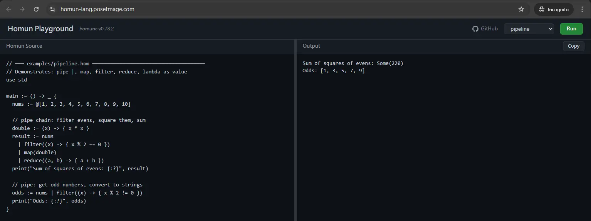
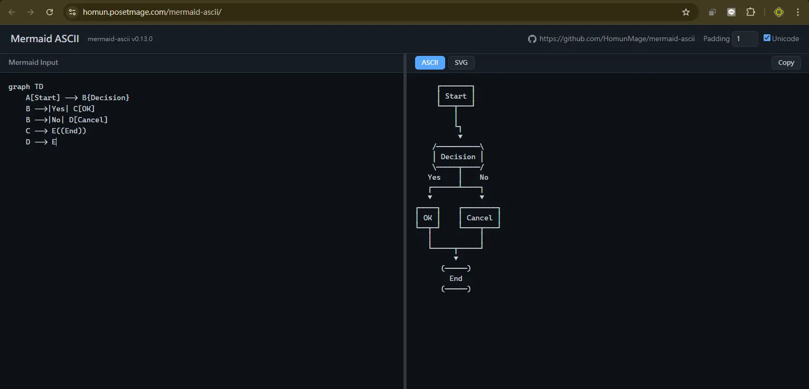
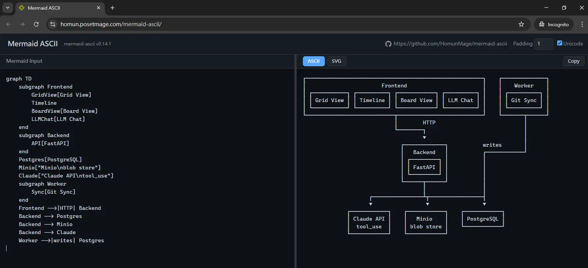

## I Have a Dream

I want to create my own programming language.

demo:

Homun playground: https://homun-lang.posetmage.com/

mermaid playground: https://homun-lang.github.io/mermaid-ascii/




## Why 2026 Is the Right Time

Programming language syntax has been fully explored — no truly new paradigms left.

What remains is **engineering combination**: picking the best ideas and assembling them.

Before writing a single line of code, spent months discussing design with AI — iterating through trade-offs, edge cases, and syntax choices.

In 2026, designing a language is no longer about invention. It's about **curation**.

## What's Wrong with Languages

Every language has something I hate.

* C++ hooks LLVM to a frontend — stupid. ML family (OCaml, Haskell) is better for compilers
* C++ has huge breaking changes every version — `constexpr` scope differs across C++11/14/17/20
* Python syntax is nice, but lambda is single-line only — stupid
* Most languages use `.chaining()` not pipe — ugly in practice
* Rust lambda `|x| x*2` — ugly
* `=` vs `==` hell

## So I Want My Own Language

But making a language from scratch is too hard.

So start with a simpler example first.

## Why Rust?

I hate C++. But I need a systems language. Why Rust?

**1. Rust is from the Haskell family**

Rust borrowed the best parts from ML/Haskell:
* Pattern matching, ADTs (`enum` with data), `Option`/`Result` instead of null
* Trait system ≈ Haskell type classes
* Expression-based (everything returns a value)

Writing a compiler in Rust feels like writing it in Haskell — but with zero-cost abstractions.

**2. Rust compiles to WASM**

```
cargo build --target wasm32-unknown-unknown
```

One command → runs in the browser via JavaScript.

This is why Homun playground and mermaid-ascii playground both work on the web. No server needed.

C++ can technically do WASM too, but the toolchain is painful. Rust + `wasm-pack` just works.

**3. Cargo is not CMake**

C++ build system is a nightmare. Rust's `cargo` is sane by default — deps, build, test, publish, all in one tool.

## What Is a Compiler?


```
Source Code (text)
       │
       ▼
   Tokenizer      "if" "(" "x" ">" "0" ")"  →  tokens
       │
       ▼
   Parser          builds AST (Abstract Syntax Tree)
       │
       ▼
   AST             tree structure of the program
       │
       ▼
   IR              Intermediate Representation
       │
       ▼
   Backend         machine code / another language
```

## Tokenizer

Break source text into tokens:

```
"if (x > 0)"  →  [IF, LPAREN, IDENT("x"), GT, INT(0), RPAREN]
```

* Just string splitting — find keywords, symbols, literals
* No understanding of structure yet

## Parser → AST

Tokens → tree structure (Abstract Syntax Tree):

```
       IfStmt
      /      \
  Condition   Body
    /  |  \
   x   >   0
```

* Recursive descent — most common approach
* Each grammar rule = one function
* Tree captures the **meaning**, not the text

## AST → IR → Output

* **AST** = what the programmer wrote (structured)
* **IR** = intermediate form, easier to transform
* **Output** = target language or machine code

For Homun: AST → Rust source code (no IR needed, 1-to-1 transpile)

For mermaid-ascii: AST → Layout IR → ASCII art

## Mermaid-ASCII

Problem with current Mermaid: change one tiny thing, the entire layout shifts drastically.

Referenced existing repos: mermaid-ascii (Go), ascii-mermaid (TypeScript)

Wanted to try Rust — decided to write a compiler in Rust.

But Rust syntax is too complex. So first version written in Python, then ported to Rust.



## Compiler Pipeline

```
                    Mermaid DSL text
                           │
                           ▼
               ┌───────────────────────┐
               │  Tokenizer + Parser   │  parsers/registry.py
               │  (recursive descent)  │  parsers/flowchart.py
               └───────────┬───────────┘
                           │
       ┌───────────────────┼────────────────────┐
       │                   │                    │
       ▼                   ▼                    ▼
┌──────────────┐    ┌──────────────┐    ┌────────────────┐
│  Flowchart   │    │  Sequence    │    │ Architecture   │
│  AST         │    │  AST         │    │ AST            │
│  (current)   │    │  (future)    │    │ (future)       │
└──────┬───────┘    └──────┬───────┘    └───────┬────────┘
       │                   │                    │
       └───────────────┬───┴────────────────────┘
                       │
                       ▼
                ┌──────────────┐
                │  Layout IR   │
                │ LayoutNode[] │
                │ RoutedEdge[] │
                └──────┬───────┘
                       │
                 ┌─────┼─────┐
                 │           │
                 ▼           ▼
            ┌─────────┐ ┌─────────┐
            │  ASCII  │ │   SVG   │
            │Renderer │ │Renderer │
            │(current)│ │(future) │
            └─────────┘ └─────────┘
```


## Mermaid-ASCII Results (cont.)



## Back to the Real Dream

OK, mermaid-ascii works. Time for the real dream: **my own language**.

But I had no idea how painful this would be.

## First Question: Strong or Weak Typing?

Every language picks a side:

```
Strong typing (Java, Rust):
  int x = 42;
  String s = "hello";
  // Verbose, but catches errors at compile time

Weak/Dynamic typing (Python, JS):
  x = 42
  s = "hello"
  // Clean, but "undefined is not a function" at 3am
```

Homun wants: clean syntax like Python, but type-safe like Rust.

TypeScript's approach: gradual typing. You can write `any` and opt out. Convenient, but defeats the purpose.

Homun doesn't want an escape hatch. Every program must be fully type-safe.

## The Answer: Learn from C++ `auto`

```
// C++ evolution of variable typing:
int x = 42;            // C style: explicit type
auto x = 42;           // C++11: auto deduces type from value
                        // but "auto" is redundant — 42 is obviously int

// Homun: just drop "auto" entirely
x := 42                // type = int, deduced from 42
s := "hello"            // type = str, deduced from "hello"
flag := true            // type = bool, deduced from true
```

The variable's type is **fixed at first assignment** — once `x := 42`, x is `int` forever.

No annotation. No `auto`. No `let`. Just `:=` and the value decides the type.

```
// Homun
x := 42
x := "hello"           // ❌ compile error: x is int, not str

// Same for collections
nums := @[1, 2, 3]     // type = list of int, deduced from elements
nums := @["a"]          // ❌ compile error: nums is @[int]
```

Not dynamic — **Rust checks everything at compile time**. Write like Python, caught like Rust.

## Stuck for Months: Lambda Syntax Evolution

Spent months agonizing over syntax. Tried 

```
lambda()              // too verbose
\() -> Type {}         // Haskell-ish, weird
|| -> Type {}          // Rust-ish, ugly
|params| -> Type {}    // still ugly
(params) -> { body }   // ← finally! clean.
```


```
// ts-like — .chaining()
res = [1,2,3,4,5,6,7,8,9]
  .filter(x -> x % 2 === 0)
  .map(x -> x * 2)
  .reduce((acc, x) -> acc + x, 0);

//rs-like — |ugly| lambdas
res = (1..=9)
    .filter(|x| x % 2 == 0)
    .map(|x| x * 2)
    .reduce(|a, b| a + b)
    .unwrap();
```

Every version felt wrong until `| (params) -> { body }`.

## The `.member` vs `.method` Nightmare

The deeper problem: how do you call methods on data?

* `player.hp` — field access
* `player.attack()` — method call
* `list.filter(...)` — method? field holding a function?

If `.` does both, you need `self`, `impl`, the whole OOP machine.

I kept going in circles. Every version felt wrong.

## Pipe Evolution: From `|>` to `|`

Also iterated on the pipe operator:

```
|>              // F#/Elixir style, too long
. (UFCS)        // ambiguous with field access
newline-. pipe   // whitespace-sensitive = fragile
|               // ← simple. explicit. done.
```

`.` is always field access. `|` is always pipe. No ambiguity. 

Finally:

```
res := @[1,2,3,4,5,6,7,8,9]
  | filter((x) -> { x % 2 == 0 })
  | map((x) -> { x * 2 })
  | reduce((x, y) -> { x + y })
```

## The `@` Compromise: Easy to Parse, Nice to Read

Wanted Python-style `[]` for lists and `{}` for dicts. But:

* `[` is also indexing — `a[0]` vs `[1,2,3]`? Parser ambiguity.
* `{` is also code blocks — `{ x + 1 }` vs `{ "a": 1 }`? More ambiguity.
* `()` is function calls and grouping — can't use for tuples without conflict.

The compromise: **`@` prefix for collections** (v0.11):

```
@[1, 2, 3]          // list (Vec)
@{"a": 1, "b": 2}   // dict (HashMap)
@{a, b, c}          // set (HashSet) — no colons = set
(1, 2)              // tuple — () is reserved for tuples only
```

* `[` = always indexing
* `{` = always code block
* `@` = always collection literal
* `()` = tuples, function calls, grouping

No ambiguity. Parser stays simple. Decided before implementation — one less headache.

## More Pain: 1-Base vs 0-Base

Initially wanted 1-based indexing — more intuitive for humans.

But then: should I write a full compiler from scratch?

...still too hard.

Learned from TypeScript & Svelte — just compile to Rust. Let Rust handle the hard parts.

But if I compile to Rust... Rust is 0-based. Translating 1-base to 0-base everywhere = nightmare.

Gave up on 1-base. Another dream killed by practicality.

## More Pain: Currying

Currying = a function that takes multiple arguments is transformed into a chain of functions, each taking one argument.

```
// Normal function
add(a, b) = a + b
add(1, 2) // 3

// Curried version
add(a)(b) = a + b
add(1)(2) // 3

// Why is this powerful? Partial application:
add1 = add(1)    // returns a function that adds 1
add1(2)          // 3
add1(10)         // 11
```

Currying is elegant in Haskell / ML — every function is automatically curried.

## Currying × Pipe: The Conflict

If Homun had currying, pipe must feed into the **last** parameter:

```
// Without currying (current Homun):
// x | f(args) → f(x, args)     pipe = first param
@[1,2,3] | filter(is_even)      // filter(@[1,2,3], is_even)

// With currying (Haskell-style):
// x | f(args) → f(args)(x)     pipe = last param
@[1,2,3] | filter(is_even)      // filter(is_even)(@[1,2,3])
```

Why last? Because curried `filter(is_even)` returns a new function waiting for the collection — the "data" argument must be rightmost to enable partial application.

## Why Not Currying: Rust Can't Do It

Considered currying seriously. But Homun transpiles to Rust, and Rust has no currying.

```
// Curried Homun (hypothetical)
add := (a) -> (b) -> { a + b }

// Would need to transpile to... what?
// Rust closures capturing variables — messy, allocation, lifetime hell
fn add(a: i32) -> impl Fn(i32) -> i32 {
    move |b| a + b   // closure + move + impl Fn
}
```

Every curried function → nested closures in Rust. Performance cost, lifetime complexity, unreadable output.

Same story as 1-base indexing: **sounds nice, but transpiling to Rust kills it.**

Final decision: pipe feeds **first** parameter. No currying. Simple 1-to-1 transpile.

## Write a Full Compiler? No — Transpile to Rust

Thought about it seriously. Kept coming back to: too hard.

Learned from TS (compiles to JS) and Svelte (compiles to JS):

**Just compile to Rust.** Don't try to be a real language. Be a transpiler.

Every valid Homun program transpiles 1-to-1 to Rust.

```
identity := (x) -> { x }
// becomes: fn identity<T>(x: T) -> T { x }
```

## Haskell POC → Rust Rewrite

Started with **Haskell** for the compiler (v0.23–v0.29):

* ML family is great for writing compilers (pattern matching, ADTs)
* Quickly validated: lexer → parser → sema → codegen pipeline works

But then: if Homun transpiles to Rust, the compiler should also be in Rust.

**v0.30**: full rewrite from Haskell to Rust. Same architecture, better ecosystem fit.

## Self-Hosting: .hom + .rs Mixed Source

Starting v0.60, the compiler compiles itself:

`.hom` = logic in Homun. `_imp.rs` = Rust helpers (FFI, state, I/O).

This is **hemi-self-hosting**: never fully self-host, always keep Rust as safety net.

## Auto-Detection Hell

Originally thought `:=` could auto-detect: rebind? reference? clone?

Sounded smart. Result: generated Rust code full of `Rc<RefCell<...>>`.

**Ugly. Unreadable. Tech debt everywhere.**

## The Fix: `::` in Parameters

Introduced `::` in parameter position to explicitly say "this is `&mut`":

```
// Before: auto-detect → Rc<RefCell<...>> everywhere
move := (pos, vel, dt) -> _ { ... }

// After: (pos::Position) = &mut, explicit and clean
move := (pos::Position, vel: Velocity, dt: float) -> _ {
  pos.x := pos.x + vel.dx * dt
}
```

Finally killed the `Rc<RefCell<...>>` tech debt.

## Svelte Had the Same Pain

Realized later: Svelte went through the exact same thing.

* **Svelte 4**: `let` magically auto-detects what becomes a reactive signal
* **Svelte 5**: gave up. Explicit `$state()` rune. You tell the compiler what's reactive.

Auto-detection sounds elegant. In practice it creates monsters.

## CI/CD: 2-Stage Update for Hemi-Self-Hosting

Hemi-self-hosting means **breaking syntax changes will happen**.

```
Stage 1: old syntax .hom + Rust core → build new compiler
Stage 2: update .hom to new syntax → compile again
```

* Stage 1: Rust core always compiles — it's the safety net
* Stage 2: migrate `.hom` to new syntax, recompile
* Fully self-hosting language would just break. Hemi = safe.

## Why Not Existing Scripting Solutions?

For game engines, current options all have problems:

* **Rhai (Bevy)** — dynamic, no type safety, performance overhead
* **Lua (mlua/rlua)** — need FFI binding glue, ecosystem split from Rust
* **GDScript** — locked to Godot, can't use with other engines

Homun: transpiles to Rust directly. Zero-cost abstraction. No FFI. No runtime overhead.

## Scoping Down: ECS Game Engine DSL

pipe + no-method struct + no self + transpile to Rust

This combination naturally fits **ECS game engines**:

Components = data structs. Systems = functions. No OOP needed.

```
// Components — just data
Position := struct { x: float, y: float }
Velocity := struct { dx: float, dy: float }

// Systems — just functions, :: for mutation
move_system := (pos::Position, vel: Velocity, dt: float) -> _ {
  pos.x := pos.x + vel.dx * dt
  pos.y := pos.y + vel.dy * dt
}
```

No traits. No impl blocks. No derive macros.


## UVP: Homun = Rust Syntax Sugar

Homun is not trying to replace Rust. It **is** Rust — with nicer syntax.

* `:=` instead of `let` / `let mut`
* `(x) -> { body }` instead of `|x| body`
* `|` pipe instead of `.method()` chains
* `::` for `&mut` — explicit, no magic
* Structs hold data only — no `impl`, no `self`

Every `.hom` file transpiles to valid `.rs`. Always.

## Lessons Learned

1. **Prototype in a high-level language first** — Python for mermaid-ascii, Haskell for Homun POC
2. **Transpile, don't compile** — TS→JS, Svelte→JS, Homun→Rust. Standing on giants' shoulders.
3. **Auto-detection is a trap** — explicit `::` beats magic `Rc<RefCell<...>>`
4. **Hemi-self-hosting > full self-hosting** — safety net for breaking changes
5. **Design takes longer than implementation** — 22 spec versions before writing real code